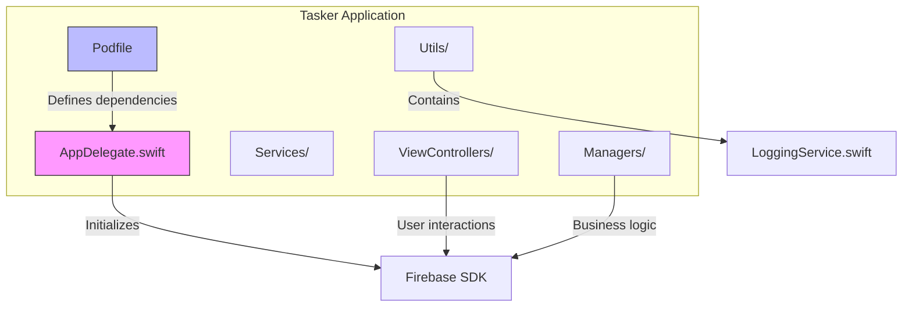
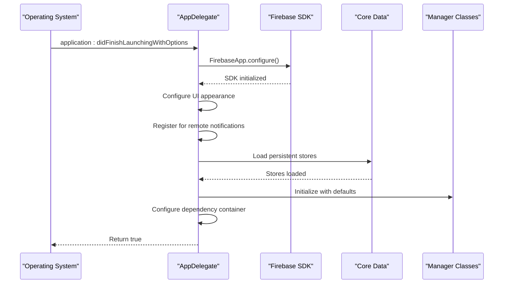
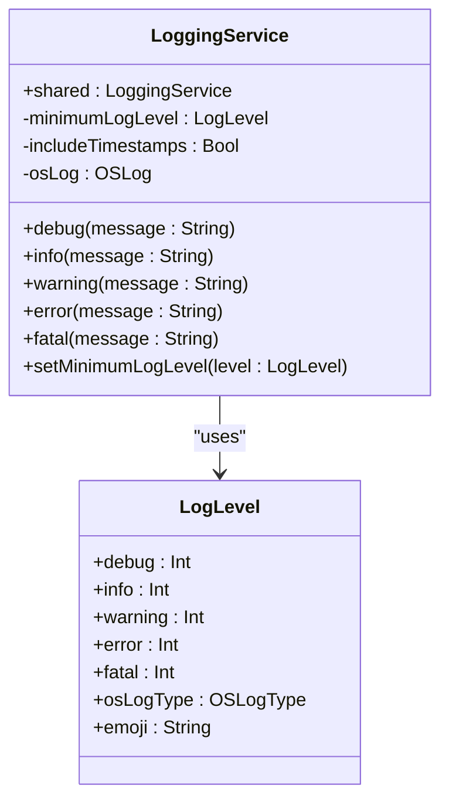
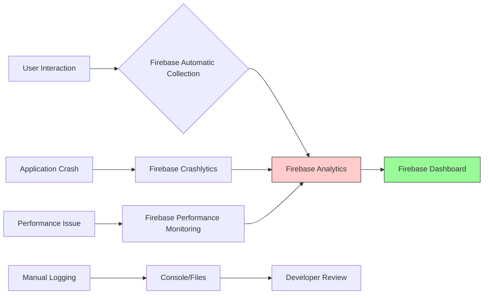

# Firebase Integration Architecture

<cite>
**Referenced Files in This Document**   
- [Podfile](file://Podfile#L5-L15)
- [AppDelegate.swift](file://To%20Do%20List/AppDelegate.swift#L1-L193)
- [LoggingService.swift](file://To%20Do%20List/Utils/LoggingService.swift#L1-L404)
- [README.md](file://README.md#L1380-L1420)
</cite>

## Table of Contents
1. [Introduction](#introduction)
2. [Project Structure](#project-structure)
3. [Firebase Configuration and Initialization](#firebase-configuration-and-initialization)
4. [Analytics and Diagnostics Implementation](#analytics-and-diagnostics-implementation)
5. [Data Flow and Event Tracking](#data-flow-and-event-tracking)
6. [Privacy and Data Minimization](#privacy-and-data-minimization)
7. [Best Practices for Firebase Usage](#best-practices-for-firebase-usage)
8. [Troubleshooting Guide](#troubleshooting-guide)
9. [Conclusion](#conclusion)

## Introduction

This document provides a comprehensive analysis of the Firebase integration within the Tasker iOS application. The integration leverages Firebase Analytics, Crashlytics, and Performance Monitoring to enhance application stability, understand user behavior, and optimize performance. Firebase is initialized at application startup and serves as the primary diagnostics and analytics backend. This documentation details the configuration, initialization sequence, diagnostic data collection, and best practices for maintaining an effective Firebase implementation.

**Section sources**
- [README.md](file://README.md#L1380-L1420)

## Project Structure

The Tasker project follows a hybrid architecture combining MVC patterns with elements of Clean Architecture. The Firebase integration is primarily configured through the Podfile for dependency management and initialized in the AppDelegate for runtime setup. The application structure includes dedicated directories for models, services, managers, view controllers, and utilities, with Firebase-related components integrated at the application lifecycle level.



**Diagram sources**
- [Podfile](file://Podfile#L5-L15)
- [AppDelegate.swift](file://To%20Do%20List/AppDelegate.swift#L1-L193)

**Section sources**
- [README.md](file://README.md#L1380-L1420)

## Firebase Configuration and Initialization

### Dependency Management via Podfile

Firebase dependencies are managed through CocoaPods, with specific versions pinned for stability. The Podfile includes three core Firebase services:

- **Firebase/Analytics**: For user interaction tracking and behavioral analytics
- **Firebase/Crashlytics**: For crash reporting and stability monitoring
- **Firebase/Performance**: For performance monitoring and optimization

```ruby
# Firebase
pod 'Firebase/Analytics',   '~> 11.13'
pod 'Firebase/Crashlytics', '~> 11.13'
pod 'Firebase/Performance', '~> 11.13'
```

These dependencies are configured to work with iOS 16.0 and above, ensuring compatibility with modern iOS features and security requirements.

### Application Initialization Sequence

Firebase is initialized in the AppDelegate during the application launch sequence. The initialization occurs in the `application(_:didFinishLaunchingWithOptions:)` method, which is the primary entry point for application setup.

```swift
func application(_ application: UIApplication, didFinishLaunchingWithOptions launchOptions: [UIApplication.LaunchOptionsKey: Any]?) -> Bool {
    FirebaseApp.configure()
    
    // Additional configuration...
    UITableView.appearance().backgroundColor = UIColor.clear
    application.registerForRemoteNotifications()
    
    return true
}
```

The `FirebaseApp.configure()` call is critical and must be the first Firebase call in the application lifecycle. This method reads the `GoogleService-Info.plist` configuration file (which was not found in the repository but is required for build) and initializes all Firebase services registered in the Podfile.

### App Startup Sequence with Firebase

The application startup sequence follows a specific order to ensure proper initialization:

1. **Firebase Configuration**: `FirebaseApp.configure()` is called first to initialize all Firebase services
2. **UI Configuration**: Appearance settings for UITableView are configured
3. **Push Notification Registration**: The app registers for remote notifications
4. **Core Data Stack Initialization**: The persistent container is loaded
5. **Business Logic Initialization**: Manager classes are configured with default data
6. **Dependency Injection**: The dependency container is configured with the persistent store

This sequence ensures that Firebase is available for logging diagnostic events throughout the entire startup process.



**Diagram sources**
- [AppDelegate.swift](file://To%20Do%20List/AppDelegate.swift#L25-L60)
- [Podfile](file://Podfile#L5-L15)

**Section sources**
- [AppDelegate.swift](file://To%20Do%20List/AppDelegate.swift#L25-L60)
- [Podfile](file://Podfile#L5-L15)

## Analytics and Diagnostics Implementation

### Current Analytics Implementation Status

Based on the code analysis, Tasker does not currently implement a dedicated `AnalyticsService` abstraction layer for Firebase Analytics. Instead, the application relies on Firebase's automatic event collection and the existing `LoggingService` for diagnostic information.

The `LoggingService` class provides comprehensive logging capabilities but is focused on system-level logging rather than structured analytics event tracking. It supports multiple log levels (debug, info, warning, error, fatal) and can output to both console and file destinations.

```swift
final class LoggingService {
    static let shared = LoggingService()
    private(set) var minimumLogLevel: LogLevel = .debug
    
    func debug(_ message: String, file: String = #file, function: String = #function, line: Int = #line)
    func info(_ message: String, file: String = #file, function: String = #function, line: Int = #line)
    func warning(_ message: String, file: String = #file, function: String = #function, line: Int = #line)
    func error(_ message: String, file: String = #file, function: String = #function, line: Int = #line)
    func fatal(_ message: String, file: String = #file, function: String = #function, line: Int = #line)
}
```

### Diagnostic Data Collection

Diagnostic data is collected through multiple channels:

1. **Firebase Automatic Collection**: Firebase automatically collects usage, performance, and crash data
2. **Manual Logging**: The `LoggingService` captures detailed diagnostic information
3. **CloudKit Event Monitoring**: CloudKit container events are logged for synchronization debugging

The AppDelegate includes specific logging for CloudKit events, which provides insight into the synchronization process:

```swift
NotificationCenter.default.addObserver(
    forName: NSPersistentCloudKitContainer.eventChangedNotification,
    object: persistentContainer,
    queue: .main
) { note in
    guard let userInfo = note.userInfo,
          let events = userInfo[NSPersistentCloudKitContainer.eventNotificationUserInfoKey] as? [NSPersistentCloudKitContainer.Event]
    else { return }

    for event in events {
        print("📡 CloudKit event:", event.type)
        if let err = event.error {
            print("   ⛔️ error:", err)
        }
    }
}
```

This logging pattern captures both successful events and errors, providing valuable diagnostic information that complements Firebase's crash reporting.



**Diagram sources**
- [LoggingService.swift](file://To%20Do%20List/Utils/LoggingService.swift#L3-L404)

**Section sources**
- [LoggingService.swift](file://To%20Do%20List/Utils/LoggingService.swift#L3-L404)
- [AppDelegate.swift](file://To%20Do%20List/AppDelegate.swift#L50-L70)

## Data Flow and Event Tracking

### Current Data Flow Architecture

The current data flow for diagnostics and analytics follows a multi-layered approach:

1. **User Interaction Layer**: User actions in ViewControllers and UI components
2. **Application Logic Layer**: Business logic in Managers and Services
3. **Diagnostic Collection Layer**: LoggingService and Firebase automatic collection
4. **External Reporting Layer**: Firebase backend services

However, there is no explicit event tracking implementation for custom analytics events. The application relies solely on Firebase's automatic event collection for user behavior analytics.

### Missing Analytics Abstraction

The documentation objective mentioned an `AnalyticsService` abstraction for event logging and user property tracking, but this component does not exist in the current codebase. This represents a gap in the implementation where custom event tracking would require direct Firebase SDK calls throughout the application, potentially leading to inconsistent event naming and parameter usage.

An ideal implementation would include:

- **AnalyticsService Protocol**: Defining the interface for analytics operations
- **FirebaseAnalyticsService**: Concrete implementation using Firebase SDK
- **Event Enum**: Strongly-typed event definitions
- **Parameter Structs**: Type-safe parameter definitions

### Data Flow to Firebase Dashboard

Despite the lack of custom event tracking, data flows to the Firebase dashboard through automatic collection mechanisms:



**Diagram sources**
- [AppDelegate.swift](file://To%20Do%20List/AppDelegate.swift#L25-L60)
- [Podfile](file://Podfile#L5-L15)

**Section sources**
- [AppDelegate.swift](file://To%20Do%20List/AppDelegate.swift#L25-L60)
- [Podfile](file://Podfile#L5-L15)

## Privacy and Data Minimization

### Current Privacy Considerations

The current implementation does not include explicit user opt-out mechanisms for Firebase analytics. Since there is no custom `AnalyticsService` abstraction, implementing a privacy toggle would require significant refactoring to wrap all Firebase calls with consent checks.

### Data Minimization Practices

The application follows some data minimization principles through its reliance on automatic event collection rather than extensive custom event tracking. However, without a dedicated analytics service, there is no centralized control over what data is collected and transmitted.

Best practices that could be implemented include:

- **Anonymous Analytics**: Collecting data without user identifiers by default
- **Opt-In Consent**: Requiring user consent before enabling analytics
- **Data Retention Policies**: Configuring appropriate data retention periods
- **IP Address Anonymization**: Ensuring IP addresses are anonymized in collected data

### Recommended Privacy Implementation

To address privacy concerns, the following implementation is recommended:

1. **Create AnalyticsService**: Implement a service layer that abstracts Firebase calls
2. **Add Consent Management**: Store user consent status in UserDefaults
3. **Wrap Firebase Calls**: Check consent status before making any Firebase calls
4. **Provide UI Controls**: Add settings options for users to manage their data sharing preferences

```swift
protocol AnalyticsServiceProtocol {
    func logEvent(_ event: AnalyticEvent)
    func setUserProperty(_ property: UserProperty, value: String)
    func setEnabled(_ enabled: Bool)
    func isEnabled() -> Bool
}
```

**Section sources**
- [AppDelegate.swift](file://To%20Do%20List/AppDelegate.swift#L25-L60)

## Best Practices for Firebase Usage

### Event Naming Conventions

Although custom events are not currently implemented, establishing consistent naming conventions is crucial for future development:

- **Use snake_case**: `screen_view`, `button_click`, `task_created`
- **Be descriptive but concise**: `task_priority_changed` rather than `tpc`
- **Use consistent prefixes**: `screen_` for screen views, `action_` for user actions
- **Avoid special characters**: Stick to alphanumeric characters and underscores

### Parameter Usage Guidelines

When implementing custom event tracking, follow these parameter usage guidelines:

- **Limit parameters**: Use no more than 25 parameters per event
- **Use meaningful names**: `task_priority` rather than `p`
- **Standardize value types**: Use consistent data types for the same parameter across events
- **Avoid PII**: Never include personally identifiable information in parameters

### Avoiding Excessive Logging

To prevent performance degradation and data overload:

- **Batch events**: Allow Firebase to batch events automatically rather than forcing immediate sends
- **Limit debug events**: Use debug events only during development
- **Monitor event volume**: Watch for unexpected spikes in event volume
- **Use conditional logging**: Only log events that provide actionable insights

### Recommended Implementation Pattern

```swift
enum AnalyticEvent {
    case screenView(screenName: String)
    case taskCreated(priority: TaskPriority)
    case taskCompleted(completedCount: Int)
    
    var name: String {
        switch self {
        case .screenView: return "screen_view"
        case .taskCreated: return "task_created"
        case .taskCompleted: return "task_completed"
        }
    }
    
    var parameters: [String: Any]? {
        switch self {
        case .screenView(let screenName):
            return ["screen_name": screenName]
        case .taskCreated(let priority):
            return ["task_priority": priority.rawValue]
        case .taskCompleted(let completedCount):
            return ["completed_count": completedCount]
        }
    }
}
```

**Section sources**
- [README.md](file://README.md#L1380-L1420)

## Troubleshooting Guide

### Missing GoogleService-Info.plist

**Symptoms**: Firebase initialization fails, console shows "GoogleService-Info.plist not found"

**Solution**:
1. Ensure the `GoogleService-Info.plist` file is present in the app bundle
2. Verify the file is included in the Xcode project and marked for the correct target
3. Check that the file is listed in the "Copy Bundle Resources" build phase
4. Confirm the file contains valid configuration for the bundle identifier

### Initialization Failures

**Symptoms**: `FirebaseApp.configure()` crashes or fails silently

**Diagnosis**:
1. Check console logs for Firebase initialization messages
2. Verify all Firebase pods are properly installed (`pod install`)
3. Ensure the Firebase import is present in AppDelegate: `import Firebase`
4. Confirm the app targets iOS 16.0 or higher as specified in Podfile

**Common Fix**:
```swift
// In AppDelegate.swift
import Firebase // Must be present

func application(_ application: UIApplication, didFinishLaunchingWithOptions launchOptions: [UIApplication.LaunchOptionsKey: Any]?) -> Bool {
    FirebaseApp.configure() // Call must be in didFinishLaunchingWithOptions
    return true
}
```

### Data Delays in Dashboard

**Symptoms**: Events not appearing in Firebase console in real-time

**Expected Behavior**: Firebase batches events and may take up to 24 hours to appear in standard reports

**Immediate Verification**:
1. Enable debug mode in Xcode scheme:
   - Edit Scheme → Arguments → Arguments Passed On Launch
   - Add `-FIRDebugEnabled`
2. Check console for Firebase debug messages:
   - "Logging event: <event_name>"
   - "Uploading data to Firebase"
3. Use Firebase DebugView in the console to see real-time events

### Common Setup Issues Checklist

```mermaid
flowchart TD
A[Firebase Not Working] --> B{Check GoogleService-Info.plist}
B --> |Missing| C[Add plist file to project]
B --> |Present| D{Check Podfile}
D --> |Missing Firebase pods| E[Add Firebase pods and run pod install]
D --> |Pods present| F{Check AppDelegate}
F --> |Missing import Firebase| G[Add import Firebase]
F --> |Missing configure()| H[Add FirebaseApp.configure()]
F --> |Correct| I{Enable Debug Mode}
I --> |Still not working| J[Check device connectivity]
I --> |Working with debug| K[Data will appear in console]
```

**Section sources**
- [AppDelegate.swift](file://To%20Do%20List/AppDelegate.swift#L25-L60)
- [Podfile](file://Podfile#L5-L15)

## Conclusion

The Tasker application has successfully integrated Firebase Analytics, Crashlytics, and Performance Monitoring through CocoaPods dependency management and proper initialization in the AppDelegate. The current implementation leverages Firebase's automatic event collection for core analytics, crash reporting, and performance monitoring.

However, the absence of a dedicated `AnalyticsService` abstraction represents a missed opportunity for structured, consistent event tracking and privacy management. Implementing such a service would provide numerous benefits:

- **Consistent event naming and parameter usage**
- **Centralized control over analytics data collection**
- **Easier implementation of privacy features and user opt-out**
- **Simplified testing and mocking for unit tests**
- **Reduced technical debt and improved maintainability**

The recommended next steps include:
1. Implementing an `AnalyticsService` protocol and Firebase-based implementation
2. Defining a comprehensive set of custom events for key user interactions
3. Adding user consent management for analytics data collection
4. Establishing clear event naming conventions and parameter standards
5. Creating documentation for team members on proper analytics implementation

By addressing these gaps, Tasker can enhance its analytics capabilities while maintaining strong privacy practices and code quality standards.