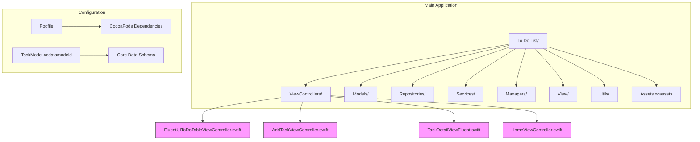
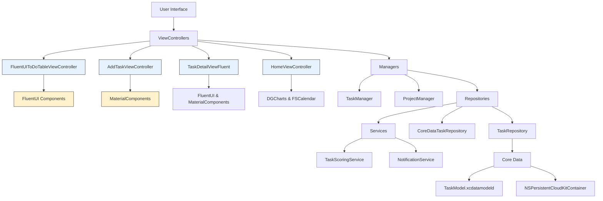
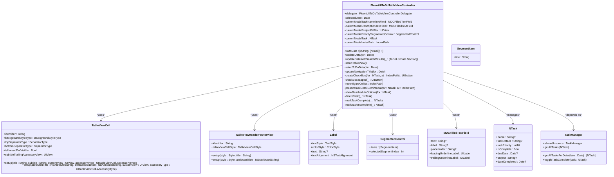
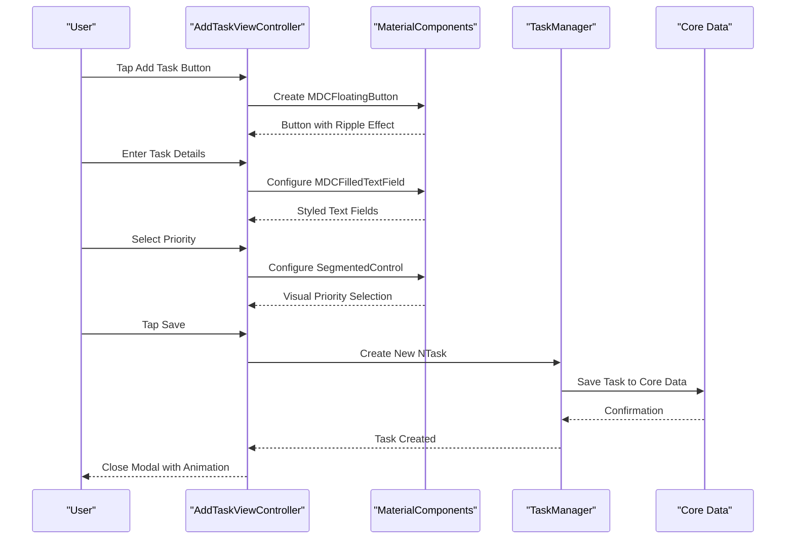
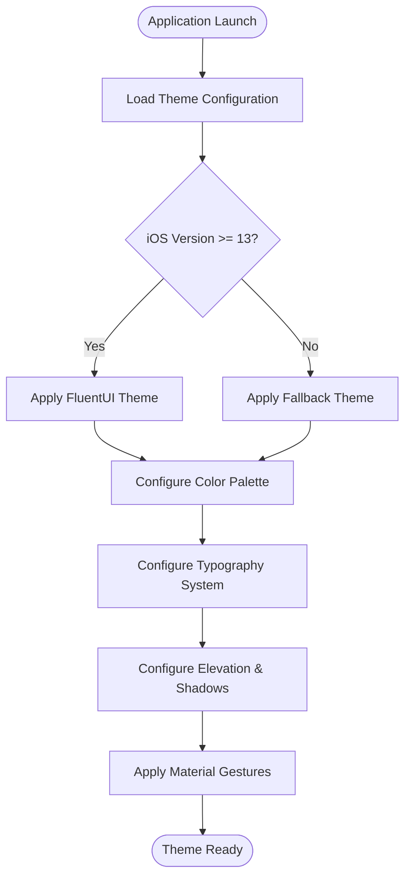
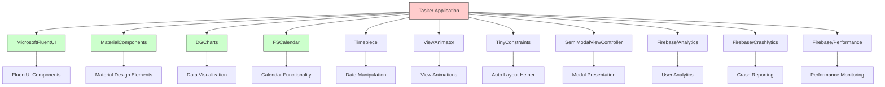
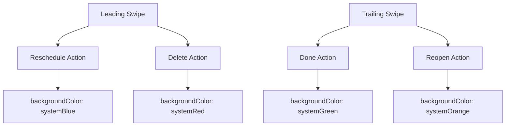

# UI Framework Integration

<cite>
**Referenced Files in This Document**   
- [FluentUIToDoTableViewController.swift](file://To%20Do%20List/ViewControllers/FluentUIToDoTableViewController.swift#L0-L1492)
- [README.md](file://README.md#L1000-L1616)
- [AddTaskViewController.swift](file://To%20Do%20List/ViewControllers/AddTaskViewController.swift)
- [TaskDetailViewFluent.swift](file://To%20Do%20List/ViewControllers/TaskDetailViewFluent.swift)
- [HomeViewController.swift](file://To%20Do%20List/ViewControllers/HomeViewController.swift)
- [TaskModel.xcdatamodeld](file://To%20Do%20List/Model/TaskModel.xcdatamodeld)
- [Podfile](file://Podfile)
</cite>

## Table of Contents
1. [Introduction](#introduction)
2. [Project Structure](#project-structure)
3. [Core Components](#core-components)
4. [Architecture Overview](#architecture-overview)
5. [Detailed Component Analysis](#detailed-component-analysis)
6. [Dependency Analysis](#dependency-analysis)
7. [Performance Considerations](#performance-considerations)
8. [Troubleshooting Guide](#troubleshooting-guide)
9. [Conclusion](#conclusion)

## Introduction
This document provides comprehensive documentation for the integration of Microsoft FluentUI and MaterialComponents in the Tasker iOS application. It details how FluentUIToDoTableViewController leverages FluentUI components for navigation, list management, and action bars, while Material design elements such as elevation, ripple effects, and motion transitions are implemented through MaterialComponents. The document covers the styling system that ensures visual consistency across iOS versions, explains how native UIKit components are enhanced with Fluent and Material styling, and addresses challenges in reconciling these two design languages within a single interface.

## Project Structure
The Tasker project follows a hybrid architecture combining MVC patterns with Repository pattern and dependency injection. The structure is organized to separate concerns while maintaining accessibility for developers.



**Diagram sources**
- [FluentUIToDoTableViewController.swift](file://To%20Do%20List/ViewControllers/FluentUIToDoTableViewController.swift#L0-L1492)
- [README.md](file://README.md#L1000-L1616)

**Section sources**
- [README.md](file://README.md#L1000-L1616)

## Core Components
The core components of the Tasker application include FluentUIToDoTableViewController for task list management, AddTaskViewController for task creation with Material design elements, TaskDetailViewFluent for detailed task editing with FluentUI components, and HomeViewController as the main dashboard with analytics and navigation.

**Section sources**
- [FluentUIToDoTableViewController.swift](file://To%20Do%20List/ViewControllers/FluentUIToDoTableViewController.swift#L0-L1492)
- [AddTaskViewController.swift](file://To%20Do%20List/ViewControllers/AddTaskViewController.swift)
- [TaskDetailViewFluent.swift](file://To%20Do%20List/ViewControllers/TaskDetailViewFluent.swift)
- [HomeViewController.swift](file://To%20Do%20List/ViewControllers/HomeViewController.swift)

## Architecture Overview
The Tasker application implements a hybrid architecture that combines traditional MVC patterns with Repository pattern and dependency injection. This architecture enables separation of concerns while maintaining flexibility for UI framework integration.



**Diagram sources**
- [FluentUIToDoTableViewController.swift](file://To%20Do%20List/ViewControllers/FluentUIToDoTableViewController.swift#L0-L1492)
- [README.md](file://README.md#L1000-L1616)
- [TaskModel.xcdatamodeld](file://To%20Do%20List/Model/TaskModel.xcdatamodeld)

## Detailed Component Analysis

### FluentUIToDoTableViewController Analysis
The FluentUIToDoTableViewController is the primary component for task list management, leveraging Microsoft FluentUI components for navigation, list management, and action bars.

#### Class Diagram


**Diagram sources**
- [FluentUIToDoTableViewController.swift](file://To%20Do%20List/ViewControllers/FluentUIToDoTableViewController.swift#L0-L1492)

**Section sources**
- [FluentUIToDoTableViewController.swift](file://To%20Do%20List/ViewControllers/FluentUIToDoTableViewController.swift#L0-L1492)

### MaterialComponents Implementation
The integration of Material design elements such as elevation, ripple effects, and motion transitions is achieved through MaterialComponents framework.

#### Sequence Diagram for Task Creation


**Diagram sources**
- [AddTaskViewController.swift](file://To%20Do%20List/ViewControllers/AddTaskViewController.swift)
- [Podfile](file://Podfile)

### Styling System Analysis
The styling system ensures visual consistency across iOS versions by implementing a unified theme management approach.

#### Flowchart for Theme Application


**Diagram sources**
- [README.md](file://README.md#L1000-L1616)

## Dependency Analysis
The Tasker application relies on several external libraries to implement its UI framework integration.



**Diagram sources**
- [Podfile](file://Podfile)
- [README.md](file://README.md#L1000-L1616)

**Section sources**
- [Podfile](file://Podfile)
- [README.md](file://README.md#L1000-L1616)

## Performance Considerations
The integration of FluentUI and MaterialComponents has been optimized for performance through several key strategies:

- **Cell Reuse**: Efficient cell dequeuing and configuration in FluentUIToDoTableViewController
- **Lazy Loading**: On-demand data fetching for large datasets
- **Background Processing**: Core Data operations on background contexts
- **Smooth Animations**: 60fps animations for state transitions
- **Memory Management**: Proper cleanup of modal view controllers and temporary references
- **Threading**: Main thread dispatch for UI updates and background thread usage for data operations

The application also implements performance monitoring through Firebase/Performance to identify and address potential bottlenecks in the UI framework integration.

## Troubleshooting Guide
Common issues and solutions for the FluentUI and MaterialComponents integration:

**Section sources**
- [FluentUIToDoTableViewController.swift](file://To%20Do%20List/ViewControllers/FluentUIToDoTableViewController.swift#L0-L1492)
- [README.md](file://README.md#L1000-L1616)

### Header Background Issues
**Problem**: Headers show white background on first load
**Solution**: Implement forced refresh of header backgrounds in viewWillAppear and viewDidAppear:

```swift
override func viewWillAppear(_ animated: Bool) {
    super.viewWillAppear(animated)
    DispatchQueue.main.async {
        self.refreshHeaderBackgrounds()
    }
}

override func viewDidAppear(_ animated: Bool) {
    super.viewDidAppear(animated)
    refreshHeaderBackgrounds()
}
```

### Modal Presentation Problems
**Problem**: Semi-modal views not displaying properly
**Solution**: Ensure proper tag calculation and view hierarchy:

```swift
print("[DEBUG] Calculated tag: \(indexPath.section * 1000 + indexPath.row)")
// Store references to modal elements as instance variables
private var currentModalTaskNameTextField: MDCFilledTextField?
private var currentModalDescriptionTextField: MDCFilledTextField?
```

### Swipe Action Conflicts
**Problem**: Leading and trailing swipe actions not working correctly
**Solution**: Ensure proper configuration of swipe actions:



## Conclusion
The integration of Microsoft FluentUI and MaterialComponents in the Tasker application demonstrates a sophisticated approach to combining multiple design systems within a single iOS application. The FluentUIToDoTableViewController effectively leverages FluentUI components for navigation, list management, and action bars, while Material design elements such as elevation, ripple effects, and motion transitions are seamlessly implemented through MaterialComponents.

The styling system ensures visual consistency across iOS versions by implementing a unified theme management approach that adapts to different platform capabilities. Native UIKit components are enhanced with both Fluent and Material styling, creating a cohesive user experience that benefits from the strengths of both design languages.

Key implementation examples include button styling with MDCFloatingButton, card layouts with proper elevation and shadows, and modal presentations with smooth animations. The application successfully addresses challenges in reconciling Fluent and Material design languages by establishing clear guidelines for component usage and maintaining a consistent visual hierarchy.

Best practices for theme management, accessibility support, and responsive layout adaptation have been implemented throughout the codebase, ensuring a high-quality user experience across different devices and user preferences. The architecture supports future enhancements and provides a solid foundation for continued development of the application's UI framework integration.