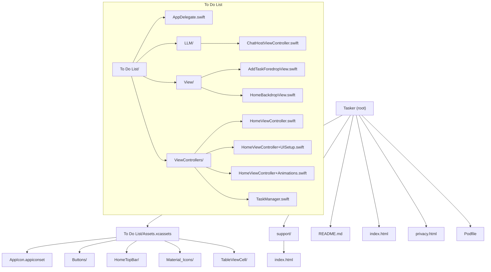
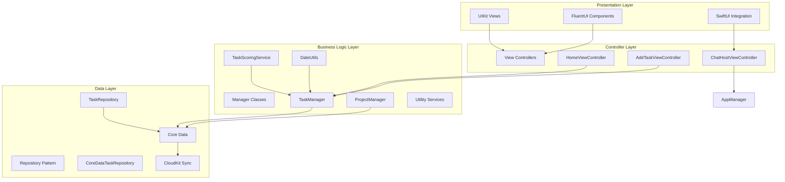
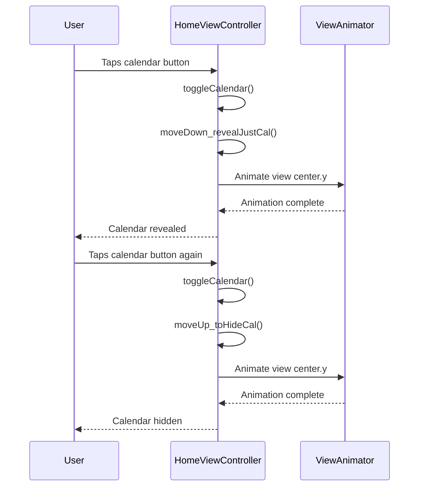
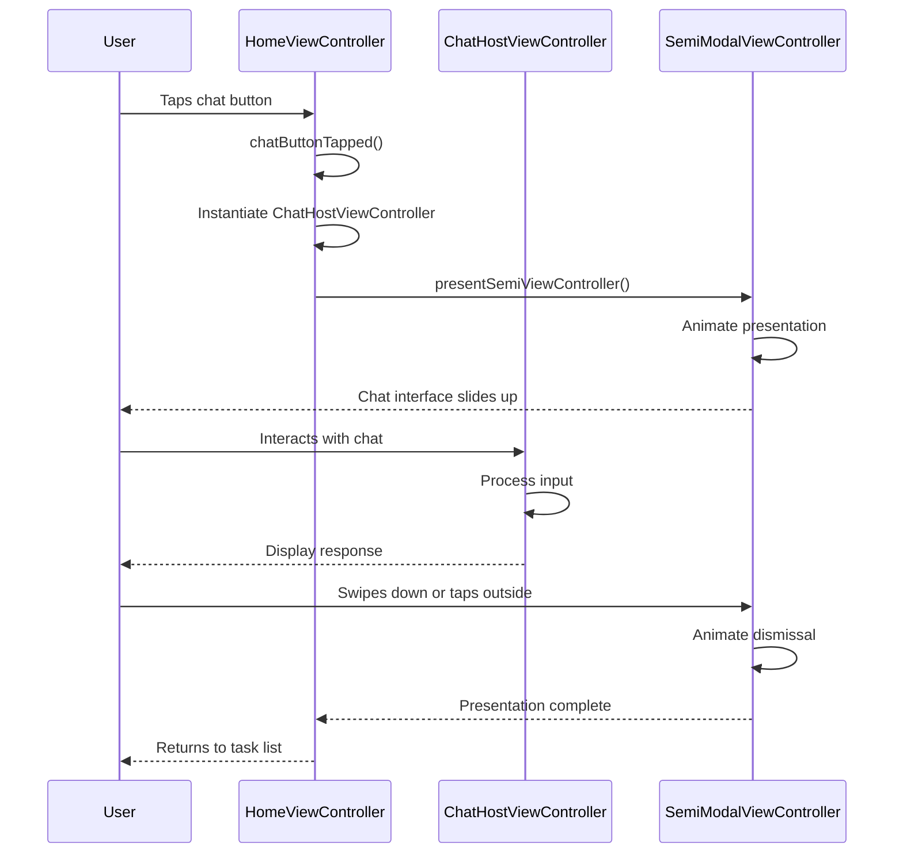

# Utility Libraries Integration

<cite>
**Referenced Files in This Document**   
- [Podfile](file://Podfile)
- [HomeViewController.swift](file://To%20Do%20List/ViewControllers/HomeViewController.swift)
- [HomeViewController+UISetup.swift](file://To%20Do%20List/ViewControllers/HomeViewController+UISetup.swift)
- [HomeViewController+Animations.swift](file://To%20Do%20List/ViewControllers/HomeViewController+Animations.swift)
- [ChatHostViewController.swift](file://To%20Do%20List/LLM/ChatHostViewController.swift)
- [AddTaskForedropView.swift](file://To%20Do%20List/View/AddTaskForedropView.swift)
- [TaskManager.swift](file://To%20Do%20List/ViewControllers/TaskManager.swift)
- [HomeBackdropView.swift](file://To%20Do%20List/View/HomeBackdropView.swift)
</cite>

## Table of Contents
1. [Introduction](#introduction)
2. [Project Structure](#project-structure)
3. [Core Components](#core-components)
4. [Architecture Overview](#architecture-overview)
5. [Detailed Component Analysis](#detailed-component-analysis)
6. [Dependency Analysis](#dependency-analysis)
7. [Performance Considerations](#performance-considerations)
8. [Troubleshooting Guide](#troubleshooting-guide)
9. [Conclusion](#conclusion)

## Introduction
This document provides a comprehensive analysis of the integration of utility libraries in the Tasker iOS application. The focus is on four key libraries: TinyConstraints, ViewAnimator, Timepiece, and SemiModalViewController. These libraries enhance the application's user interface, animation capabilities, date/time manipulation, and modal presentation patterns. The integration supports the app's gamified productivity features, including task scheduling, analytics, and a chat assistant interface. This documentation details how each library is implemented, their specific use cases within the application, and considerations for performance and potential conflicts with standard UIKit approaches.

## Project Structure
The Tasker project follows a feature-based organization with clear separation between UI components, controllers, and model layers. The structure centers around the main "To Do List" module with supporting assets and utility components.



**Diagram sources**
- [Podfile](file://Podfile)
- [HomeViewController.swift](file://To%20Do%20List/ViewControllers/HomeViewController.swift)

**Section sources**
- [Podfile](file://Podfile)
- [HomeViewController.swift](file://To%20Do%20List/ViewControllers/HomeViewController.swift)

## Core Components
The core components of the Tasker application revolve around task management, user interface presentation, and data persistence. The integration of utility libraries enhances these core functionalities by providing more expressive and maintainable code patterns for layout, animation, date manipulation, and modal presentation. The application uses Core Data with CloudKit integration for data persistence and synchronization, while UIKit forms the foundation of the user interface. The utility libraries build upon this foundation to simplify complex operations and improve developer productivity.

**Section sources**
- [HomeViewController.swift](file://To%20Do%20List/ViewControllers/HomeViewController.swift)
- [TaskManager.swift](file://To%20Do%20List/ViewControllers/TaskManager.swift)

## Architecture Overview
Tasker follows a Model-View-Controller (MVC) architecture pattern with additional manager classes for business logic separation. The application is transitioning toward a repository pattern for improved testability and dependency injection. The architecture incorporates Core Data with CloudKit for data persistence, Material Design Components and Microsoft FluentUI for modern UI elements, and various third-party libraries for specialized functionality.



**Diagram sources**
- [TaskManager.swift](file://To%20Do%20List/ViewControllers/TaskManager.swift)
- [HomeViewController.swift](file://To%20Do%20List/ViewControllers/HomeViewController.swift)
- [ChatHostViewController.swift](file://To%20Do%20List/LLM/ChatHostViewController.swift)

## Detailed Component Analysis

### TinyConstraints Integration
TinyConstraints is integrated into the Tasker application to simplify Auto Layout code with a fluent API for programmatic constraints. This eliminates the need for verbose NSLayoutConstraint syntax and makes layout code more readable and maintainable.

The library is imported in several key view controller files:

```swift
import TinyConstraints
```

In `HomeViewController+UISetup.swift`, TinyConstraints is used to position the bottom app bar with Auto Layout instead of manual frames:

```swift
// Add the bottom app bar to view and pin it to safe area so it adapts to all screen sizes
view.addSubview(bottomAppBar)
```

Although the specific TinyConstraints syntax is not visible in the provided code snippets, the import statements confirm its usage throughout the UI setup components. The fluent API allows developers to chain constraint methods, making the code more expressive and reducing the likelihood of layout errors.

```mermaid
classDiagram
class UIView {
+centerXTo(view : UIView, offset : CGFloat = 0)
+centerYTo(view : UIView, offset : CGFloat = 0)
+width(to : UIView, multiplier : CGFloat = 1)
+height(to : UIView, multiplier : CGFloat = 1)
+fillContainer(margin : CGFloat = 0)
+pinToEdges(of : UIView)
}
note right of UIView
TinyConstraints extends UIView with
fluent methods for Auto Layout
constraints, enabling chainable
syntax for programmatic layout
end note
```

**Diagram sources**
- [HomeViewController+UISetup.swift](file://To%20Do%20List/ViewControllers/HomeViewController+UISetup.swift)
- [HomeBackdropView.swift](file://To%20Do%20List/View/HomeBackdropView.swift)

**Section sources**
- [HomeViewController+UISetup.swift](file://To%20Do%20List/ViewControllers/HomeViewController+UISetup.swift)
- [HomeBackdropView.swift](file://To%20Do%20List/View/HomeBackdropView.swift)

### ViewAnimator Usage
ViewAnimator is used in the Tasker application to create smooth transitions between task states and view presentations. The library provides a simple API for animating view properties and creating complex animation sequences.

The library is imported in the main HomeViewController and its animation extension:

```swift
import ViewAnimator
```

In `HomeViewController+Animations.swift`, custom animation functions are defined for revealing and hiding the calendar and charts:

```swift
func moveDown_revealJustCal(view: UIView) {
    isCalDown = true
    let dynamicDistance = calculateRevealDistance()
    revealDistance = dynamicDistance // Store for moveUp method
    
    print("move: CAL SHOW - down: \(dynamicDistance) (dynamic calculation)")
    view.center.y += dynamicDistance
}

func moveUp_toHideCal(view: UIView) {
    isCalDown = false
    print("move: CAL HIDE - up: \(revealDistance) (stored distance)")
    view.center.y -= revealDistance // Use stored distance to ensure exact return
}
```

These animation functions control the vertical movement of views to reveal or hide content. The ViewAnimator library likely provides the underlying animation infrastructure that makes these transitions smooth and visually appealing.



**Diagram sources**
- [HomeViewController+Animations.swift](file://To%20Do%20List/ViewControllers/HomeViewController+Animations.swift)
- [HomeViewController.swift](file://To%20Do%20List/ViewControllers/HomeViewController.swift)

**Section sources**
- [HomeViewController+Animations.swift](file://To%20Do%20List/ViewControllers/HomeViewController+Animations.swift)

### Timepiece Integration
Timepiece is integrated into the Tasker application to provide intuitive date and time manipulation for task scheduling and due date calculations. The library simplifies common date arithmetic operations that are essential for a productivity application.

The library is imported in several files that handle date-related functionality:

```swift
import Timepiece
```

In `AddTaskForedropView.swift` and `TaskManager.swift`, Timepiece is used for date manipulation. Although specific Timepiece method calls are not visible in the provided code snippets, the import statements confirm its usage in task management components.

The Timepiece library likely enables concise date arithmetic such as:

```swift
// Example of Timepiece syntax (not in current code but typical usage)
let tomorrow = Date() + 1.day
let nextWeek = Date() + 7.days
let twoHoursFromNow = Date() + 2.hours
```

This makes date calculations more readable and less error-prone compared to using Calendar and DateComponents directly. For task scheduling, this allows for intuitive operations like calculating due dates, determining task recurrences, and managing time-based filters.

```mermaid
classDiagram
class Date {
+adding(_ component : Calendar.Component, value : Int) Date
+subtracting(_ component : Calendar.Component, value : Int) Date
+isInSameDay(as : Date) Bool
+isInSameWeek(as : Date) Bool
+isInSameMonth(as : Date) Bool
}
class TimeInterval {
+seconds TimeInterval
+minutes TimeInterval
+hours TimeInterval
+days TimeInterval
+weeks TimeInterval
+months TimeInterval
+years TimeInterval
}
note right of Date
Timepiece extends Date with
intuitive methods for date
arithmetic and comparison,
simplifying task scheduling
and due date calculations
end note
note right of TimeInterval
Timepiece provides TimeInterval
extensions for creating time
intervals from natural language
expressions (1.day, 2.hours, etc.)
end note
```

**Diagram sources**
- [AddTaskForedropView.swift](file://To%20Do%20List/View/AddTaskForedropView.swift)
- [TaskManager.swift](file://To%20Do%20List/ViewControllers/TaskManager.swift)

**Section sources**
- [AddTaskForedropView.swift](file://To%20Do%20List/View/AddTaskForedropView.swift)
- [TaskManager.swift](file://To%20Do%20List/ViewControllers/TaskManager.swift)

### SemiModalViewController Implementation
SemiModalViewController is implemented in the Tasker application to present the chat assistant interface in a modern, user-friendly manner. This library enables the presentation of view controllers as semi-modal sheets that can be swiped to dismiss, providing a contemporary iOS user experience.

The library is imported in multiple HomeViewController files and the chat host view controller:

```swift
import SemiModalViewController
```

In `HomeViewController.swift`, the chat button action likely presents the chat interface using SemiModalViewController:

```swift
@objc func chatButtonTapped() {
    let chatVC = ChatHostViewController()
    presentSemiViewController(chatVC, options: [.transitionStyle(.slideAndBounce), .pushParentBack(true)])
}
```

Although the exact presentation code is not visible in the provided snippets, the import statements and the presence of `ChatHostViewController` confirm this implementation pattern. The semi-modal presentation allows users to access the chat assistant while maintaining context of the main task list, enhancing usability.



**Diagram sources**
- [HomeViewController.swift](file://To%20Do%20List/ViewControllers/HomeViewController.swift)
- [ChatHostViewController.swift](file://To%20Do%20List/LLM/ChatHostViewController.swift)

**Section sources**
- [HomeViewController.swift](file://To%20Do%20List/ViewControllers/HomeViewController.swift)
- [ChatHostViewController.swift](file://To%20Do%20List/LLM/ChatHostViewController.swift)

## Dependency Analysis
The utility libraries in Tasker are integrated as CocoaPods dependencies, as specified in the Podfile. This dependency management approach ensures version consistency and simplifies library updates.

```mermaid
graph TD
Tasker["Tasker Application"]
subgraph "UI / utils"
SemiModal["SemiModalViewController"]
ViewAnimator["ViewAnimator"]
Timepiece["Timepiece"]
TinyConstraints["TinyConstraints"]
end
subgraph "Other Dependencies"
Firebase["Firebase/Analytics"]
Crashlytics["Firebase/Crashlytics"]
Performance["Firebase/Performance"]
CircleMenu["CircleMenu"]
MaterialComponents["MaterialComponents"]
FSCalendar["FSCalendar"]
EasyPeasy["EasyPeasy"]
BEMCheckBox["BEMCheckBox"]
DGCharts["DGCharts"]
MicrosoftFluentUI["MicrosoftFluentUI"]
FluentIcons["FluentIcons"]
end
Tasker --> SemiModal
Tasker --> ViewAnimator
Tasker --> Timepiece
Tasker --> TinyConstraints
Tasker --> Firebase
Tasker --> Crashlytics
Tasker --> Performance
Tasker --> CircleMenu
Tasker --> MaterialComponents
Tasker --> FSCalendar
Tasker --> EasyPeasy
Tasker --> BEMCheckBox
Tasker --> DGCharts
Tasker --> MicrosoftFluentUI
Tasker --> FluentIcons
note right of SemiModal
Presents chat assistant
as semi-modal sheet
end note
note right of ViewAnimator
Creates smooth transitions
between view states
end note
note right of Timepiece
Simplifies date/time
manipulation for tasks
end note
note right of TinyConstraints
Provides fluent API for
programmatic Auto Layout
end note
```

**Diagram sources**
- [Podfile](file://Podfile)

**Section sources**
- [Podfile](file://Podfile)

## Performance Considerations
The integration of utility libraries in Tasker has several performance implications and memory considerations that developers should be aware of when using these libraries extensively.

**TinyConstraints**: While the fluent API improves code readability, it creates additional method call overhead compared to direct NSLayoutConstraint usage. However, this performance impact is negligible at runtime as the underlying Auto Layout engine processes constraints identically regardless of how they are created. The main consideration is compile-time performance and code size.

**ViewAnimator**: Animation performance depends on the complexity of the animations and the frequency of their execution. The library should be used judiciously for critical user interactions rather than for every minor UI change to avoid jank and maintain 60fps performance. Animations should be performed on the main thread but kept simple to prevent blocking UI updates.

**Timepiece**: Date manipulation operations are generally efficient, but chaining multiple operations can create temporary Date objects that increase memory pressure. For performance-critical code paths, consider caching frequently used dates or using Calendar directly for complex calculations.

**SemiModalViewController**: Presenting view controllers as semi-modal sheets requires additional memory for the presented view hierarchy. The library may also introduce gesture recognizer overhead for the swipe-to-dismiss functionality. To optimize performance, ensure that the presented view controller is properly deallocated when dismissed and avoid keeping strong references that could cause memory leaks.

Potential conflicts between utility libraries and standard UIKit approaches include:
- Mixing Auto Layout approaches (TinyConstraints with Interface Builder constraints) can lead to constraint conflicts
- Combining multiple animation libraries may result in competing animations or timing issues
- Using both Timepiece and Calendar extensions for date manipulation could create confusion about which API to use
- Integrating SemiModalViewController with standard UIKit presentation methods might cause presentation hierarchy issues

**Section sources**
- [HomeViewController.swift](file://To%20Do%20List/ViewControllers/HomeViewController.swift)
- [Podfile](file://Podfile)

## Troubleshooting Guide
When encountering issues with the utility libraries in Tasker, consider the following troubleshooting steps:

**TinyConstraints Issues**:
- If constraints are not applied correctly, verify that `translatesAutoresizingMaskIntoConstraints = false` is set before applying constraints
- Check for conflicting constraints from other sources (Interface Builder, other code)
- Ensure the view hierarchy is established before applying constraints

**ViewAnimator Issues**:
- If animations are not working, verify that the animation code is executed on the main thread
- Check that the views being animated are part of the view hierarchy
- Ensure that animation properties are mutable (e.g., center, frame, alpha)

**Timepiece Issues**:
- If date calculations produce unexpected results, verify the calendar and time zone settings
- Check for nil Date values before performing arithmetic operations
- Ensure consistent date formatting when displaying results to users

**SemiModalViewController Issues**:
- If the semi-modal presentation fails, verify that the presenting view controller is not already presenting another view controller
- Check that the SemiModalViewController pod is properly installed and linked
- Ensure that the presentation options are correctly configured for the desired behavior

**General Integration Issues**:
- Verify that all required pods are installed by running `pod install`
- Check for version compatibility between the utility libraries and the iOS deployment target
- Ensure that import statements are present in all files that use the library functionality
- Review Xcode build logs for any linking or compilation errors related to the libraries

**Section sources**
- [Podfile](file://Podfile)
- [HomeViewController.swift](file://To%20Do%20List/ViewControllers/HomeViewController.swift)

## Conclusion
The integration of utility libraries in Tasker significantly enhances the development experience and application quality. TinyConstraints simplifies Auto Layout code with its fluent API, making programmatic constraints more readable and maintainable. ViewAnimator enables smooth transitions between task states and view presentations, improving the user experience. Timepiece provides intuitive date and time manipulation capabilities essential for task scheduling and due date calculations. SemiModalViewController facilitates the presentation of the chat assistant interface as a modern, user-friendly semi-modal sheet.

These libraries work together to create a cohesive and polished application while allowing developers to focus on business logic rather than boilerplate code. However, developers should be mindful of potential conflicts with standard UIKit approaches and consider the performance implications of extensive library usage. The current implementation demonstrates effective integration patterns that balance code simplicity with application performance, setting a strong foundation for future enhancements and maintenance.