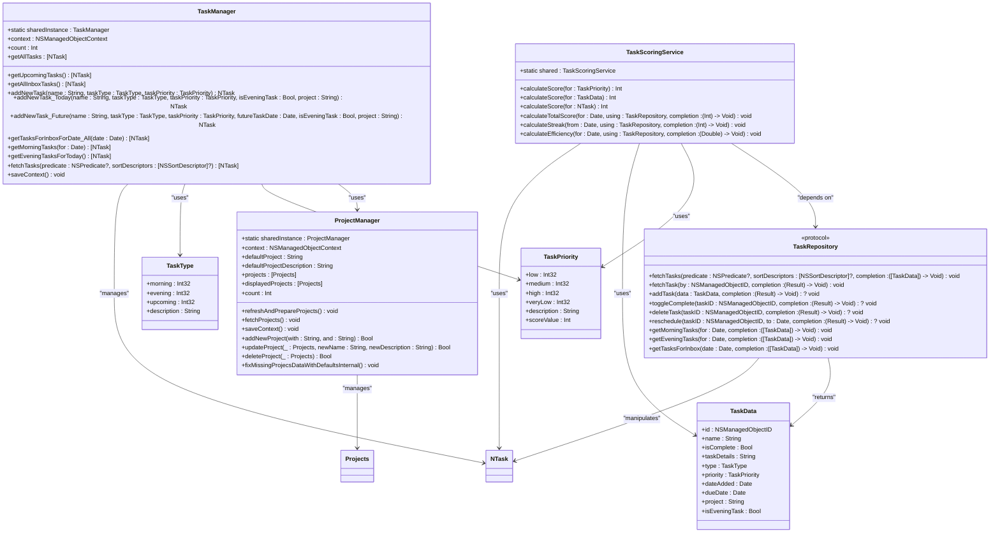
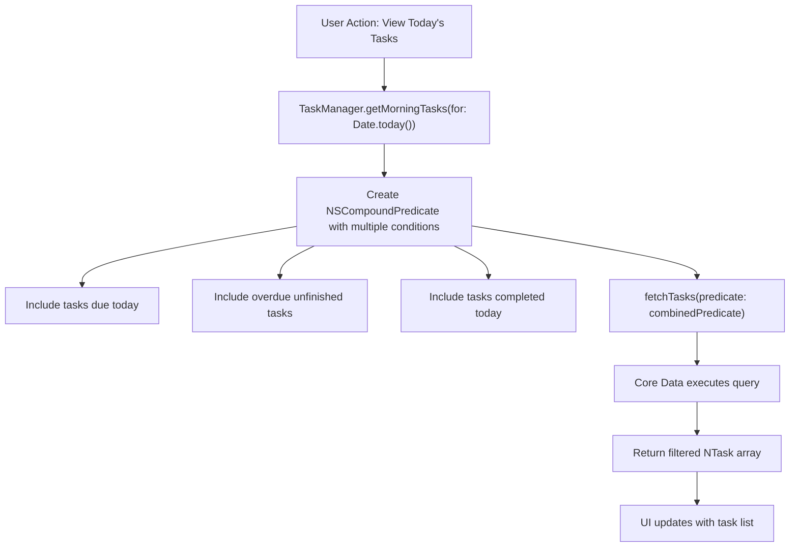
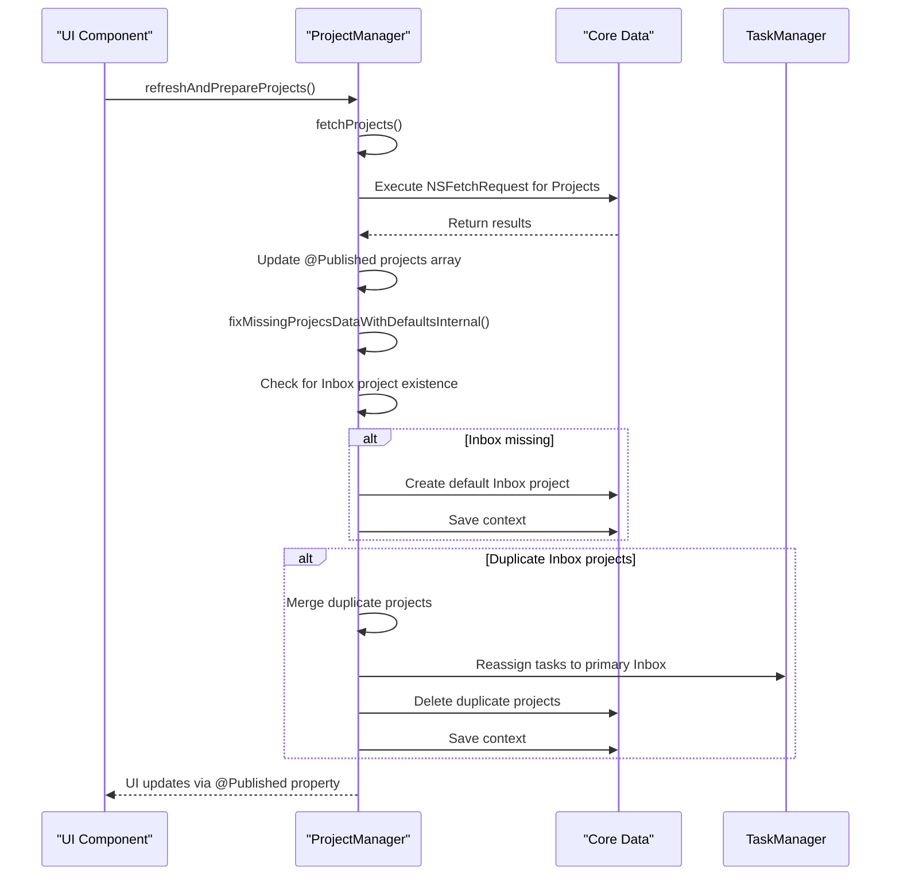
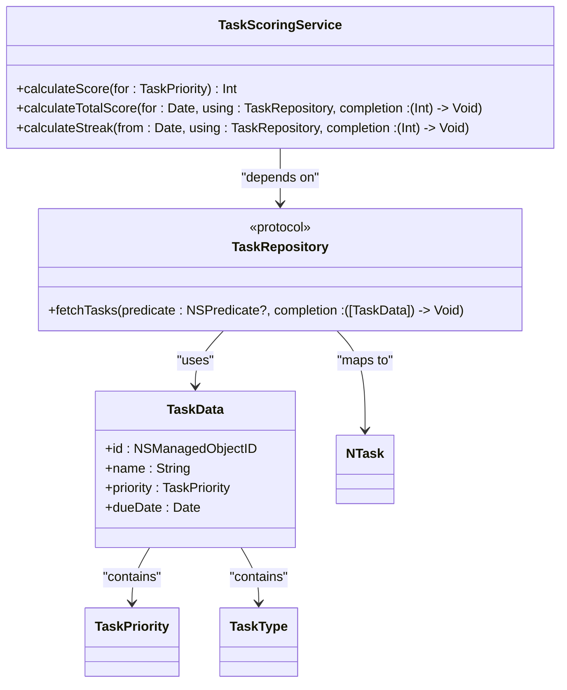
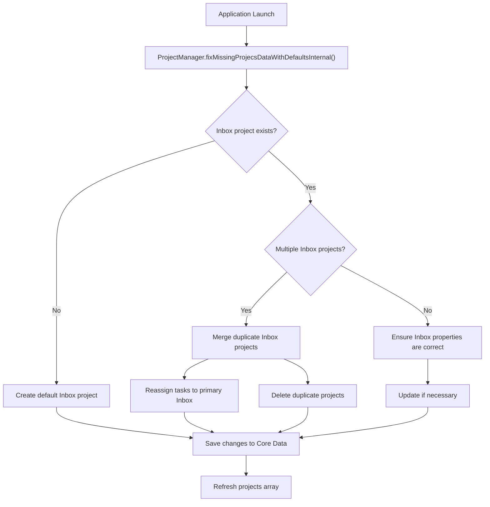
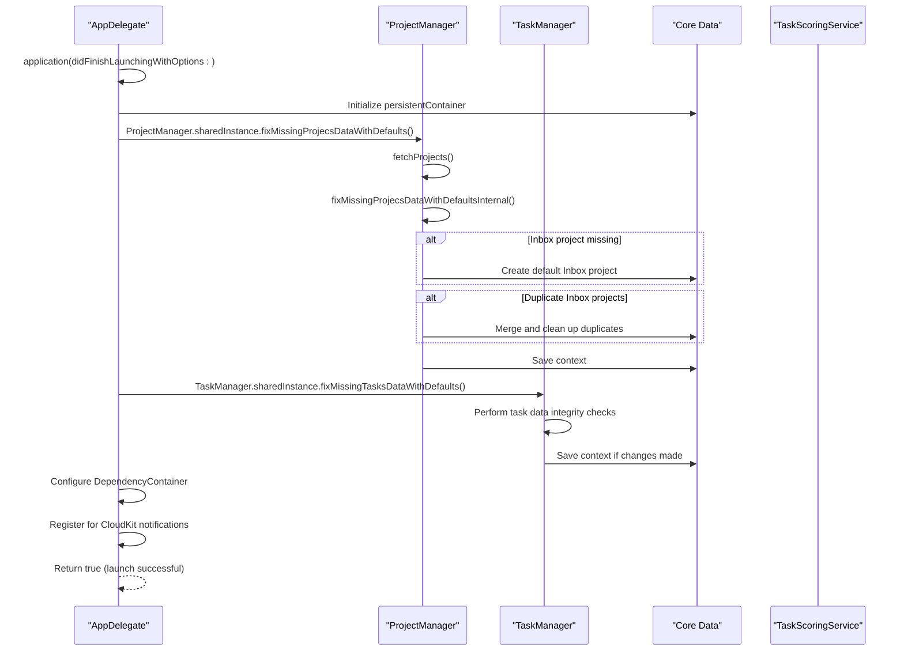
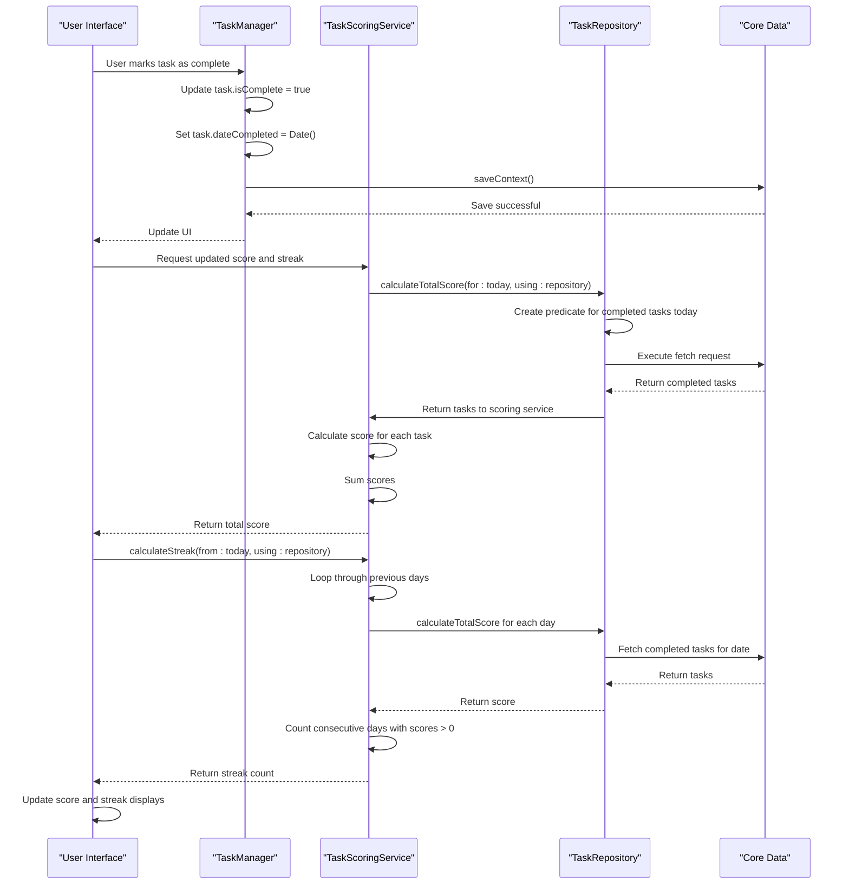
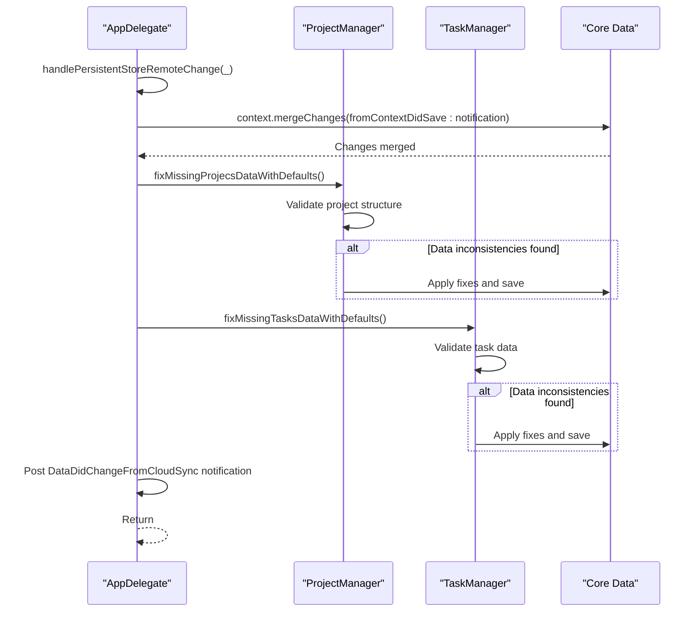
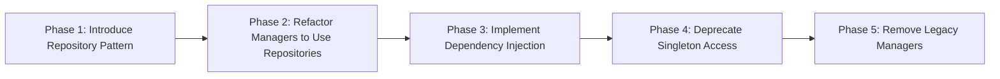

# Business Logic Layer

<cite>
**Referenced Files in This Document**   
- [TaskManager.swift](file://To%20Do%20List/ViewControllers/TaskManager.swift)
- [ProjectManager.swift](file://To%20Do%20List/ViewControllers/ProjectManager.swift)
- [TaskScoringService.swift](file://To%20Do%20List/Services/TaskScoringService.swift)
- [TaskRepository.swift](file://To%20Do%20List/Repositories/TaskRepository.swift)
- [TaskData.swift](file://To%20Do%20List/Models/TaskData.swift)
- [AppDelegate.swift](file://To%20Do%20List/AppDelegate.swift)
</cite>

## Table of Contents
1. [Introduction](#introduction)
2. [Core Business Logic Components](#core-business-logic-components)
3. [Legacy Manager Architecture](#legacy-manager-architecture)
4. [Modern Service-Oriented Components](#modern-service-oriented-components)
5. [Business Rule Implementation](#business-rule-implementation)
6. [Component Interaction and Data Flow](#component-interaction-and-data-flow)
7. [Complex Business Workflows](#complex-business-workflows)
8. [Backward Compatibility and Refactoring Challenges](#backward-compatibility-and-refactoring-challenges)
9. [Conclusion](#conclusion)

## Introduction
The Business Logic Layer in the Tasker application represents the core of the application's functionality, orchestrating task management, project organization, and gamification features. This documentation provides a comprehensive analysis of the architectural patterns, component interactions, and business rule implementations that govern the application's behavior. The layer exhibits a transitional architecture, maintaining legacy singleton managers while introducing modern service-oriented components, creating a hybrid approach to business logic management. This document will explore how these components coexist, how business rules are enforced, and how data flows through the system from user interaction to persistence.

## Core Business Logic Components

The Tasker application's business logic layer consists of several key components that work together to manage tasks, projects, and scoring systems. The architecture demonstrates a transition from legacy singleton patterns to modern service-oriented design, with careful consideration for backward compatibility.



**Diagram sources**
- [TaskManager.swift](file://To%20Do%20List/ViewControllers/TaskManager.swift#L62-L1004)
- [ProjectManager.swift](file://To%20Do%20List/ViewControllers/ProjectManager.swift#L20-L339)
- [TaskScoringService.swift](file://To%20Do%20List/Services/TaskScoringService.swift#L4-L154)
- [TaskRepository.swift](file://To%20Do%20List/Repositories/TaskRepository.swift#L3-L118)
- [TaskData.swift](file://To%20Do%20List/Models/TaskData.swift)

**Section sources**
- [TaskManager.swift](file://To%20Do%20List/ViewControllers/TaskManager.swift#L62-L1004)
- [ProjectManager.swift](file://To%20Do%20List/ViewControllers/ProjectManager.swift#L20-L339)
- [TaskScoringService.swift](file://To%20Do%20List/Services/TaskScoringService.swift#L4-L154)

## Legacy Manager Architecture

The legacy architecture of the Tasker application is built around singleton manager classes that provide centralized access to business logic and data management. These managers follow the traditional iOS application pattern of using shared instances to coordinate functionality across different parts of the application.

### TaskManager Implementation

The `TaskManager` class serves as the primary interface for task-related operations in the application. As a singleton, it provides a global point of access to task management functionality:

```swift
static let sharedInstance = TaskManager()
```

This singleton pattern allows any component in the application to access task management functionality without needing to instantiate the manager. The class maintains a direct reference to the Core Data managed object context, which it inherits from the AppDelegate during initialization.

The `TaskManager` implements a comprehensive set of methods for retrieving tasks based on various criteria:
- Date-based retrieval (today, specific date, upcoming)
- Project-based retrieval (inbox, custom projects)
- Time-of-day categorization (morning, evening)
- Completion status filtering

The class uses Core Data predicates extensively to filter tasks efficiently at the database level rather than in memory. This approach optimizes performance by leveraging Core Data's query capabilities.



**Diagram sources**
- [TaskManager.swift](file://To%20Do%20List/ViewControllers/TaskManager.swift#L500-L550)

**Section sources**
- [TaskManager.swift](file://To%20Do%20List/ViewControllers/TaskManager.swift#L62-L1004)

### ProjectManager Implementation

The `ProjectManager` class follows a similar singleton pattern and manages project-related functionality:

```swift
static let sharedInstance = ProjectManager()
```

Unlike the `TaskManager`, the `ProjectManager` adopts the `ObservableObject` protocol from the Combine framework, indicating its integration with SwiftUI's reactive programming model. This allows the UI to automatically update when project data changes.

The class maintains an `@Published` array of projects that serves as the single source of truth for UI updates:

```swift
@Published var projects: [Projects] = []
```

Key responsibilities of the `ProjectManager` include:
- Ensuring the existence of the default "Inbox" project
- Handling project creation, updating, and deletion
- Managing project-task relationships
- Resolving data inconsistencies (e.g., duplicate inbox projects)

The `fixMissingProjecsDataWithDefaultsInternal()` method demonstrates a critical data integrity function that runs during application initialization and after CloudKit synchronization to ensure the default project structure is maintained.



**Diagram sources**
- [ProjectManager.swift](file://To%20Do%20List/ViewControllers/ProjectManager.swift#L20-L339)

**Section sources**
- [ProjectManager.swift](file://To%20Do%20List/ViewControllers/ProjectManager.swift#L20-L339)

## Modern Service-Oriented Components

The Tasker application has begun transitioning from the legacy singleton manager pattern to a more modern service-oriented architecture. This evolution is exemplified by the `TaskScoringService`, which represents a cleaner separation of concerns and improved testability.

### TaskScoringService Design

The `TaskScoringService` class implements gamification features such as task scoring, streak tracking, and efficiency calculations. While it maintains a singleton interface for backward compatibility, its design incorporates modern software engineering principles:

```swift
final class TaskScoringService {
    static let shared = TaskScoringService()
    // ... methods
}
```

Key architectural improvements in this component include:
- **Dependency Injection**: The service accepts a `TaskRepository` parameter in its methods, allowing for easier testing and decoupling from specific data access implementations
- **Protocol-Based Design**: It depends on the `TaskRepository` protocol rather than a concrete implementation, enabling flexibility and testability
- **Asynchronous Operations**: Methods use completion handlers to support non-blocking operations, improving application responsiveness
- **Single Responsibility**: The service focuses exclusively on scoring and gamification logic, separating these concerns from general task management

### TaskRepository Abstraction

The `TaskRepository` protocol represents a significant architectural improvement over the legacy managers:

```swift
protocol TaskRepository {
    func fetchTasks(predicate: NSPredicate?, 
                   sortDescriptors: [NSSortDescriptor]?, 
                   completion: @escaping ([TaskData]) -> Void)
    // ... other methods
}
```

This protocol defines a contract for data access operations, enabling:
- **Dependency Inversion**: Higher-level components depend on abstractions rather than concrete implementations
- **Testability**: Mock repositories can be created for unit testing without requiring Core Data
- **Flexibility**: Different repository implementations can be swapped (e.g., for different data sources or caching strategies)
- **Separation of Concerns**: Data access logic is separated from business logic

The repository uses `TaskData` objects as data transfer objects (DTOs) rather than exposing Core Data managed objects directly, further decoupling the business logic from the persistence layer.



**Diagram sources**
- [TaskScoringService.swift](file://To%20Do%20List/Services/TaskScoringService.swift#L4-L154)
- [TaskRepository.swift](file://To%20Do%20List/Repositories/TaskRepository.swift#L3-L118)
- [TaskData.swift](file://To%20Do%20List/Models/TaskData.swift)

**Section sources**
- [TaskScoringService.swift](file://To%20Do%20List/Services/TaskScoringService.swift#L4-L154)
- [TaskRepository.swift](file://To%20Do%20List/Repositories/TaskRepository.swift#L3-L118)

## Business Rule Implementation

The business logic layer enforces several critical rules that govern the application's behavior, from task prioritization to data integrity constraints.

### Task Prioritization Rules

Task prioritization is implemented through the `TaskPriority` enum, which defines four priority levels with corresponding score values:

```swift
enum TaskPriority: Int32, CaseIterable {
    case low = 1          // P0 – Highest priority
    case medium = 2       // P1
    case high = 3         // P2
    case veryLow = 4      // P3 – Lowest priority
    
    var scoreValue: Int {
        switch self {
        case .high:      return 3
        case .medium:    return 2
        case .low:       return 1
        case .veryLow:   return 0
        }
    }
}
```

The scoring system demonstrates a tiered approach where higher priority tasks contribute more to the user's overall score. This implementation is used by both the legacy `TaskManager` (via the `scoreValue` property) and the modern `TaskScoringService` (which uses different scoring values).

### Project Management Rules

Project management enforces several business rules to maintain data integrity:

1. **Inbox Project Protection**: The default "Inbox" project cannot be renamed or deleted
2. **Project Name Uniqueness**: Project names must be unique (case-insensitive)
3. **Reserved Name Protection**: Cannot create a project named "Inbox"
4. **Task Reassignment**: When a project is deleted, its tasks are reassigned to the Inbox

These rules are implemented in the `ProjectManager` class through validation methods:

```swift
func updateProject(_ projectToUpdate: Projects, newName: String, newDescription: String) -> Bool {
    // Prevent renaming a normal project to "Inbox"
    if trimmedName.lowercased() == defaultProject.lowercased() && oldProjectName?.lowercased() != defaultProject.lowercased() {
        print("ProjectManager Error: Cannot rename project to 'Inbox'.")
        return false
    }
    // Prevent renaming the "Inbox" project to something else
    if oldProjectName?.lowercased() == defaultProject.lowercased() && trimmedName.lowercased() != defaultProject.lowercased() {
        print("ProjectManager Error: Cannot rename the default 'Inbox' project.")
        return false
    }
    // ... other validation
}
```

### Data Integrity Rules

The application implements several data integrity rules, particularly around the default project structure:



**Diagram sources**
- [ProjectManager.swift](file://To%20Do%20List/ViewControllers/ProjectManager.swift#L150-L250)

**Section sources**
- [ProjectManager.swift](file://To%20Do%20List/ViewControllers/ProjectManager.swift#L150-L250)

## Component Interaction and Data Flow

The business logic layer components interact with each other and with the presentation and data layers through well-defined interfaces and patterns.

### Application Initialization Flow

During application startup, several critical interactions occur to establish the business logic layer:



**Diagram sources**
- [AppDelegate.swift](file://To%20Do%20List/AppDelegate.swift#L50-L100)
- [ProjectManager.swift](file://To%20Do%20List/ViewControllers/ProjectManager.swift#L150-L250)

**Section sources**
- [AppDelegate.swift](file://To%20Do%20List/AppDelegate.swift#L50-L100)
- [ProjectManager.swift](file://To%20Do%20List/ViewControllers/ProjectManager.swift#L150-L250)

### User Action to Data Update Flow

When a user performs an action such as completing a task, the following flow occurs:



**Diagram sources**
- [TaskManager.swift](file://To%20Do%20List/ViewControllers/TaskManager.swift#L800-L900)
- [TaskScoringService.swift](file://To%20Do%20List/Services/TaskScoringService.swift#L50-L100)

**Section sources**
- [TaskManager.swift](file://To%20Do%20List/ViewControllers/TaskManager.swift#L800-L900)
- [TaskScoringService.swift](file://To%20Do%20List/Services/TaskScoringService.swift#L50-L100)

## Complex Business Workflows

The business logic layer handles several complex workflows that involve multiple components and business rules.

### Task Completion Impact on Scoring and Streaks

When a task is completed, it triggers a cascade of effects on the user's gamification metrics:

```swift
func calculateStreak(from fromDate: Date, using repository: TaskRepository, completion: @escaping (Int) -> Void) {
    let calendar = Calendar.current
    let startOfToday = calendar.startOfDay(for: Date())
    
    var currentDate = startOfToday
    var streak = 0
    var checkNextDay = true
    
    let group = DispatchGroup()
    
    for dayOffset in 0..<30 {
        if !checkNextDay { break }
        
        currentDate = calendar.date(byAdding: .day, value: -dayOffset, to: startOfToday)!
        
        group.enter()
        calculateTotalScore(for: currentDate, using: repository) { score in
            if score > 0 {
                streak += 1
                checkNextDay = true
            } else {
                checkNextDay = false
            }
            group.leave()
        }
        
        group.wait()
    }
    
    completion(streak)
}
```

This workflow demonstrates several important characteristics:
- **Asynchronous Operations**: The streak calculation involves multiple asynchronous calls to calculate the daily score
- **Sequential Processing**: Days are checked in sequence from today backward
- **Early Termination**: The loop stops as soon as a day with no score is found
- **Thread Safety**: DispatchGroup is used to synchronize the asynchronous operations

### CloudKit Synchronization and Data Integrity

The application handles CloudKit synchronization through a sophisticated notification system that maintains data integrity across devices:



**Diagram sources**
- [AppDelegate.swift](file://To%20Do%20List/AppDelegate.swift#L150-L180)

**Section sources**
- [AppDelegate.swift](file://To%20Do%20List/AppDelegate.swift#L150-L180)

## Backward Compatibility and Refactoring Challenges

The Tasker application faces several challenges in maintaining backward compatibility while refactoring toward a cleaner architecture.

### Coexistence of Legacy and Modern Patterns

The application currently maintains both legacy singleton managers and modern service-oriented components:

```swift
// Legacy pattern
let tasks = TaskManager.sharedInstance.getAllTasks

// Modern pattern
TaskScoringService.shared.calculateTotalScore(for: date, using: repository) { score in
    // Handle score
}
```

This hybrid approach creates several challenges:
- **Inconsistent APIs**: Different components use different patterns for similar functionality
- **Duplication of Logic**: Some business rules are implemented in multiple places
- **Migration Complexity**: Transitioning from one pattern to another requires careful coordination

### Refactoring Opportunities

Several opportunities exist for improving the architecture:

1. **Dependency Injection**: Replace singleton references with dependency injection
2. **Protocol Adoption**: Have legacy managers adopt protocols for better testability
3. **Consistent Error Handling**: Standardize error handling across components
4. **Unified Data Access**: Consolidate data access patterns between legacy and modern components

### Migration Strategy

A phased migration strategy could be implemented:



This approach would allow for gradual refactoring without disrupting existing functionality.

**Section sources**
- [TaskManager.swift](file://To%20Do%20List/ViewControllers/TaskManager.swift#L62-L1004)
- [TaskScoringService.swift](file://To%20Do%20List/Services/TaskScoringService.swift#L4-L154)
- [TaskRepository.swift](file://To%20Do%20List/Repositories/TaskRepository.swift#L3-L118)

## Conclusion

The Business Logic Layer in the Tasker application represents a transitional architecture that balances the need for backward compatibility with the desire for modern, maintainable code. The coexistence of legacy singleton managers and modern service-oriented components demonstrates an evolutionary approach to software architecture.

Key strengths of the current implementation include:
- Comprehensive business rule enforcement
- Robust data integrity mechanisms
- Effective handling of asynchronous operations
- Thoughtful consideration for user experience through gamification

Areas for improvement include:
- Standardizing architectural patterns across components
- Enhancing testability through dependency injection
- Reducing code duplication between legacy and modern components
- Improving error handling consistency

The hybrid architecture successfully supports the application's current functionality while providing a foundation for future refactoring. By continuing the transition toward service-oriented design and protocol-based dependencies, the application can achieve greater maintainability, testability, and flexibility in the future.