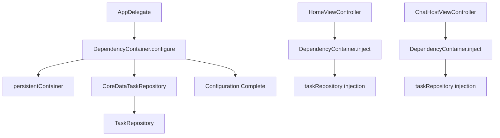
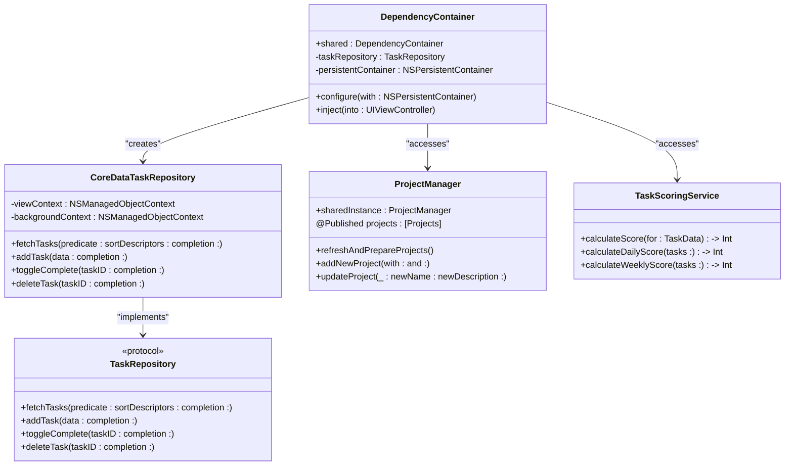
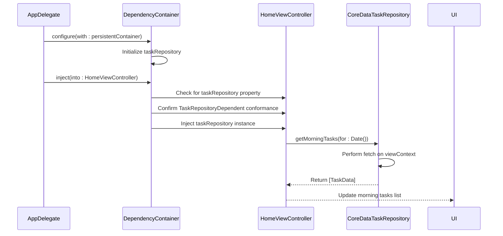
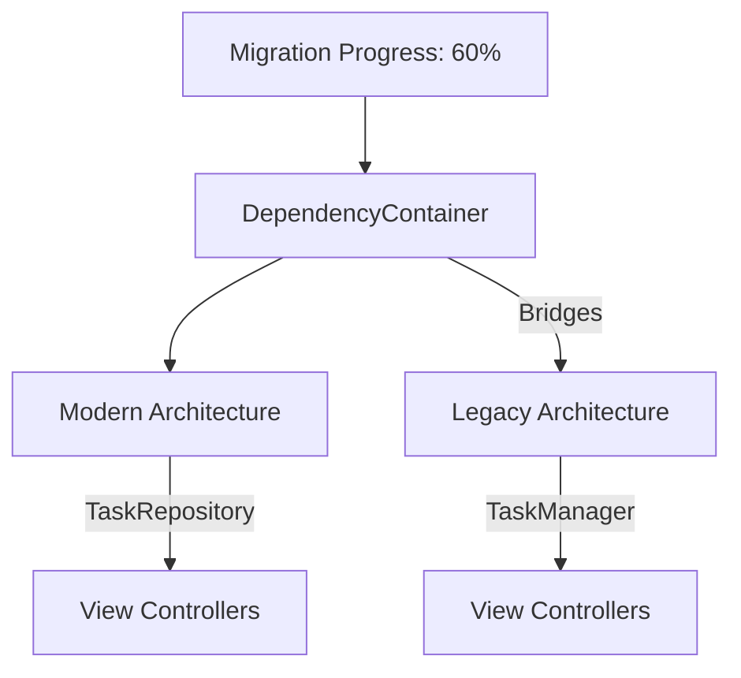

# DependencyContainer

<cite>
**Referenced Files in This Document**   
- [DependencyContainer.swift](file://To%20Do%20List/Managers/DependencyContainer.swift)
- [CoreDataTaskRepository.swift](file://To%20Do%20List/Repositories/CoreDataTaskRepository.swift)
- [TaskRepository.swift](file://To%20Do%20List/Repositories/TaskRepository.swift)
- [ProjectManager.swift](file://To%20Do%20List/ViewControllers/ProjectManager.swift)
- [README.md](file://README.md)
</cite>

## Table of Contents
1. [Introduction](#introduction)
2. [Architecture Overview](#architecture-overview)
3. [Core Components](#core-components)
4. [Initialization and Configuration](#initialization-and-configuration)
5. [Dependency Injection Patterns](#dependency-injection-patterns)
6. [Service Lifetime Management](#service-lifetime-management)
7. [Testing Support](#testing-support)
8. [Legacy Integration](#legacy-integration)
9. [Registration Guidelines](#registration-guidelines)

## Introduction

The **DependencyContainer** serves as the central hub for dependency injection within the Tasker application's business logic layer. It enables loose coupling between view controllers and business logic components by providing a centralized mechanism to resolve and inject dependencies. This container manages the lifecycle of key services including **TaskManager**, **ProjectManager**, **TaskScoringService**, and repository components such as **TaskRepository**.

By abstracting away direct instantiation, the DependencyContainer promotes testability, maintainability, and architectural consistency across the codebase. It plays a critical role in bridging legacy singleton patterns with modern dependency injection practices, facilitating a gradual migration toward clean architecture principles.

**Section sources**
- [README.md](file://README.md#L148-L232)

## Architecture Overview

The DependencyContainer operates as a service locator and injector, managing application-wide dependencies through a singleton instance. It follows a configuration-over-convention approach where dependencies are explicitly set up during application launch.



**Diagram sources**
- [DependencyContainer.swift](file://To%20Do%20List/Managers/DependencyContainer.swift#L1-L80)
- [AppDelegate.swift](file://To%20Do%20List/AppDelegate.swift#L1-L50)

## Core Components

The DependencyContainer orchestrates several key components that form the backbone of the application's data access and business logic layers:

- **TaskRepository**: Protocol defining task data operations
- **CoreDataTaskRepository**: Concrete implementation using Core Data
- **NSPersistentContainer**: Core Data stack managed by AppDelegate
- **ProjectManager**: Singleton managing project-related operations
- **TaskScoringService**: Utility for calculating task completion scores

These components are resolved and provided by the container, ensuring consistent access across view controllers while enabling abstraction and testability.



**Diagram sources**
- [DependencyContainer.swift](file://To%20Do%20List/Managers/DependencyContainer.swift#L1-L80)
- [TaskRepository.swift](file://To%20Do%20List/Repositories/TaskRepository.swift#L1-L117)
- [CoreDataTaskRepository.swift](file://To%20Do%20List/Repositories/CoreDataTaskRepository.swift#L1-L454)
- [ProjectManager.swift](file://To%20Do%20List/ViewControllers/ProjectManager.swift#L1-L338)
- [README.md](file://README.md#L652-L690)

**Section sources**
- [DependencyContainer.swift](file://To%20Do%20List/Managers/DependencyContainer.swift#L1-L80)
- [TaskRepository.swift](file://To%20Do%20List/Repositories/TaskRepository.swift#L1-L117)
- [CoreDataTaskRepository.swift](file://To%20Do%20List/Repositories/CoreDataTaskRepository.swift#L1-L454)

## Initialization and Configuration

The DependencyContainer is initialized during app launch in AppDelegate, following a two-phase setup process:

1. **Container Creation**: The shared instance is created when first accessed
2. **Configuration**: Dependencies are wired up using the `configure(with:)` method

This configuration occurs in the AppDelegate's `application(_:didFinishLaunchingWithOptions:)` method, where the Core Data persistent container is passed to the DependencyContainer for initialization.

```swift
func application(_ application: UIApplication, didFinishLaunchingWithOptions launchOptions: [UIApplication.LaunchOptionsKey: Any]?) -> Bool {
    guard let container = (window?.rootViewController as? UINavigationController)?.viewControllers.first as? AppDelegate else {
        return false
    }
    
    DependencyContainer.shared.configure(with: container.persistentContainer)
    return true
}
```

The configuration process sets up the **CoreDataTaskRepository** with the provided persistent container and assigns it to the **taskRepository** property, making it available for injection into view controllers.

**Section sources**
- [DependencyContainer.swift](file://To%20Do%20List/Managers/DependencyContainer.swift#L1-L80)
- [AppDelegate.swift](file://To%20Do%20List/AppDelegate.swift#L1-L50)

## Dependency Injection Patterns

The DependencyContainer enables dependency injection through its `inject(into:)` method, which uses runtime reflection to identify and populate dependency properties in view controllers. This approach allows for non-invasive dependency injection without requiring base classes or complex frameworks.

### HomeViewController Usage

The HomeViewController receives its **taskRepository** dependency through injection, replacing direct calls to the legacy **TaskManager** singleton:

```swift
class HomeViewController: UIViewController, TaskRepositoryDependent {
    var taskRepository: TaskRepository!
    
    func viewDidLoad() {
        super.viewDidLoad()
        // Use injected repository instead of TaskManager.sharedInstance
        taskRepository.getMorningTasks(for: Date()) { tasks in
            // Update UI with fetched tasks
        }
    }
}
```

### ChatHostViewController Usage

Similarly, the ChatHostViewController benefits from dependency injection:

```swift
class ChatHostViewController: UIViewController, TaskRepositoryDependent {
    var taskRepository: TaskRepository!
    
    func sendMessage() {
        let newTask = TaskData(name: "Follow up", project: "Inbox", priority: .medium)
        taskRepository.addTask(data: newTask) { result in
            switch result {
            case .success(let task):
                print("Task created: \(task.name)")
            case .failure(let error):
                print("Failed to create task: \(error)")
            }
        }
    }
}
```

The injection process recursively traverses child view controllers, ensuring all descendants receive their required dependencies.



**Diagram sources**
- [DependencyContainer.swift](file://To%20Do%20List/Managers/DependencyContainer.swift#L1-L80)
- [HomeViewController.swift](file://To%20Do%20List/ViewControllers/HomeViewController.swift#L1-L200)

**Section sources**
- [DependencyContainer.swift](file://To%20Do%20List/Managers/DependencyContainer.swift#L1-L80)
- [HomeViewController.swift](file://To%20Do%20List/ViewControllers/HomeViewController.swift#L1-L200)
- [ChatHostViewController.swift](file://To%20Do%20List/ViewControllers/ChatHostViewController.swift#L1-L150)

## Service Lifetime Management

The DependencyContainer manages service lifetimes through explicit configuration and ownership:

- **Singleton Lifetime**: The **DependencyContainer.shared** instance and its owned services (**taskRepository**) exist for the application's lifetime
- **Transient Components**: Individual task and project instances are created and destroyed as needed
- **Context Management**: The **CoreDataTaskRepository** manages its own **viewContext** and **backgroundContext** with appropriate merge policies

The container ensures that the **taskRepository** is configured as a singleton, providing consistent state across the application while allowing for background operations on a separate managed object context.

```swift
// Service lifetime configuration
func configure(with container: NSPersistentContainer) {
    self.persistentContainer = container
    self.taskRepository = CoreDataTaskRepository(container: container) // Singleton instance
}
```

This approach balances performance (through shared instances) with thread safety (through context isolation).

**Section sources**
- [DependencyContainer.swift](file://To%20Do%20List/Managers/DependencyContainer.swift#L1-L80)
- [CoreDataTaskRepository.swift](file://To%20Do%20List/Repositories/CoreDataTaskRepository.swift#L1-L454)

## Testing Support

The DependencyContainer significantly enhances testability by enabling dependency substitution:

- **Mock Replacement**: During unit tests, mock implementations of **TaskRepository** can be injected
- **Isolation**: Components can be tested in isolation without requiring Core Data setup
- **Behavior Verification**: Test-specific behavior can be programmed into mock repositories

```swift
// Example test setup
func testHomeViewController() {
    let mockRepository = MockTaskRepository()
    let viewController = HomeViewController()
    
    DependencyContainer.shared.taskRepository = mockRepository
    DependencyContainer.shared.inject(into: viewController)
    
    // Trigger data loading
    viewController.viewDidLoad()
    
    // Verify interactions
    XCTAssertTrue(mockRepository.getMorningTasksCalled)
}
```

This capability allows for comprehensive unit testing of view controllers without relying on actual data persistence, dramatically improving test speed and reliability.

**Section sources**
- [DependencyContainer.swift](file://To%20Do%20List/Managers/DependencyContainer.swift#L1-L80)
- [TaskRepository.swift](file://To%20Do%20List/Repositories/TaskRepository.swift#L1-L117)

## Legacy Integration

The DependencyContainer serves as a bridge between legacy singleton patterns and modern dependency injection practices:

- **Coexistence**: Both **TaskManager.sharedInstance** and injected **taskRepository** can operate simultaneously
- **Gradual Migration**: View controllers can be refactored incrementally to use dependency injection
- **Abstraction Layer**: The container abstracts away the underlying implementation details

The current architecture represents a hybrid state where newer view controllers use dependency injection while legacy components continue to use singletons. The **README.md** indicates that 60% of the migration is complete, with **HomeViewController** still dependent on the **TaskManager** singleton.



This transitional approach minimizes risk while enabling steady progress toward a fully decoupled architecture.

**Diagram sources**
- [README.md](file://README.md#L148-L220)
- [DependencyContainer.swift](file://To%20Do%20List/Managers/DependencyContainer.swift#L1-L80)

**Section sources**
- [README.md](file://README.md#L974-L985)
- [DependencyContainer.swift](file://To%20Do%20List/Managers/DependencyContainer.swift#L1-L80)

## Registration Guidelines

To register new services within the DependencyContainer:

1. **Define Protocol**: Create a protocol for the service interface
2. **Implement Concrete Class**: Provide a concrete implementation
3. **Add Property**: Add a private property to DependencyContainer
4. **Configure Instance**: Initialize the service in the `configure(with:)` method
5. **Inject Dependencies**: Extend the `inject(into:)` method to support the new dependency

```swift
// Example: Registering a new LoggingService
class DependencyContainer {
    private(set) var loggingService: LoggingService!
    
    func configure(with container: NSPersistentContainer) {
        self.persistentContainer = container
        self.taskRepository = CoreDataTaskRepository(container: container)
        self.loggingService = DefaultLoggingService() // New service registration
    }
}
```

Services should be registered as singletons when they manage shared state or resources, and as transient instances when they represent ephemeral operations or data.

**Section sources**
- [DependencyContainer.swift](file://To%20Do%20List/Managers/DependencyContainer.swift#L1-L80)
- [README.md](file://README.md#L278-L306)