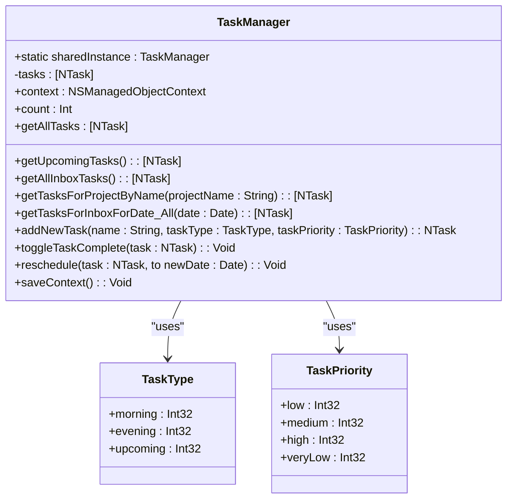
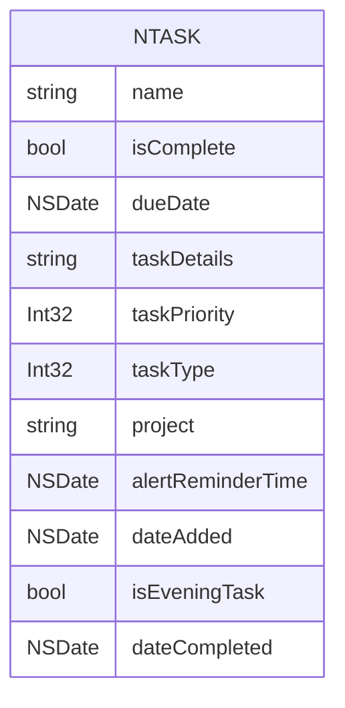
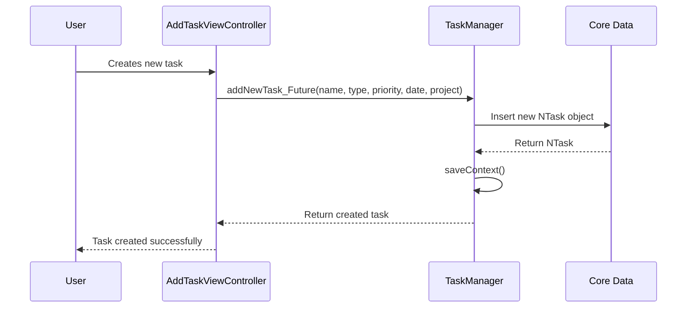
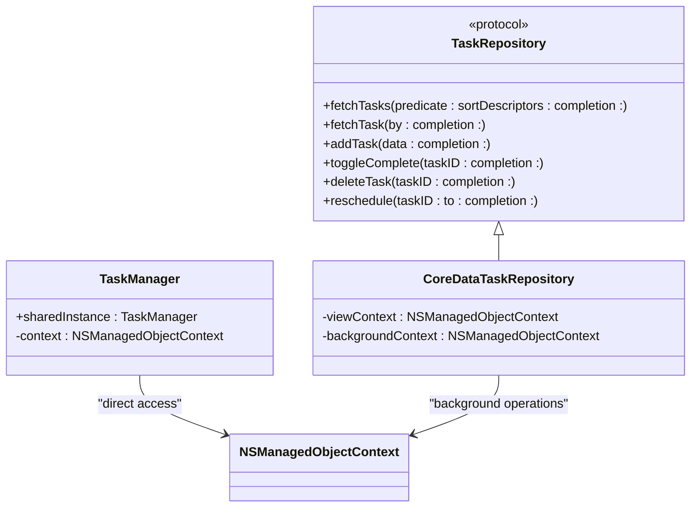

# TaskManager

<cite>
**Referenced Files in This Document**   
- [TaskManager.swift](file://To%20Do%20List/ViewControllers/TaskManager.swift)
- [NTask+CoreDataProperties.swift](file://To%20Do%20List/NTask+CoreDataProperties.swift)
- [NTask+CoreDataClass.swift](file://To%20Do%20List/NTask+CoreDataClass.swift)
- [HomeViewController.swift](file://To%20Do%20List/ViewControllers/HomeViewController.swift)
- [AddTaskViewController.swift](file://To%20Do%20List/ViewControllers/AddTaskViewController.swift)
- [CoreDataTaskRepository.swift](file://To%20Do%20List/Repositories/CoreDataTaskRepository.swift)
- [TaskRepository.swift](file://To%20Do%20List/Repositories/TaskRepository.swift)
- [TaskData.swift](file://To%20Do%20List/Models/TaskData.swift)
</cite>

## Table of Contents
1. [Introduction](#introduction)
2. [Core Responsibilities](#core-responsibilities)
3. [Data Model and Core Data Integration](#data-model-and-core-data-integration)
4. [Task Creation and Modification](#task-creation-and-modification)
5. [Task Completion and State Management](#task-completion-and-state-management)
6. [Priority and Due Date Validation](#priority-and-due-date-validation)
7. [Interaction with View Controllers](#interaction-with-view-controllers)
8. [Coexistence with Modern TaskRepository](#coexistence-with-modern-taskrepository)
9. [Code Examples](#code-examples)
10. [Challenges and Refactoring Recommendations](#challenges-and-refactoring-recommendations)

## Introduction

The **TaskManager** component is a legacy singleton class responsible for managing all task-related business logic in the Tasker application. It serves as the central hub for creating, retrieving, updating, and deleting tasks, tightly coupled with Core Data through direct access to the **NTask** entity. This document provides a comprehensive analysis of its architecture, functionality, and integration points, while also addressing its current coexistence with the modern **TaskRepository** pattern and outlining recommendations for gradual refactoring.

**Section sources**
- [TaskManager.swift](file://To%20Do%20List/ViewControllers/TaskManager.swift#L1-L50)

## Core Responsibilities

The **TaskManager** class encapsulates the core business logic for task management in the application. Its primary responsibilities include:

- **CRUD Operations**: Creating, reading, updating, and deleting tasks from the persistent store.
- **Task Retrieval and Filtering**: Providing methods to fetch tasks based on various criteria such as project, date, completion status, and time of day (morning/evening).
- **State Management**: Maintaining a global state of tasks and ensuring data consistency across the application.
- **Business Rule Enforcement**: Enforcing application-specific rules regarding task priorities, due dates, and project assignments.

The class is implemented as a singleton using the **sharedInstance** static property, ensuring that only one instance exists throughout the application lifecycle. This design allows any component to access task management functionality without needing to instantiate the class.



**Diagram sources**
- [TaskManager.swift](file://To%20Do%20List/ViewControllers/TaskManager.swift#L50-L100)

**Section sources**
- [TaskManager.swift](file://To%20Do%20List/ViewControllers/TaskManager.swift#L50-L150)

## Data Model and Core Data Integration

The **TaskManager** interacts directly with the **NTask** Core Data entity, which represents a single task in the application. The **NTask** entity contains various attributes that define a task's properties, including its name, completion status, due date, priority, project assignment, and timestamps.

The **TaskManager** maintains a reference to the **NSManagedObjectContext** obtained from the **AppDelegate**, which is used for all Core Data operations. This tight coupling with Core Data is evident in methods like **addNewTask**, which uses **NSEntityDescription.insertNewObject(forEntityName:into:)** to create new managed objects.



**Diagram sources**
- [NTask+CoreDataProperties.swift](file://To%20Do%20List/NTask+CoreDataProperties.swift#L10-L30)
- [NTask+CoreDataClass.swift](file://To%20Do%20List/NTask+CoreDataClass.swift#L1-L10)

**Section sources**
- [NTask+CoreDataProperties.swift](file://To%20Do%20List/NTask+CoreDataProperties.swift#L1-L50)
- [NTask+CoreDataClass.swift](file://To%20Do%20List/NTask+CoreDataClass.swift#L1-L17)

## Task Creation and Modification

The **TaskManager** provides multiple methods for creating new tasks, each tailored to specific use cases within the application. The primary method, **addNewTask(name:taskType:taskPriority:)**, creates a new task with the specified name, type, and priority, setting default values for other properties.

```swift
@discardableResult
func addNewTask(name: String, taskType: TaskType, taskPriority: TaskPriority) -> NTask {
    let task = NSEntityDescription.insertNewObject(forEntityName: "NTask", into: context) as! NTask
    
    task.name = name
    task.isComplete = false
    task.taskDetails = ""
    task.type = taskType
    task.priority = taskPriority
    
    saveContext()
    return task
}
```

Additional methods like **addNewTask_Today** and **addNewTask_Future** provide convenience for creating tasks scheduled for the current day or a future date, respectively. These methods set the **dueDate** property accordingly and handle project assignment, defaulting to the "inbox" project if none is specified.

The **TaskManager** also includes methods for modifying existing tasks, such as **reschedule(task:to:)**, which updates a task's due date, and **toggleTaskComplete(task:)**, which changes a task's completion status.

**Section sources**
- [TaskManager.swift](file://To%20Do%20List/ViewControllers/TaskManager.swift#L300-L400)

## Task Completion and State Management

Managing task completion is a critical responsibility of the **TaskManager**. The **toggleTaskComplete(task:)** method handles the logic for marking a task as complete or incomplete. When a task is completed, the method sets the **dateCompleted** property to the current date; when marked incomplete, it clears this property.

```swift
func toggleTaskComplete(task: NTask) {
    let wasComplete = task.isComplete
    task.isComplete.toggle()
    if task.isComplete {
        task.dateCompleted = Date.today() as NSDate
    } else {
        task.dateCompleted = nil
    }
    saveContext()
    
    NotificationCenter.default.post(name: NSNotification.Name("TaskCompletionChanged"), object: nil)
}
```

After updating the task's state, the method calls **saveContext()** to persist the changes to Core Data. It also posts a **TaskCompletionChanged** notification via **NotificationCenter**, allowing other parts of the application (such as charts or UI components) to react to the change in task status.

**Section sources**
- [TaskManager.swift](file://To%20Do%20List/ViewControllers/TaskManager.swift#L750-L780)

## Priority and Due Date Validation

The **TaskManager** enforces business rules related to task priorities and due dates through its interaction with the **TaskPriority** and **TaskType** enums. The **TaskPriority** enum defines four levels of priority: **low** (P0), **medium** (P1), **high** (P2), and **veryLow** (P3), with higher values indicating higher priority.

The class ensures that tasks are created with valid priority and type values by using the enum's **rawValue** property when setting the corresponding attributes on the **NTask** entity. For example, when creating a new task, the **taskPriority** parameter is converted to its **Int32** raw value and assigned to the **taskPriority** property of the **NTask** object.

Due date validation is handled implicitly through the use of **Date** objects and Core Data's type safety. The **TaskManager** provides methods like **getTasksForInboxForDate_All(date:)** that construct **NSPredicate** objects to filter tasks based on their due dates, ensuring that only tasks with valid date ranges are retrieved.

**Section sources**
- [TaskManager.swift](file://To%20Do%20List/ViewControllers/TaskManager.swift#L20-L50)
- [TaskManager.swift](file://To%20Do%20List/ViewControllers/TaskManager.swift#L600-L700)

## Interaction with View Controllers

The **TaskManager** interacts closely with view controllers such as **HomeViewController** and **AddTaskViewController** to respond to user actions. These view controllers use the **TaskManager.sharedInstance** to perform task-related operations, such as creating new tasks or retrieving existing ones.

For example, the **AddTaskViewController** calls **TaskManager.addNewTask_Future()** when a user creates a new task with a future due date. Similarly, the **HomeViewController** uses **TaskManager.getMorningTasks(for:)** and **TaskManager.getEveningTasksForToday()** to populate its UI with the appropriate tasks for the current day.



**Diagram sources**
- [TaskManager.swift](file://To%20Do%20List/ViewControllers/TaskManager.swift#L800-L900)
- [AddTaskViewController.swift](file://To%20Do%20List/ViewControllers/AddTaskViewController.swift#L1-L50)
- [HomeViewController.swift](file://To%20Do%20List/ViewControllers/HomeViewController.swift#L1-L50)

**Section sources**
- [AddTaskViewController.swift](file://To%20Do%20List/ViewControllers/AddTaskViewController.swift#L1-L200)
- [HomeViewController.swift](file://To%20Do%20List/ViewControllers/HomeViewController.swift#L1-L200)

## Coexistence with Modern TaskRepository

The **TaskManager** currently coexists with a modern **TaskRepository** pattern, which represents a shift toward dependency injection and protocol-oriented programming. The **TaskRepository** protocol defines a contract for task data access, with **CoreDataTaskRepository** providing a concrete implementation.

This dual architecture creates a transitional state where some components use the legacy **TaskManager** singleton, while others use the injected **TaskRepository** dependency. The **HomeViewController** and **AddTaskViewController** both conform to the **TaskRepositoryDependent** protocol, indicating that they are designed to work with the modern repository pattern, but they still rely on **TaskManager** for certain operations.

The **CoreDataTaskRepository** implements asynchronous methods with completion handlers, using background contexts for data manipulation to avoid blocking the main thread. In contrast, the **TaskManager** uses synchronous operations on the main context, which can lead to performance issues and reduced testability.



**Diagram sources**
- [TaskRepository.swift](file://To%20Do%20List/Repositories/TaskRepository.swift#L1-L118)
- [CoreDataTaskRepository.swift](file://To%20Do%20List/Repositories/CoreDataTaskRepository.swift#L1-L50)

**Section sources**
- [TaskRepository.swift](file://To%20Do%20List/Repositories/TaskRepository.swift#L1-L118)
- [CoreDataTaskRepository.swift](file://To%20Do%20List/Repositories/CoreDataTaskRepository.swift#L1-L200)

## Code Examples

### Creating a New Task

```swift
let newTask = TaskManager.sharedInstance.addNewTask(
    name: "Complete documentation",
    taskType: .morning,
    taskPriority: .high
)
```

### Marking a Task as Completed

```swift
TaskManager.sharedInstance.toggleTaskComplete(task: myTask)
```

### Retrieving Morning Tasks for Today

```swift
let morningTasks = TaskManager.sharedInstance.getMorningTasks(for: Date.today())
```

### Rescheduling a Task

```swift
let newDueDate = Calendar.current.date(byAdding: .day, value: 1, to: Date())!
TaskManager.sharedInstance.reschedule(task: myTask, to: newDueDate)
```

**Section sources**
- [TaskManager.swift](file://To%20Do%20List/ViewControllers/TaskManager.swift#L300-L900)

## Challenges and Refactoring Recommendations

The **TaskManager** singleton presents several challenges that impact the application's testability, maintainability, and scalability:

- **Global State**: The singleton pattern creates global state, making it difficult to isolate components for testing and increasing the risk of unintended side effects.
- **Tight Coupling**: Direct dependency on Core Data and the **AppDelegate** makes the class difficult to unit test and tightly couples the business logic to the persistence layer.
- **Synchronous Operations**: Performing Core Data operations on the main thread can lead to UI freezes and degraded performance, especially with large datasets.
- **Limited Extensibility**: The monolithic design makes it difficult to extend or modify behavior without affecting the entire application.

To address these challenges, the following refactoring recommendations are proposed:

1. **Adopt Dependency Injection**: Gradually replace direct calls to **TaskManager.sharedInstance** with injected instances of **TaskRepository**. This will decouple the view controllers from the specific implementation and make the code more testable.

2. **Implement Protocol Abstraction**: Define a **TaskManagerProtocol** that mirrors the public interface of **TaskManager**, then refactor the class to conform to this protocol. This will allow for easier mocking in tests and facilitate the transition to the **TaskRepository** pattern.

3. **Migrate to Asynchronous Operations**: Update the **TaskManager** methods to use completion handlers or async/await patterns, performing Core Data operations on background contexts to avoid blocking the main thread.

4. **Deprecate and Remove**: Once all components have been migrated to use **TaskRepository**, mark **TaskManager** as deprecated and eventually remove it from the codebase.

5. **Improve Error Handling**: Enhance error handling in **saveContext()** and other Core Data operations to provide more meaningful feedback and prevent silent failures.

By following these recommendations, the application can evolve toward a more modular, testable, and maintainable architecture, reducing technical debt and improving long-term sustainability.

**Section sources**
- [TaskManager.swift](file://To%20Do%20List/ViewControllers/TaskManager.swift#L1-L1004)
- [CoreDataTaskRepository.swift](file://To%20Do%20List/Repositories/CoreDataTaskRepository.swift#L1-L455)
- [TaskRepository.swift](file://To%20Do%20List/Repositories/TaskRepository.swift#L1-L118)