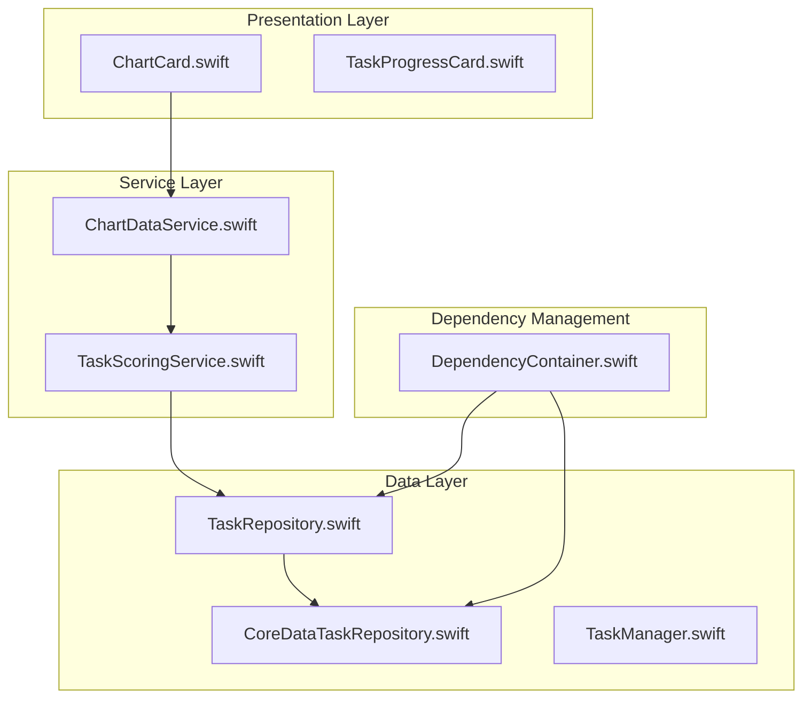
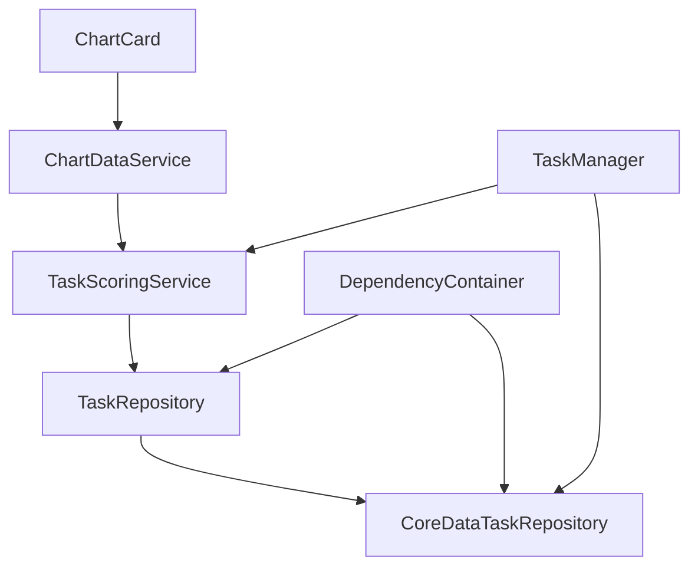
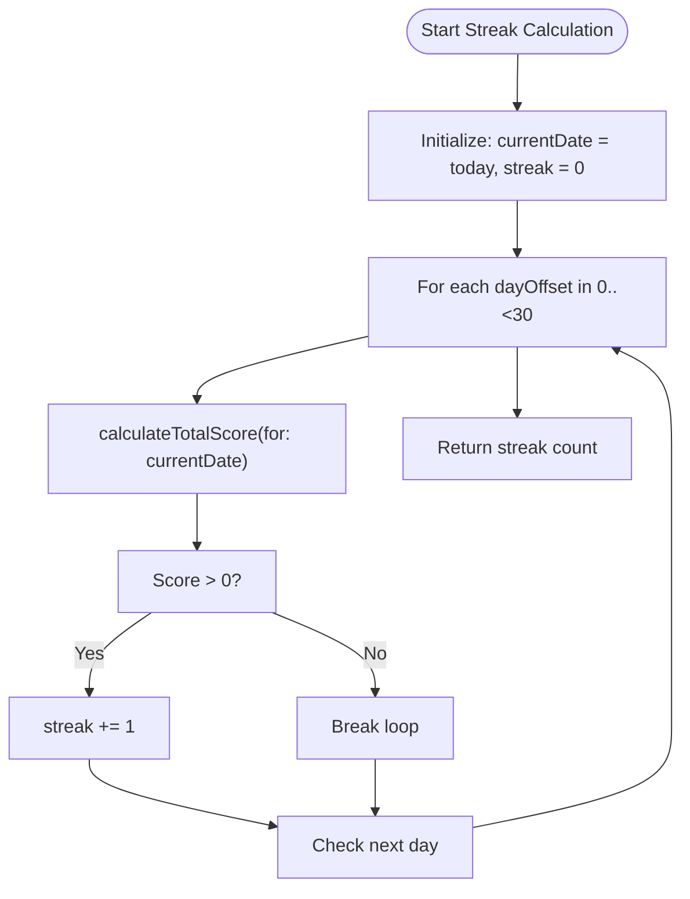
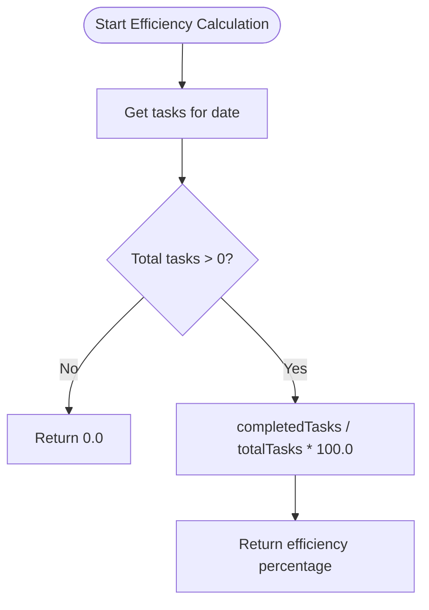
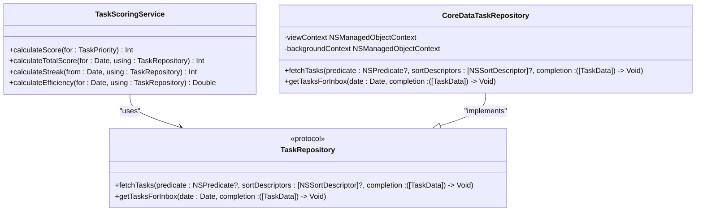
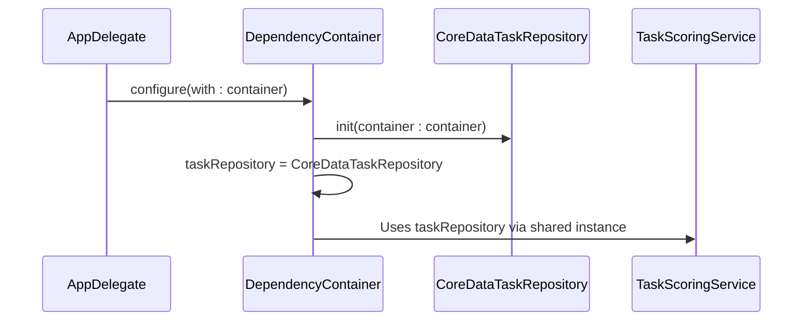
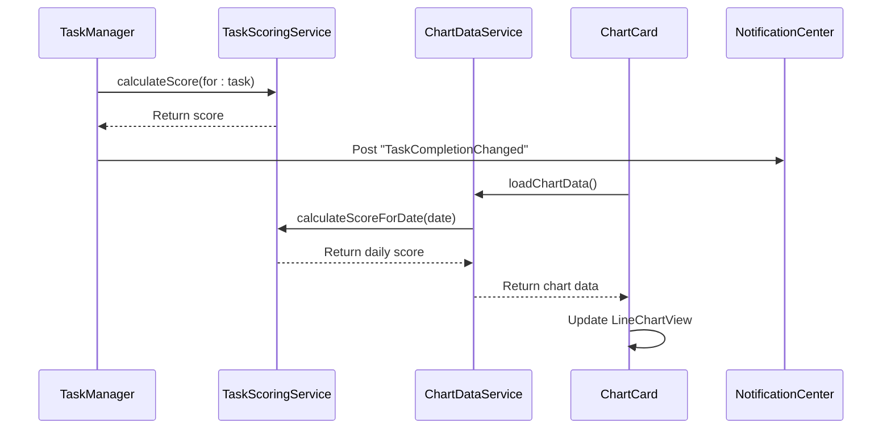
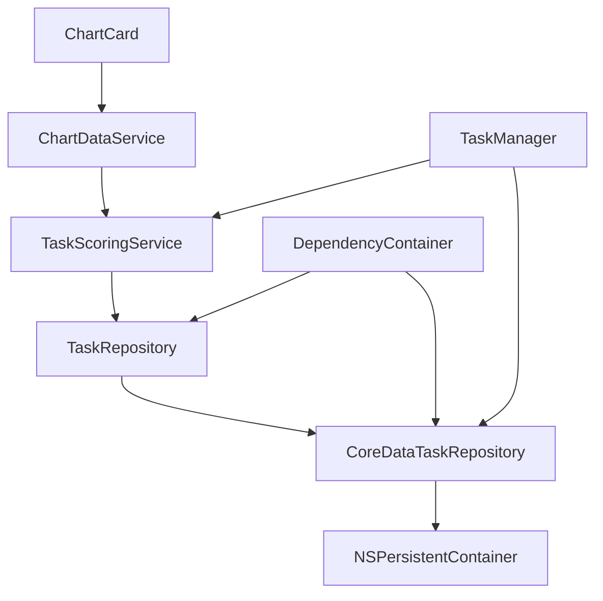

# TaskScoringService

<cite>
**Referenced Files in This Document**   
- [TaskScoringService.swift](file://To%20Do%20List/Services/TaskScoringService.swift)
- [TaskManager.swift](file://To%20Do%20List/ViewControllers/TaskManager.swift)
- [TaskRepository.swift](file://To%20Do%20List/Repositories/TaskRepository.swift)
- [CoreDataTaskRepository.swift](file://To%20Do%20List/Repositories/CoreDataTaskRepository.swift)
- [DependencyContainer.swift](file://To%20Do%20List/Managers/DependencyContainer.swift)
- [ChartCard.swift](file://To%20Do%20List/Views/Cards/ChartCard.swift)
- [ChartDataService.swift](file://To%20Do%20List/Services/ChartDataService.swift)
</cite>

## Table of Contents
1. [Introduction](#introduction)
2. [Project Structure](#project-structure)
3. [Core Components](#core-components)
4. [Architecture Overview](#architecture-overview)
5. [Detailed Component Analysis](#detailed-component-analysis)
6. [Dependency Analysis](#dependency-analysis)
7. [Performance Considerations](#performance-considerations)
8. [Troubleshooting Guide](#troubleshooting-guide)
9. [Conclusion](#conclusion)

## Introduction
The **TaskScoringService** is a central component in the Tasker application responsible for calculating gamification metrics such as task scores, completion streaks, and efficiency percentages. Designed with modern software principles in mind, it encapsulates scoring logic based on task priority, completion time, and consecutive activity. The service is implemented as a singleton for backward compatibility but is designed to support dependency injection via the **DependencyContainer**, promoting testability and modular architecture. It integrates tightly with the **TaskRepository** to fetch task data and feeds analytics into visualization components like **ChartCard** and **TaskProgressCard**.

## Project Structure
The Tasker project follows a layered architecture with clear separation of concerns. The **TaskScoringService** resides in the `Services` directory, indicating its role as a business logic component. It interacts with data access layers through protocols like **TaskRepository**, which abstracts Core Data operations. The application uses a hybrid approach where legacy components like **TaskManager** coexist with modern replacements like **CoreDataTaskRepository**, as noted in the migration roadmap.



**Diagram sources**
- [TaskScoringService.swift](file://To%20Do%20List/Services/TaskScoringService.swift)
- [ChartDataService.swift](file://To%20Do%20List/Services/ChartDataService.swift)
- [ChartCard.swift](file://To%20Do%20List/Views/Cards/ChartCard.swift)
- [TaskRepository.swift](file://To%20Do%20List/Repositories/TaskRepository.swift)
- [CoreDataTaskRepository.swift](file://To%20Do%20List/Repositories/CoreDataTaskRepository.swift)
- [DependencyContainer.swift](file://To%20Do%20List/Managers/DependencyContainer.swift)

**Section sources**
- [TaskScoringService.swift](file://To%20Do%20List/Services/TaskScoringService.swift)
- [TaskManager.swift](file://To%20Do%20List/ViewControllers/TaskManager.swift)

## Core Components
The **TaskScoringService** is the primary component responsible for gamification logic. It provides methods to calculate individual task scores, total daily scores, completion streaks, and efficiency metrics. It relies on the **TaskRepository** protocol to fetch task data, enabling loose coupling and testability. The service is consumed by **ChartDataService**, which generates time-series data for visualizations in **ChartCard**.

**Section sources**
- [TaskScoringService.swift](file://To%20Do%20List/Services/TaskScoringService.swift)
- [ChartDataService.swift](file://To%20Do%20List/Services/ChartDataService.swift)

## Architecture Overview
The Tasker application follows a clean architecture pattern with dependency injection. The **TaskScoringService** sits at the core of the gamification system, receiving data from repositories and providing scores to visualization components. The **DependencyContainer** manages object lifecycles and injects dependencies into view controllers, reducing coupling and improving testability.



**Diagram sources**
- [TaskScoringService.swift](file://To%20Do%20List/Services/TaskScoringService.swift)
- [ChartDataService.swift](file://To%20Do%20List/Services/ChartDataService.swift)
- [ChartCard.swift](file://To%20Do%20List/Views/Cards/ChartCard.swift)
- [TaskRepository.swift](file://To%20Do%20List/Repositories/TaskRepository.swift)
- [CoreDataTaskRepository.swift](file://To%20Do%20List/Repositories/CoreDataTaskRepository.swift)
- [DependencyContainer.swift](file://To%20Do%20List/Managers/DependencyContainer.swift)

## Detailed Component Analysis

### TaskScoringService Analysis
The **TaskScoringService** is a final class that implements scoring logic based on task priority. It provides multiple overloads of `calculateScore(for:)` to accept different input types such as **TaskPriority**, **TaskData**, and **NTask**. The service also calculates aggregate metrics like total daily score, streak count, and efficiency percentage.

#### Scoring Algorithm
The scoring system assigns points based on task priority:
- **High priority**: 7 points
- **Medium priority**: 4 points
- **Low priority**: 2 points
- **Very low priority**: 1 point

```swift
func calculateScore(for taskPriority: TaskPriority) -> Int {
    switch taskPriority {
    case .high:   return 7
    case .medium: return 4
    case .low:    return 2
    case .veryLow: return 1
    @unknown default:
        return 1
    }
}
```

**Section sources**
- [TaskScoringService.swift](file://To%20Do%20List/Services/TaskScoringService.swift#L20-L35)

#### Streak Calculation
The streak calculation counts consecutive days with at least one completed task, starting from today and moving backward. It uses synchronous dispatch groups to ensure all daily score calculations complete before returning the final streak count.



**Diagram sources**
- [TaskScoringService.swift](file://To%20Do%20List/Services/TaskScoringService.swift#L100-L145)

#### Efficiency Calculation
The efficiency score measures the percentage of planned tasks completed on a given date. It uses **getTasksForInbox(date:)** to retrieve all tasks for the date and calculates the ratio of completed tasks to total tasks.



**Diagram sources**
- [TaskScoringService.swift](file://To%20Do%20List/Services/TaskScoringService.swift#L147-L165)

### TaskRepository Integration
The **TaskScoringService** depends on **TaskRepository** to fetch task data, adhering to protocol-oriented programming principles. This abstraction allows for easy mocking in tests and supports multiple implementations.



**Diagram sources**
- [TaskScoringService.swift](file://To%20Do%20List/Services/TaskScoringService.swift)
- [TaskRepository.swift](file://To%20Do%20List/Repositories/TaskRepository.swift)
- [CoreDataTaskRepository.swift](file://To%20Do%20List/Repositories/CoreDataTaskRepository.swift)

**Section sources**
- [TaskScoringService.swift](file://To%20Do%20List/Services/TaskScoringService.swift)
- [TaskRepository.swift](file://To%20Do%20List/Repositories/TaskRepository.swift)
- [CoreDataTaskRepository.swift](file://To%20Do%20List/Repositories/CoreDataTaskRepository.swift)

### Dependency Injection via DependencyContainer
The **DependencyContainer** manages the application's dependencies and injects them into view controllers. It initializes the **CoreDataTaskRepository** with the persistent container and assigns it to the **taskRepository** property.



**Diagram sources**
- [DependencyContainer.swift](file://To%20Do%20List/Managers/DependencyContainer.swift)
- [CoreDataTaskRepository.swift](file://To%20Do%20List/Repositories/CoreDataTaskRepository.swift)
- [TaskScoringService.swift](file://To%20Do%20List/Services/TaskScoringService.swift)

**Section sources**
- [DependencyContainer.swift](file://To%20Do%20List/Managers/DependencyContainer.swift)

### Visualization Integration
The **ChartDataService** consumes **TaskScoringService** to generate time-series data for the **ChartCard** component. When a task's completion status changes, a notification triggers data reload.



**Diagram sources**
- [TaskScoringService.swift](file://To%20Do%20List/Services/TaskScoringService.swift)
- [ChartDataService.swift](file://To%20Do%20List/Services/ChartDataService.swift)
- [ChartCard.swift](file://To%20Do%20List/Views/Cards/ChartCard.swift)

**Section sources**
- [TaskScoringService.swift](file://To%20Do%20List/Services/TaskScoringService.swift)
- [ChartDataService.swift](file://To%20Do%20List/Services/ChartDataService.swift)
- [ChartCard.swift](file://To%20Do%20List/Views/Cards/ChartCard.swift)

## Dependency Analysis
The **TaskScoringService** has well-defined dependencies that promote testability and maintainability. It depends on protocols rather than concrete implementations, allowing for easy substitution during testing. The dependency chain flows from presentation to data layers through clearly defined interfaces.



**Diagram sources**
- [TaskScoringService.swift](file://To%20Do%20List/Services/TaskScoringService.swift)
- [ChartDataService.swift](file://To%20Do%20List/Services/ChartDataService.swift)
- [ChartCard.swift](file://To%20Do%20List/Views/Cards/ChartCard.swift)
- [TaskRepository.swift](file://To%20Do%20List/Repositories/TaskRepository.swift)
- [CoreDataTaskRepository.swift](file://To%20Do%20List/Repositories/CoreDataTaskRepository.swift)
- [DependencyContainer.swift](file://To%20Do%20List/Managers/DependencyContainer.swift)

**Section sources**
- [TaskScoringService.swift](file://To%20Do%20List/Services/TaskScoringService.swift)
- [TaskRepository.swift](file://To%20Do%20List/Repositories/TaskRepository.swift)
- [CoreDataTaskRepository.swift](file://To%20Do%20List/Repositories/CoreDataTaskRepository.swift)

## Performance Considerations
The **TaskScoringService** uses synchronous operations in streak calculation, which could block the main thread for extended periods. The `calculateStreak` method performs up to 30 sequential `calculateTotalScore` calls, each involving Core Data fetches. This design may benefit from optimization through batch processing or caching.

The **ChartDataService** mitigates performance issues by fetching all tasks once and filtering in memory, reducing database round-trips during weekly chart generation. However, this approach trades memory usage for speed, which may become problematic with large task datasets.

## Troubleshooting Guide
Common issues with **TaskScoringService** typically involve data consistency and timing:

1. **Zero scores despite completed tasks**: Verify that `dateCompleted` is properly set when tasks are marked complete. The **CoreDataTaskRepository**'s `toggleComplete` method should update `dateCompleted` to the current date.

2. **Streak calculation inaccuracies**: Ensure that `calculateTotalScore` uses the correct date range (startOfDay to startOfDay + 1 day) and that completed tasks fall within this window.

3. **Chart not updating after task completion**: Confirm that the `TaskCompletionChanged` notification is posted in `toggleComplete` and that **ChartCard** listens for this notification.

4. **Priority mapping issues**: The **TaskPriority** enum in **TaskManager.swift** has a different raw value mapping than expected. Ensure consistency between the enum definition and scoring logic.

**Section sources**
- [TaskScoringService.swift](file://To%20Do%20List/Services/TaskScoringService.swift)
- [CoreDataTaskRepository.swift](file://To%20Do%20List/Repositories/CoreDataTaskRepository.swift)
- [ChartDataService.swift](file://To%20Do%20List/Services/ChartDataService.swift)
- [ChartCard.swift](file://To%20Do%20List/Views/Cards/ChartCard.swift)

## Conclusion
The **TaskScoringService** is a well-designed component that effectively encapsulates gamification logic in the Tasker application. Its adherence to protocol-oriented programming and dependency injection principles makes it testable and maintainable. The service integrates seamlessly with data access layers and visualization components, forming a critical part of the application's analytics pipeline. While the current implementation works well, opportunities for optimization exist, particularly in the synchronous streak calculation. The ongoing migration from legacy **TaskManager** to **TaskRepository** pattern indicates a commitment to modern software architecture practices.