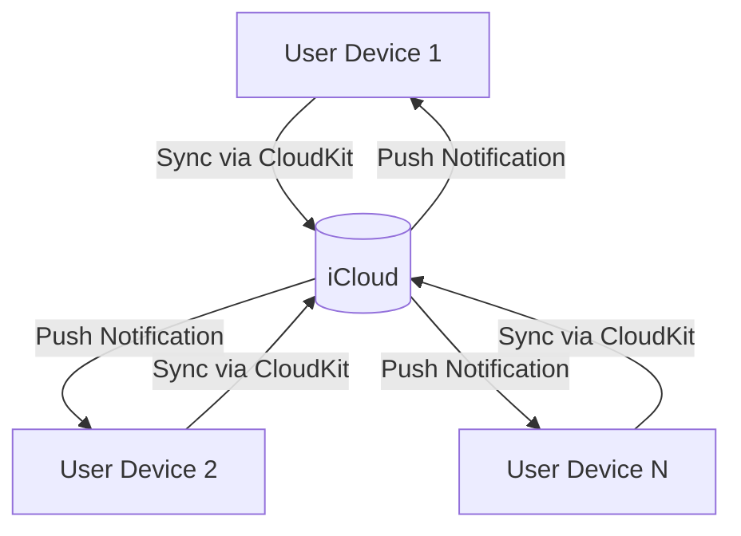
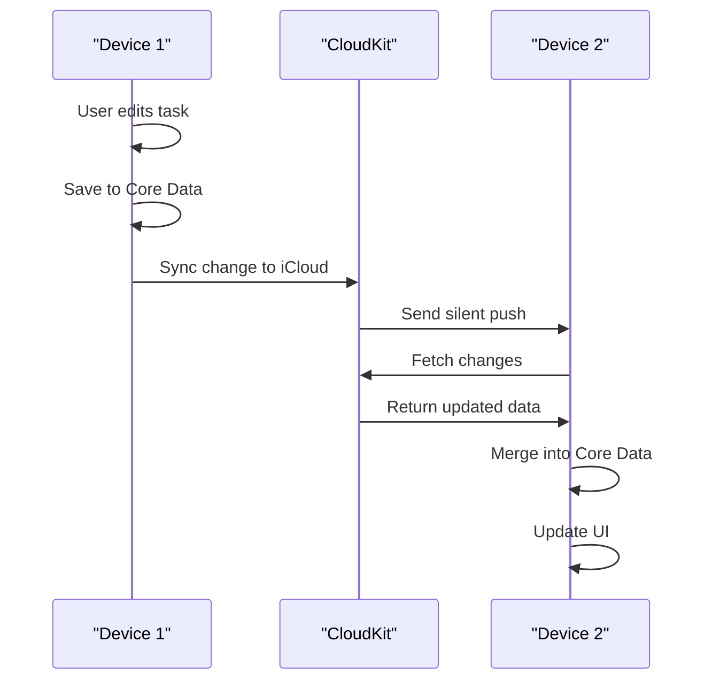

# Data Synchronization Strategy

<cite>
**Referenced Files in This Document**   
- [AppDelegate.swift](file://To%20Do%20List/AppDelegate.swift#L0-L193)
- [CoreDataTaskRepository.swift](file://To%20Do%20List/Repositories/CoreDataTaskRepository.swift#L0-L455)
- [NTask+CoreDataProperties.swift](file://To%20Do%20List/NTask+CoreDataProperties.swift#L0-L54)
- [NTask+CoreDataClass.swift](file://To%20Do%20List/NTask+CoreDataClass.swift#L0-L17)
- [README.md](file://README.md#L1300-L1499)
</cite>

## Table of Contents
1. [Introduction](#introduction)
2. [Core Data and CloudKit Integration](#core-data-and-cloudkit-integration)
3. [NSPersistentCloudKitContainer Configuration](#nspersistentcloudkitcontainer-configuration)
4. [Data Change Flow Across Devices](#data-change-flow-across-devices)
5. [Conflict Resolution and Merge Policies](#conflict-resolution-and-merge-policies)
6. [Monitoring Sync Status and Events](#monitoring-sync-status-and-events)
7. [Handling Synchronization Issues](#handling-synchronization-issues)
8. [Best Practices for User Feedback and Error Handling](#best-practices-for-user-feedback-and-error-handling)
9. [Conclusion](#conclusion)

## Introduction
The Tasker application implements a robust data synchronization strategy using Apple's Core Data and CloudKit integration to enable seamless cross-device data sync. This document details the architecture, implementation, and operational aspects of the synchronization system, focusing on how NSPersistentCloudKitContainer automates record zone management and conflict resolution. The system ensures that task data remains consistent across all user devices while maintaining offline capability and data integrity.

**Section sources**
- [README.md](file://README.md#L1300-L1499)

## Core Data and CloudKit Integration
Tasker leverages NSPersistentCloudKitContainer to integrate Core Data with CloudKit, enabling automatic synchronization of task data across devices. The integration is configured in the AppDelegate, where the persistent container is initialized with CloudKit options. This setup allows the app to store data locally using Core Data while automatically syncing changes to iCloud, ensuring that users have access to their tasks on all devices.

The Core Data stack is configured to use a dedicated CloudKit container identified as "iCloud.TaskerCloudKit". This container is specified in the persistent store description, which is a crucial step in enabling CloudKit synchronization. The app also registers for remote notifications to receive silent pushes from CloudKit, allowing it to respond to data changes even when the app is not actively running.



**Diagram sources**
- [AppDelegate.swift](file://To%20Do%20List/AppDelegate.swift#L0-L193)

**Section sources**
- [AppDelegate.swift](file://To%20Do%20List/AppDelegate.swift#L0-L193)
- [README.md](file://README.md#L1300-L1499)

## NSPersistentCloudKitContainer Configuration
The NSPersistentCloudKitContainer is configured in the AppDelegate as a lazy property, ensuring that it is only initialized when needed. The container is named "TaskModel", which corresponds to the Core Data model file. The configuration includes setting the CloudKit container identifier, enabling history tracking, and configuring remote change notifications.

```swift
lazy var persistentContainer: NSPersistentCloudKitContainer = {
    let container = NSPersistentCloudKitContainer(name: "TaskModel")
    
    guard let description = container.persistentStoreDescriptions.first else {
        fatalError("Failed to retrieve a persistent store description.")
    }
    
    description.cloudKitContainerOptions = NSPersistentCloudKitContainerOptions(
        containerIdentifier: "iCloud.TaskerCloudKit"
    )
    
    description.setOption(true as NSNumber, forKey: NSPersistentHistoryTrackingKey)
    description.setOption(true as NSNumber, forKey: NSPersistentStoreRemoteChangeNotificationPostOptionKey)
    
    return container
}()
```

This configuration enables several key features:
- **History Tracking**: Enables the use of persistent history transactions, which are essential for efficient change detection and synchronization.
- **Remote Change Notifications**: Allows the app to receive notifications when changes are made to the data on other devices, enabling real-time updates.
- **Automatic Record Zone Management**: NSPersistentCloudKitContainer automatically manages CloudKit record zones and subscriptions, reducing the need for manual configuration.

**Section sources**
- [AppDelegate.swift](file://To%20Do%20List/AppDelegate.swift#L0-L193)
- [README.md](file://README.md#L1300-L1499)

## Data Change Flow Across Devices
The flow of data changes across devices is managed through a combination of CloudKit push notifications and Core Data's built-in synchronization mechanisms. When a user makes a change to a task on one device, the change is saved to the local Core Data store and then automatically synced to iCloud. CloudKit then sends a silent push notification to all other devices associated with the same iCloud account, informing them of the change.

On receiving the push notification, each device fetches the changes from iCloud and merges them into the local Core Data store. This process is handled by the `handlePersistentStoreRemoteChange` method in the AppDelegate, which listens for the `.NSPersistentStoreRemoteChange` notification. The method performs the merge on the view context's queue to avoid threading issues and ensures that the UI is updated appropriately.



**Diagram sources**
- [AppDelegate.swift](file://To%20Do%20List/AppDelegate.swift#L0-L193)

**Section sources**
- [AppDelegate.swift](file://To%20Do%20List/AppDelegate.swift#L0-L193)
- [README.md](file://README.md#L1300-L1499)

## Conflict Resolution and Merge Policies
Tasker employs a conflict resolution strategy based on the `NSMergeByPropertyStoreTrumpMergePolicy`, which ensures that changes from the persistent store (iCloud) take precedence over local changes in case of conflicts. This policy is set on the view context during the persistent container configuration.

The app also implements a data consolidation mechanism that runs after merging remote changes. This mechanism, handled by `ProjectManager` and `TaskManager`, ensures data integrity by fixing missing projects and tasks with default values. This is particularly important in scenarios where data might be corrupted or incomplete due to network issues or other errors.

```mermaid
graph TD
A["Data Change Detected"] --> B{"Conflict?}
B --> |Yes| C["Apply NSMergeByPropertyStoreTrumpMergePolicy"]
B --> |No| D["Merge Changes"]
C --> E["Update Local Store"]
D --> E
E --> F["Run Data Consolidation"]
F --> G["Notify UI of Changes"]
```

**Diagram sources**
- [AppDelegate.swift](file://To%20Do%20List/AppDelegate.swift#L0-L193)

**Section sources**
- [AppDelegate.swift](file://To%20Do%20List/AppDelegate.swift#L0-L193)

## Monitoring Sync Status and Events
The app monitors CloudKit container events for debugging and operational purposes. This is achieved by observing the `NSPersistentCloudKitContainer.eventChangedNotification` notification. When an event occurs, the app logs the event type and any associated errors, providing valuable insights into the synchronization process.

```swift
NotificationCenter.default.addObserver(
    forName: NSPersistentCloudKitContainer.eventChangedNotification,
    object: persistentContainer,
    queue: .main
) { note in
    guard
      let userInfo = note.userInfo,
      let events = userInfo[NSPersistentCloudKitContainer.eventNotificationUserInfoKey]
                    as? [NSPersistentCloudKitContainer.Event]
    else { return }

    for event in events {
        print("📡 CloudKit event:", event.type)
        if let err = event.error {
            print("   ⛔️ error:", err)
        }
    }
}
```

This monitoring system allows developers to track synchronization events such as record imports, zone migrations, and errors, facilitating troubleshooting and performance optimization.

**Section sources**
- [AppDelegate.swift](file://To%20Do%20List/AppDelegate.swift#L0-L193)

## Handling Synchronization Issues
The synchronization system is designed to handle common issues such as network failures, quota limits, and permission errors. When a synchronization error occurs, it is logged through the CloudKit event monitoring system, allowing for diagnosis and resolution.

For network failures, the app relies on Core Data's local storage to maintain functionality, allowing users to continue working offline. When the network is restored, the app automatically resumes synchronization. For quota limits and permission errors, the app logs the specific error and may prompt the user to resolve the issue through system settings.

The `handlePersistentStoreRemoteChange` method includes safeguards to ensure that data integrity is maintained even in the face of partial failures. After merging changes, the app runs data consolidation logic to fix any inconsistencies, ensuring that the user's data remains accurate and complete.

**Section sources**
- [AppDelegate.swift](file://To%20Do%20List/AppDelegate.swift#L0-L193)

## Best Practices for User Feedback and Error Handling
Tasker implements several best practices for providing user feedback during synchronization operations. The app uses `NotificationCenter` to post custom notifications when data changes are detected, allowing the UI to update in response to synchronization events.

```swift
NotificationCenter.default.post(name: Notification.Name("DataDidChangeFromCloudSync"), object: nil)
```

This approach ensures that the UI remains responsive and up-to-date, even when changes are made on other devices. The app also logs synchronization events and errors, providing developers with the information needed to diagnose and resolve issues.

For user-facing feedback, the app could be enhanced to display sync status indicators or error messages when synchronization fails. This would improve the user experience by providing transparency into the synchronization process and helping users understand when their data is being updated.

**Section sources**
- [AppDelegate.swift](file://To%20Do%20List/AppDelegate.swift#L0-L193)

## Conclusion
The Tasker application's data synchronization strategy effectively leverages NSPersistentCloudKitContainer to provide seamless cross-device data sync. By automating record zone management and conflict resolution, the system ensures that task data remains consistent and up-to-date across all user devices. The implementation includes robust error handling, data consolidation, and monitoring mechanisms, making it a reliable solution for multi-device task management. Future enhancements could include more detailed user feedback and improved error recovery mechanisms to further enhance the user experience.