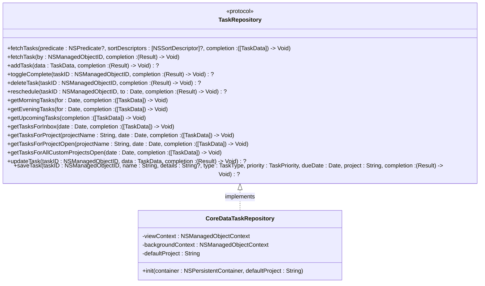
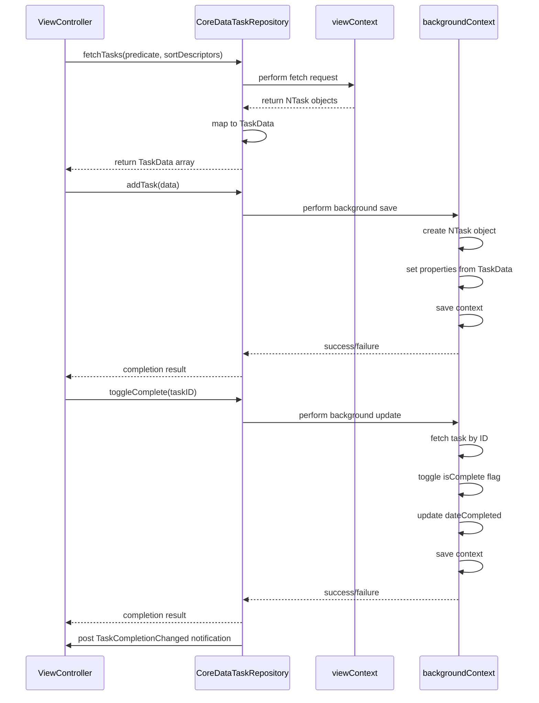
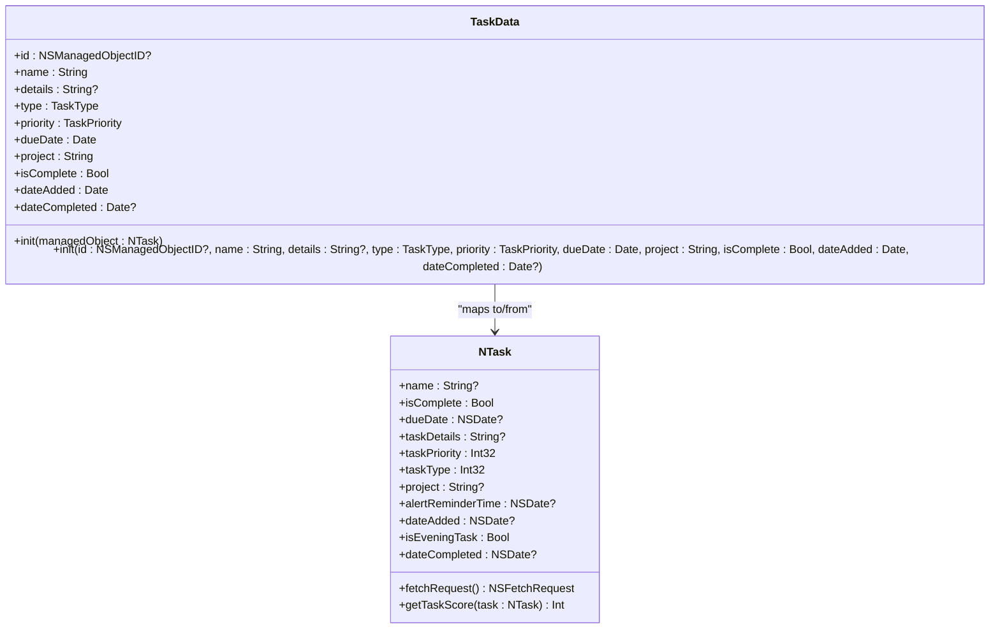
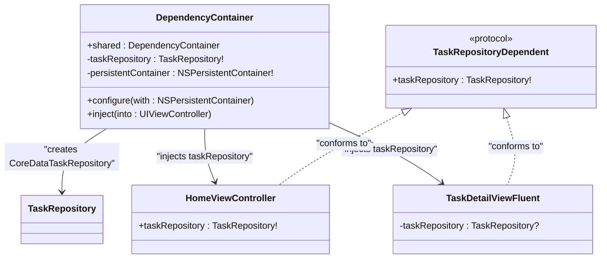
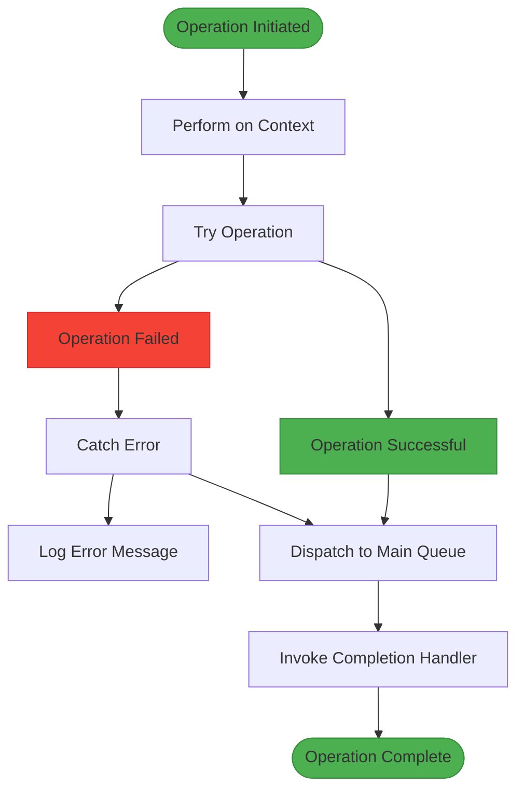

# Repository Pattern Implementation

<cite>
**Referenced Files in This Document**   
- [TaskRepository.swift](file://To%20Do%20List/Repositories/TaskRepository.swift)
- [CoreDataTaskRepository.swift](file://To%20Do%20List/Repositories/CoreDataTaskRepository.swift)
- [TaskData.swift](file://To%20Do%20List/Models/TaskData.swift)
- [NTask+CoreDataProperties.swift](file://To%20Do%20List/NTask+CoreDataProperties.swift)
- [DependencyContainer.swift](file://To%20Do%20List/Managers/DependencyContainer.swift)
- [HomeViewController.swift](file://To%20Do%20List/ViewControllers/HomeViewController.swift)
</cite>

## Table of Contents
1. [Introduction](#introduction)
2. [TaskRepository Protocol Definition](#taskrepository-protocol-definition)
3. [CoreDataTaskRepository Implementation](#coredatataskrepository-implementation)
4. [Data Model Structure](#data-model-structure)
5. [Dependency Injection and Usage](#dependency-injection-and-usage)
6. [Error Handling and Asynchronous Operations](#error-handling-and-asynchronous-operations)
7. [Architecture and Design Benefits](#architecture-and-design-benefits)
8. [Code Examples and Invocation Patterns](#code-examples-and-invocation-patterns)
9. [Conclusion](#conclusion)

## Introduction
The repository pattern in Tasker provides a clean abstraction layer between the application's business logic and data persistence mechanisms. This implementation replaces the legacy singleton-based `TaskManager` with a protocol-driven approach that enhances testability, maintainability, and extensibility. The pattern separates concerns by defining a clear contract for data operations while encapsulating the complexities of Core Data interactions. This document details the implementation of the repository pattern, focusing on the `TaskRepository` protocol, its `CoreDataTaskRepository` implementation, and how it integrates with the rest of the application through dependency injection.

**Section sources**
- [TaskRepository.swift](file://To%20Do%20List/Repositories/TaskRepository.swift#L1-L117)
- [CoreDataTaskRepository.swift](file://To%20Do%20List/Repositories/CoreDataTaskRepository.swift#L1-L455)

## TaskRepository Protocol Definition
The `TaskRepository` protocol defines a comprehensive contract for all task-related data operations, serving as an abstraction layer that decouples business logic from data persistence details. This protocol enables dependency injection and facilitates testing by allowing mock implementations.



**Diagram sources**
- [TaskRepository.swift](file://To%20Do%20List/Repositories/TaskRepository.swift#L1-L117)

**Section sources**
- [TaskRepository.swift](file://To%20Do%20List/Repositories/TaskRepository.swift#L1-L117)

## CoreDataTaskRepository Implementation
The `CoreDataTaskRepository` class provides a concrete implementation of the `TaskRepository` protocol using Core Data as the underlying persistence mechanism. It employs a dual-context strategy with separate view and background contexts to ensure thread safety and optimal performance.



**Diagram sources**
- [CoreDataTaskRepository.swift](file://To%20Do%20List/Repositories/CoreDataTaskRepository.swift#L1-L455)

**Section sources**
- [CoreDataTaskRepository.swift](file://To%20Do%20List/Repositories/CoreDataTaskRepository.swift#L1-L455)

## Data Model Structure
The data model in Tasker follows a clean separation between domain entities and Core Data managed objects. The `TaskData` struct serves as a lightweight representation of tasks for use in the presentation layer, while `NTask` represents the Core Data managed object.



**Diagram sources**
- [TaskData.swift](file://To%20Do%20List/Models/TaskData.swift#L1-L57)
- [NTask+CoreDataProperties.swift](file://To%20Do%20List/NTask+CoreDataProperties.swift#L1-L54)

**Section sources**
- [TaskData.swift](file://To%20Do%20List/Models/TaskData.swift#L1-L57)
- [NTask+CoreDataProperties.swift](file://To%20Do%20List/NTask+CoreDataProperties.swift#L1-L54)

## Dependency Injection and Usage
Dependency injection in Tasker is managed through the `DependencyContainer` class, which centralizes the creation and distribution of shared dependencies. This approach eliminates the need for singleton access and makes dependencies explicit.



**Diagram sources**
- [DependencyContainer.swift](file://To%20Do%20List/Managers/DependencyContainer.swift#L1-L81)
- [HomeViewController.swift](file://To%20Do%20List/ViewControllers/HomeViewController.swift#L1-L1106)

**Section sources**
- [DependencyContainer.swift](file://To%20Do%20List/Managers/DependencyContainer.swift#L1-L81)
- [HomeViewController.swift](file://To%20Do%20List/ViewControllers/HomeViewController.swift#L1-L1106)

## Error Handling and Asynchronous Operations
The repository implementation employs robust error handling strategies and asynchronous operation patterns to ensure reliability and responsiveness. All data operations are performed asynchronously on appropriate dispatch queues, with errors propagated through Swift's `Result` type.



The implementation uses background contexts for write operations to prevent blocking the main thread, while read operations use the view context with automatic merging of changes. Errors are handled gracefully, with appropriate logging and fallback behaviors to maintain application stability.

**Section sources**
- [CoreDataTaskRepository.swift](file://To%20Do%20List/Repositories/CoreDataTaskRepository.swift#L1-L455)

## Architecture and Design Benefits
The repository pattern implementation in Tasker delivers significant architectural benefits:

**Separation of Concerns**: The pattern clearly separates data access logic from business logic and presentation layers. The `TaskRepository` protocol defines what operations are available, while `CoreDataTaskRepository` handles how they are implemented.

**Testability**: By defining a protocol, the implementation can be easily mocked in unit tests. Components that depend on the repository can be tested in isolation without requiring a real Core Data stack.

**Extensibility**: The abstraction allows for future data source implementations. For example, a cloud-based repository could be created to sync tasks across devices, or a file-based repository for backup purposes.

**Maintainability**: Changes to the data persistence mechanism are isolated to the repository implementation. The rest of the application remains unaffected by such changes.

**Migration Path**: The implementation represents a strategic migration from the legacy `TaskManager` singleton, with 60% of components already migrated to use the repository pattern.

**Section sources**
- [README.md](file://README.md#L974-L985)
- [README.md](file://README.md#L1546-L1556)

## Code Examples and Invocation Patterns
The following examples demonstrate typical usage patterns of the repository from business logic components:

**Fetching tasks with a predicate:**
```swift
let predicate = NSPredicate(format: "project == %@ AND isComplete == NO", "Work")
taskRepository.fetchTasks(predicate: predicate, sortDescriptors: [
    NSSortDescriptor(key: "dueDate", ascending: true)
]) { tasks in
    // Update UI with fetched tasks
    self.updateTaskList(tasks)
}
```

**Adding a new task:**
```swift
let taskData = TaskData(
    name: "Complete report",
    type: .morning,
    priority: .high,
    dueDate: Date(),
    project: "Work"
)

taskRepository.addTask(data: taskData) { result in
    switch result {
    case .success(let task):
        print("Task added successfully: \(task.name ?? "")")
        // Refresh UI
    case .failure(let error):
        print("Failed to add task: \(error)")
        // Show error to user
    }
}
```

**Toggling task completion:**
```swift
taskRepository.toggleComplete(taskID: task.objectID) { result in
    switch result {
    case .success:
        print("Task completion status updated")
        // The repository automatically posts a notification
        // to refresh charts and other UI components
    case .failure(let error):
        print("Failed to toggle task: \(error)")
    }
}
```

These patterns demonstrate the consistent approach to asynchronous operations throughout the repository, with completion handlers providing results in a non-blocking manner.

**Section sources**
- [CoreDataTaskRepository.swift](file://To%20Do%20List/Repositories/CoreDataTaskRepository.swift#L1-L455)
- [HomeViewController.swift](file://To%20Do%20List/ViewControllers/HomeViewController.swift#L1-L1106)

## Conclusion
The repository pattern implementation in Tasker represents a significant improvement over the legacy singleton-based approach. By defining a clear protocol for data operations and implementing it with a dedicated class, the application achieves better separation of concerns, improved testability, and greater extensibility. The use of dependency injection through the `DependencyContainer` ensures that components receive their dependencies in a controlled and predictable manner. The dual-context Core Data strategy provides thread safety and optimal performance, while comprehensive error handling ensures application stability. This implementation serves as a foundation for future enhancements and demonstrates a modern approach to data management in iOS applications.