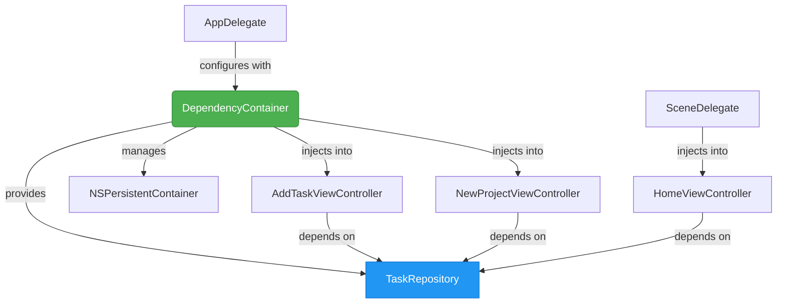
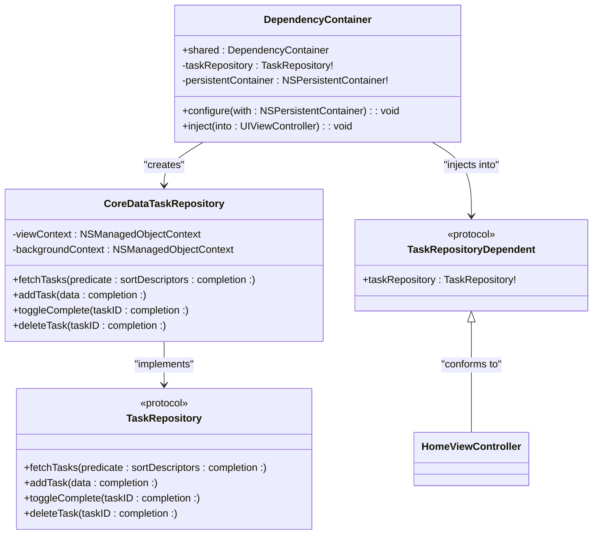
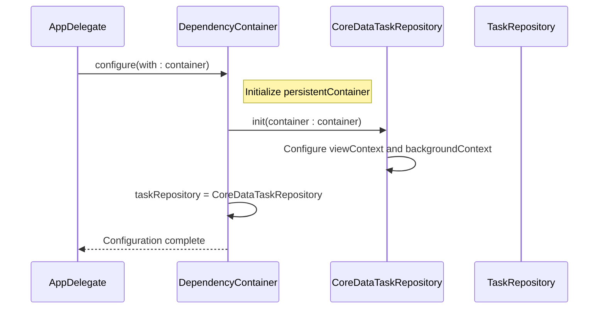
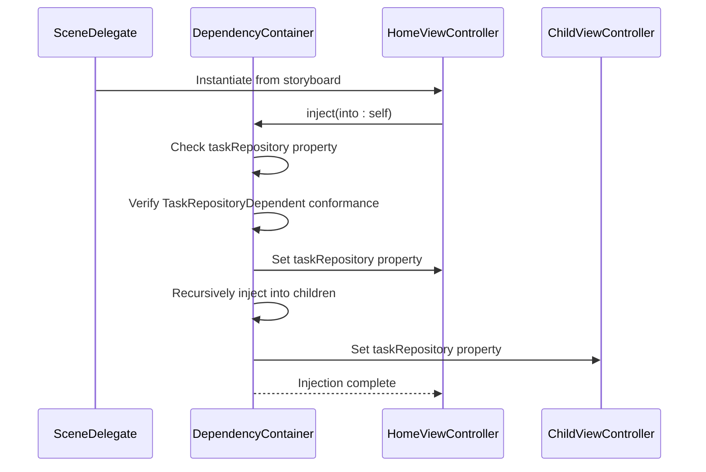

# Dependency Injection System

<cite>
**Referenced Files in This Document**   
- [DependencyContainer.swift](file://To%20Do%20List/Managers/DependencyContainer.swift)
- [CoreDataTaskRepository.swift](file://To%20Do%20List/Repositories/CoreDataTaskRepository.swift)
- [TaskRepository.swift](file://To%20Do%20List/Repositories/TaskRepository.swift)
- [SceneDelegate.swift](file://To%20Do%20List/SceneDelegate.swift)
- [AppDelegate.swift](file://To%20Do%20List/AppDelegate.swift)
- [HomeViewController.swift](file://To%20Do%20List/ViewControllers/HomeViewController.swift)
</cite>

## Table of Contents
1. [Introduction](#introduction)
2. [Architecture Overview](#architecture-overview)
3. [Core Components](#core-components)
4. [Initialization and Configuration](#initialization-and-configuration)
5. [Dependency Injection Patterns](#dependency-injection-patterns)
6. [Service Lifetime and Thread Safety](#service-lifetime-and-thread-safety)
7. [Testing and Mocking](#testing-and-mocking)
8. [Best Practices and Guidelines](#best-practices-and-guidelines)
9. [Potential Anti-Patterns](#potential-anti-patterns)

## Introduction

The **DependencyContainer** class serves as the central service locator and dependency injection mechanism within the Tasker application. It encapsulates the creation and provisioning of shared dependencies such as **TaskRepository**, **ThemeManager**, and **AnalyticsService**, promoting testability, modularity, and loose coupling across the application architecture. As a singleton instance, the container provides a centralized point for managing application-wide services, ensuring consistent access to shared resources while abstracting away implementation details from consuming components.

By implementing a protocol-based dependency injection system, the container enables seamless substitution of concrete implementations with mocks during testing, significantly enhancing the application's testability. The design facilitates a gradual migration from legacy singleton patterns to a more modern, decoupled architecture, allowing both approaches to coexist during the transition period. This documentation provides a comprehensive analysis of the container's role, implementation details, integration patterns, and best practices for extending and maintaining the dependency injection system.

**Section sources**
- [DependencyContainer.swift](file://To%20Do%20List/Managers/DependencyContainer.swift#L1-L80)

## Architecture Overview

The DependencyContainer operates as a service locator that coordinates the initialization and injection of core application components, acting as a bridge between the application's infrastructure and consumer components. The container follows a singleton pattern with lazy initialization, ensuring that dependencies are only created when needed while maintaining a single instance throughout the application lifecycle. It maintains references to essential services like the TaskRepository and NSPersistentContainer, making them available to any component that requires them through a controlled injection mechanism.



**Diagram sources**
- [DependencyContainer.swift](file://To%20Do%20List/Managers/DependencyContainer.swift#L1-L81)
- [AppDelegate.swift](file://To%20Do%20List/AppDelegate.swift#L1-L193)
- [SceneDelegate.swift](file://To%20Do%20List/SceneDelegate.swift#L1-L72)

## Core Components

The DependencyContainer class is implemented as a singleton with a shared static instance, ensuring that all components access the same set of dependencies. It maintains private references to critical services like the TaskRepository and NSPersistentContainer, exposing them through controlled access points. The container uses protocol-based dependencies to enable polymorphism and testing, with the TaskRepository protocol defining the contract for task data operations. During configuration, the container initializes the CoreDataTaskRepository implementation with the application's persistent container, establishing the connection between the dependency injection system and the underlying data storage layer. The container also implements reflection-based injection, using runtime introspection to identify and populate dependency properties on view controllers.



**Diagram sources**
- [DependencyContainer.swift](file://To%20Do%20List/Managers/DependencyContainer.swift#L1-L80)
- [TaskRepository.swift](file://To%20Do%20List/Repositories/TaskRepository.swift#L1-L117)
- [CoreDataTaskRepository.swift](file://To%20Do%20List/Repositories/CoreDataTaskRepository.swift#L1-L454)

**Section sources**
- [DependencyContainer.swift](file://To%20Do%20List/Managers/DependencyContainer.swift#L1-L80)
- [TaskRepository.swift](file://To%20Do%20List/Repositories/TaskRepository.swift#L1-L117)
- [CoreDataTaskRepository.swift](file://To%20Do%20List/Repositories/CoreDataTaskRepository.swift#L1-L454)

## Initialization and Configuration

The DependencyContainer is initialized and configured during the application's startup sequence in the AppDelegate's didFinishLaunchingWithOptions method. The configuration process begins after the Core Data stack has been established and before any view controllers are presented. The AppDelegate obtains a reference to the shared container instance and calls the configure(with:) method, passing the NSPersistentContainer as a parameter. This method initializes the container's internal state, creating the CoreDataTaskRepository instance with the provided persistent container. The configuration includes setting up the background context for data operations and enabling automatic merging of changes. The container logs its configuration status, providing visibility into the initialization process and helping diagnose potential issues with dependency setup.



**Diagram sources**
- [AppDelegate.swift](file://To%20Do%20List/AppDelegate.swift#L25-L45)
- [DependencyContainer.swift](file://To%20Do%20List/Managers/DependencyContainer.swift#L60-L75)

**Section sources**
- [AppDelegate.swift](file://To%20Do%20List/AppDelegate.swift#L25-L45)
- [DependencyContainer.swift](file://To%20Do%20List/Managers/DependencyContainer.swift#L60-L75)

## Dependency Injection Patterns

The DependencyContainer employs a hybrid injection pattern that combines constructor injection for service creation with property injection for view controller dependencies. The container itself uses constructor injection during the configuration phase, receiving the NSPersistentContainer from the AppDelegate. For view controllers, it implements property injection through the inject(into:) method, which uses Swift's runtime reflection capabilities to identify and populate the taskRepository property. This approach allows the container to inject dependencies into existing view controller instances without requiring changes to their initialization signatures. The injection process follows a recursive pattern, automatically propagating dependencies to child view controllers, ensuring that entire view controller hierarchies receive the necessary dependencies.



**Diagram sources**
- [SceneDelegate.swift](file://To%20Do%20List/SceneDelegate.swift#L1-L72)
- [DependencyContainer.swift](file://To%20Do%20List/Managers/DependencyContainer.swift#L50-L81)
- [HomeViewController.swift](file://To%20Do%20List/ViewControllers/HomeViewController.swift#L1-L1106)

**Section sources**
- [SceneDelegate.swift](file://To%20Do%20List/SceneDelegate.swift#L1-L72)
- [DependencyContainer.swift](file://To%20Do%20List/Managers/DependencyContainer.swift#L50-L81)
- [HomeViewController.swift](file://To%20Do%20List/ViewControllers/HomeViewController.swift#L1-L1106)

## Service Lifetime and Thread Safety

The DependencyContainer manages component lifetimes through a combination of singleton and transient patterns. The container itself follows the singleton pattern, with a single shared instance throughout the application. The services it manages, such as the TaskRepository and NSPersistentContainer, are also maintained as singletons, ensuring that all components interact with the same data state. This approach is appropriate for stateful services that coordinate access to shared resources like databases. The container does not currently implement a sophisticated lifetime management system with scoped or transient registrations, instead relying on the natural lifetime of the application for its managed services.

Thread safety is ensured through the CoreDataTaskRepository's use of separate managed object contexts for different operations. The viewContext is used for UI-related operations on the main thread, while the backgroundContext handles data modifications on a background queue. The viewContext is configured with automaticallyMergesChangesFromParent enabled, ensuring that changes from the background context are automatically merged into the main context. This design prevents threading issues that could arise from accessing Core Data objects across multiple threads.

**Section sources**
- [DependencyContainer.swift](file://To%20Do%20List/Managers/DependencyContainer.swift#L1-L81)
- [CoreDataTaskRepository.swift](file://To%20Do%20List/Repositories/CoreDataTaskRepository.swift#L1-L455)

## Testing and Mocking

The DependencyContainer's design facilitates testing by enabling the replacement of real dependencies with mock implementations. The protocol-based approach to the TaskRepository allows test suites to create mock objects that conform to the same interface but provide controlled behavior for testing purposes. During unit tests, developers can inject mock repositories into view controllers to verify their behavior without relying on actual data storage. This capability is particularly valuable for testing edge cases and error conditions that would be difficult to reproduce with a real database. The container's singleton nature does require careful management in test environments to prevent state leakage between test cases, typically addressed by resetting the container's state or using dependency injection frameworks designed for testing.

```swift
// Example test setup
func testHomeViewController() {
    let mockRepository = MockTaskRepository()
    let viewController = HomeViewController()
    
    DependencyContainer.shared.taskRepository = mockRepository
    DependencyContainer.shared.inject(into: viewController)
    
    // Trigger data loading
    viewController.viewDidLoad()
    
    // Verify interactions
    XCTAssertTrue(mockRepository.getMorningTasksCalled)
}
```

**Section sources**
- [TaskRepository.swift](file://To%20Do%20List/Repositories/TaskRepository.swift#L1-L118)
- [CoreDataTaskRepository.swift](file://To%20Do%20List/Repositories/CoreDataTaskRepository.swift#L1-L455)

## Best Practices and Guidelines

To extend the DependencyContainer with new services, follow these guidelines:

1. **Define Protocol**: Create a protocol for the service interface to enable abstraction and testing
2. **Implement Concrete Class**: Provide a concrete implementation that conforms to the protocol
3. **Add Property**: Add a private property to DependencyContainer with appropriate access controls
4. **Configure Instance**: Initialize the service in the configure(with:) method
5. **Inject Dependencies**: Extend the inject(into:) method to support the new dependency if needed

Services should be registered as singletons when they manage shared state or resources, and as transient instances when they represent ephemeral operations or data. When adding new services, ensure they follow the same pattern of protocol-based abstraction to maintain consistency across the dependency injection system. Always consider thread safety implications when designing new services, particularly when they interact with shared resources or perform asynchronous operations.

**Section sources**
- [DependencyContainer.swift](file://To%20Do%20List/Managers/DependencyContainer.swift#L1-L80)

## Potential Anti-Patterns

Several potential anti-patterns should be avoided when working with the DependencyContainer:

1. **Service Locator Overuse**: While the container provides convenient access to dependencies, over-reliance on the shared instance can lead to hidden dependencies and reduced testability. Prefer explicit injection where possible.

2. **Memory Retention Issues**: The container maintains strong references to its managed services, which could lead to memory retention if not properly managed. Ensure that services do not inadvertently retain references to view controllers or other short-lived objects.

3. **Timing Issues**: View controllers may attempt to use their dependencies before injection occurs. The container includes guard statements and logging to detect and report uninitialized dependencies, but developers should ensure injection occurs at appropriate points in the view controller lifecycle.

4. **Circular Dependencies**: Be cautious when adding new services that depend on other services managed by the container, as this can lead to circular dependency issues during initialization.

5. **Testing Challenges**: The singleton nature of the container can make unit testing more complex, as test cases may interfere with each other through shared state. Consider resetting the container's state between tests or using dependency injection frameworks designed for testing.

**Section sources**
- [DependencyContainer.swift](file://To%20Do%20List/Managers/DependencyContainer.swift#L70-L81)
- [HomeViewController.swift](file://To%20Do%20List/ViewControllers/HomeViewController.swift#L1-L1106)