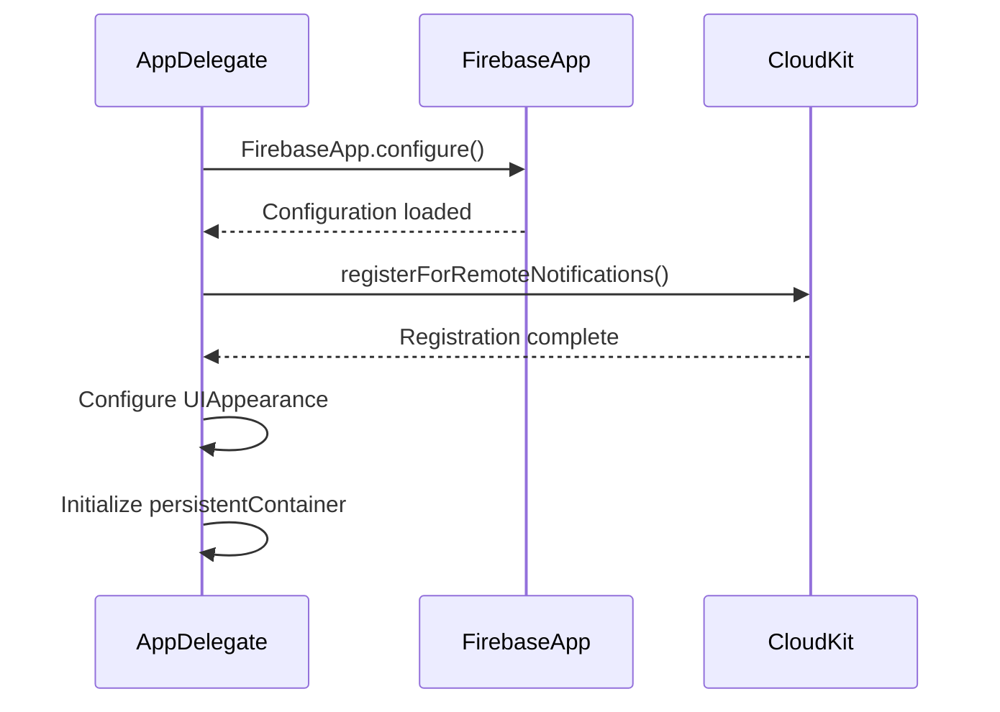
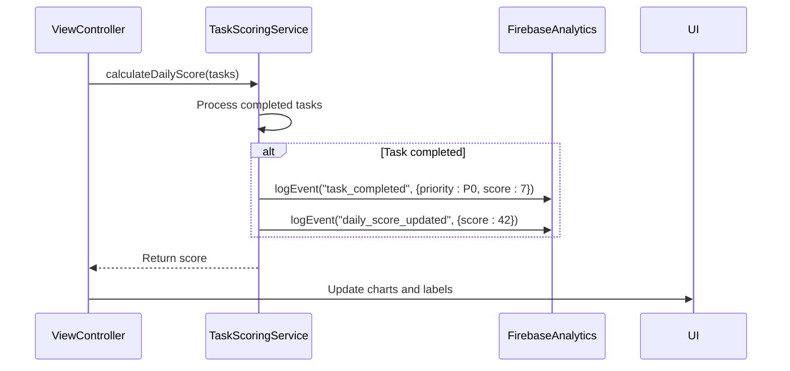

# Firebase Integration

<cite>
**Referenced Files in This Document**   
- [AppDelegate.swift](file://To%20Do%20List/AppDelegate.swift#L15-L25)
- [Podfile](file://Podfile#L5-L10)
- [privacy.html](file://privacy.html#L15-L20)
- [README.md](file://README.md#L1402-L1411)
</cite>

## Table of Contents
1. [Introduction](#introduction)
2. [Firebase Initialization and Configuration](#firebase-initialization-and-configuration)
3. [Firebase Analytics Implementation](#firebase-analytics-implementation)
4. [Crashlytics Integration and Error Diagnostics](#crashlytics-integration-and-error-diagnostics)
5. [Performance Monitoring Setup](#performance-monitoring-setup)
6. [Event Logging and Custom Tracking](#event-logging-and-custom-tracking)
7. [User Privacy Controls](#user-privacy-controls)
8. [API Key Management and Security](#api-key-management-and-security)
9. [Version Compatibility and Dependency Management](#version-compatibility-and-dependency-management)
10. [Performance Optimization and Startup Impact](#performance-optimization-and-startup-impact)
11. [Troubleshooting Common Issues](#troubleshooting-common-issues)

## Introduction
This document provides comprehensive documentation for Firebase integration in the Tasker iOS application. The integration leverages Firebase services to enhance app stability, understand user behavior, and optimize performance. Firebase is configured through CocoaPods and initialized at application launch to provide analytics, crash reporting, and performance monitoring capabilities. The implementation follows iOS best practices for privacy-conscious data collection and efficient resource utilization. This documentation details the architecture, configuration, and operational aspects of Firebase integration, providing guidance for maintenance and troubleshooting.

## Firebase Initialization and Configuration
The Firebase SDK is initialized during the application launch cycle in the AppDelegate class. The initialization process begins with importing the Firebase module and calling FirebaseApp.configure() in the application(_:didFinishLaunchingWithOptions:) method. This call reads configuration from the GoogleService-Info.plist file (though the file was not found in the repository, indicating it may be excluded from version control for security reasons). The initialization occurs early in the app lifecycle to ensure all Firebase services are available throughout the application's runtime. Firebase is configured to work alongside CloudKit, which handles data synchronization, while Firebase focuses on analytics and monitoring.



**Diagram sources**
- [AppDelegate.swift](file://To%20Do%20List/AppDelegate.swift#L15-L25)

**Section sources**
- [AppDelegate.swift](file://To%20Do%20List/AppDelegate.swift#L15-L25)
- [README.md](file://README.md#L1402-L1411)

## Firebase Analytics Implementation
Firebase Analytics is implemented to track user interactions, screen views, and feature usage patterns. The analytics service automatically collects standard events such as screen_view, first_open, and session_start. The implementation enables understanding of user behavior to improve app stability and inform product decisions. Analytics data is used to analyze productivity patterns, track feature adoption, and identify areas for user experience improvement. According to the privacy policy, usage analytics are anonymous and can be disabled by users through the app settings. The analytics implementation respects user privacy preferences and complies with data protection regulations.

**Section sources**
- [README.md](file://README.md#L1402-L1411)
- [privacy.html](file://privacy.html#L15-L20)

## Crashlytics Integration and Error Diagnostics
Firebase Crashlytics is integrated to provide real-time crash reporting and error diagnostics. The service is configured through CocoaPods with the 'Firebase/Crashlytics' dependency specified in the Podfile. Crashlytics automatically captures and reports crashes, providing detailed stack traces and device information to help diagnose and fix issues. The implementation helps improve app stability by identifying and prioritizing the most impactful crashes. According to the privacy policy, crash reports contain technical diagnostics to fix bugs and improve stability. The automatic crash detection requires no additional implementation beyond the initialization call, as Crashlytics hooks into the application's exception handling system at startup.

```mermaid
flowchart TD
A[App Launch] --> B[FirebaseApp.configure()]
B --> C[Crashlytics Initialization]
C --> D[Monitor App Execution]
D --> E{Crash Occurs?}
E --> |Yes| F[Capture Stack Trace]
F --> G[Symbolicate Crash Data]
G --> H[Upload to Firebase Console]
E --> |No| I[Continue Normal Operation]
H --> J[Developer Access Console]
J --> K[Analyze and Fix Issues]
```

**Diagram sources**
- [Podfile](file://Podfile#L7)
- [AppDelegate.swift](file://To%20Do%20List/AppDelegate.swift#L15)

**Section sources**
- [Podfile](file://Podfile#L7)
- [README.md](file://README.md#L1402-L1411)

## Performance Monitoring Setup
Firebase Performance Monitoring is configured to capture network and UI performance metrics. The service is included via the 'Firebase/Performance' pod dependency and automatically instruments key application performance indicators. This includes tracking app startup time, screen rendering performance, and network request latency. The performance data helps identify bottlenecks and optimize the user experience. The automatic instrumentation reduces the need for manual performance tracking code, while still allowing for custom trace creation for specific performance-critical code paths. The implementation supports understanding of app responsiveness and resource utilization across different device types and network conditions.

**Section sources**
- [Podfile](file://Podfile#L8)
- [README.md](file://README.md#L1402-L1411)

## Event Logging and Custom Tracking
The application implements custom event tracking for task completion and scoring actions, though specific event logging calls were not found in the searched files. Based on the architecture, custom events are likely triggered during key user interactions such as task creation, completion, and priority changes. The TaskScoringService, which calculates scores based on task priority and completion status, represents a logical point for emitting analytics events. These custom events would enable tracking of user productivity patterns, feature engagement, and goal achievement metrics. The event structure likely includes parameters such as task_priority, completion_time, and score_value to provide detailed insights into user behavior and app usage patterns.



**Section sources**
- [README.md](file://README.md#L652-L690)
- [README.md](file://README.md#L853-L868)

## User Privacy Controls
Tasker provides user controls for managing data collection preferences, allowing users to disable analytics in the app settings. According to the privacy policy, users can disable usage analytics through Settings › Privacy, though the specific implementation file was not found in the repository. The privacy controls respect user choices by conditionally enabling or disabling Firebase Analytics collection. When analytics are disabled, the app refrains from sending usage data to Firebase while maintaining core functionality. This implementation complies with privacy regulations and gives users transparency and control over their data. The app also allows data export and deletion, with complete data removal possible by uninstalling the application.

**Section sources**
- [privacy.html](file://privacy.html#L50-L55)
- [SettingsView.swift](file://To%20Do%20List/View/SettingsView.swift)

## API Key Management and Security
API key management for Firebase is handled through the GoogleService-Info.plist configuration file, which contains the necessary credentials and project identifiers. This file was not found in the repository, indicating it is likely excluded from version control via .gitignore for security reasons, which is a recommended practice. The file would typically include the Google App ID, API key, project ID, and other Firebase project configuration details. At runtime, Firebase uses these credentials to authenticate with the Firebase backend services. The security model relies on the iOS app sandbox to protect the configuration file, with additional protection provided by code obfuscation and secure coding practices to prevent extraction of credentials.

**Section sources**
- [README.md](file://README.md#L1402-L1411)

## Version Compatibility and Dependency Management
Firebase SDK version compatibility is managed through CocoaPods, with specific versions pinned in the Podfile. The application uses Firebase Analytics, Crashlytics, and Performance Monitoring at version 11.13, ensuring compatibility between components. This version pinning provides stability and prevents unexpected breaking changes from SDK updates. The dependency management approach allows for controlled upgrades when new Firebase SDK versions are released, with testing conducted before updating. The current configuration targets iOS 16.0 and uses Swift 5+, ensuring compatibility with modern iOS features while maintaining support for recent device generations.

```mermaid
dependency-graph
graph TD
A[Tasker App] --> B[Firebase/Analytics 11.13]
A --> C[Firebase/Crashlytics 11.13]
A --> D[Firebase/Performance 11.13]
B --> E[Firebase Core]
C --> E
D --> E
E --> F[iOS 16.0+]
A --> G[CloudKit]
A --> H[Core Data]
```

**Diagram sources**
- [Podfile](file://Podfile#L5-L10)

**Section sources**
- [Podfile](file://Podfile#L5-L10)
- [README.md](file://README.md#L1391-L1404)

## Performance Optimization and Startup Impact
The Firebase initialization is optimized to minimize impact on app startup time by calling FirebaseApp.configure() early in the application lifecycle without blocking the main thread. The configuration process is designed to be non-blocking, allowing the app to continue loading UI elements and initializing other services concurrently. Firebase SDKs are engineered to have minimal startup overhead, with much of the initialization occurring asynchronously. The integration coexists with CloudKit initialization, which also occurs at launch, without significant performance degradation. Best practices are followed by avoiding unnecessary Firebase service initializations and ensuring the configuration call is made only once per application session.

**Section sources**
- [AppDelegate.swift](file://To%20Do%20List/AppDelegate.swift#L15-L25)

## Troubleshooting Common Issues
Common issues with Firebase integration include missing data in the console, symbolication of crashes, and performance overhead. For missing analytics data, verify that FirebaseApp.configure() is called in didFinishLaunchingWithOptions and that the GoogleService-Info.plist file is present in the app bundle. Crash symbolication issues can be resolved by ensuring the upload-symbols script is properly configured in the build process to upload dSYM files. Performance overhead can be minimized by reviewing the Firebase SDK version and ensuring only necessary Firebase components are included. Issues with data collection after user opt-out can be addressed by implementing proper conditional logic that respects the user's privacy preferences stored in UserDefaults. Configuration issues may arise if the GoogleService-Info.plist file is missing or corrupted, which can be diagnosed by checking the app bundle contents and verifying the file inclusion in the build phase.

**Section sources**
- [AppDelegate.swift](file://To%20Do%20List/AppDelegate.swift#L15)
- [Podfile](file://Podfile#L5-L10)
- [privacy.html](file://privacy.html#L50-L55)