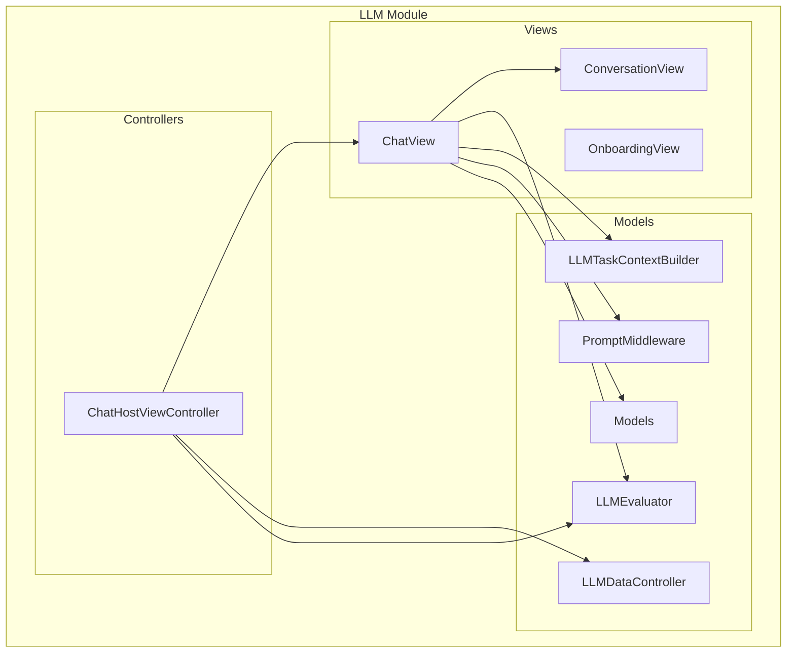
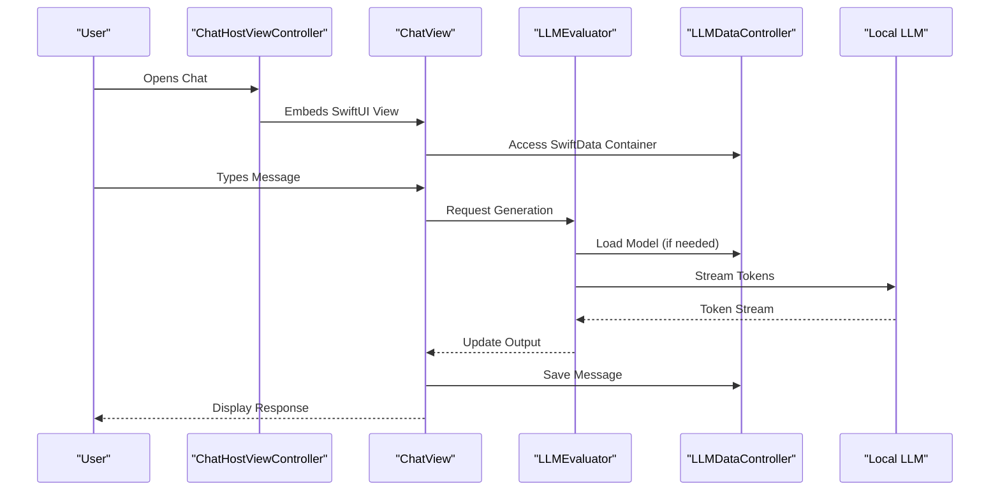
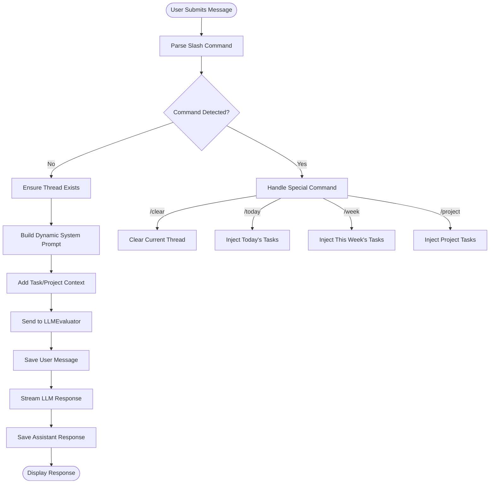
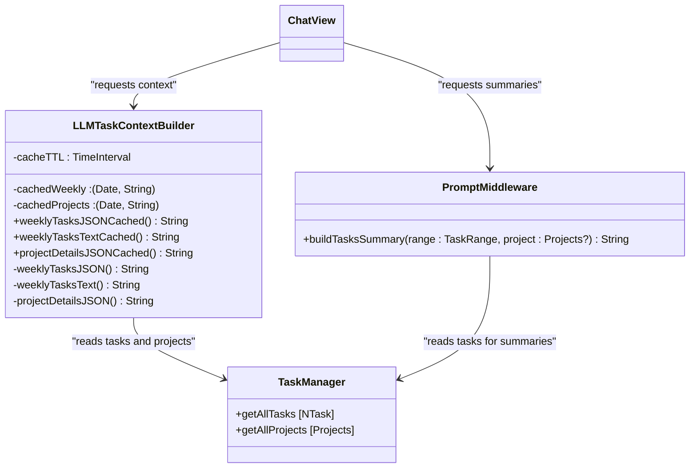
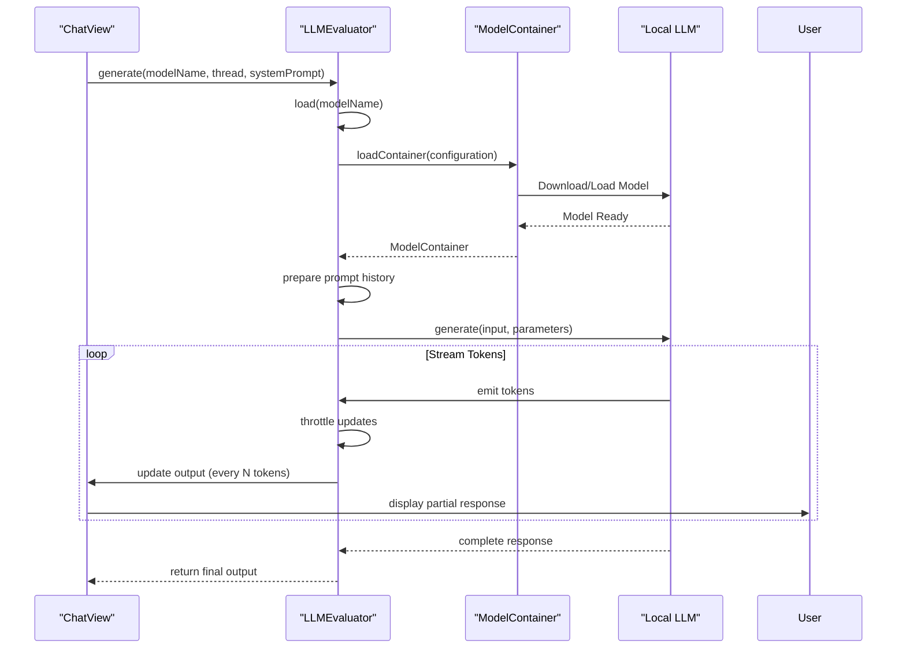
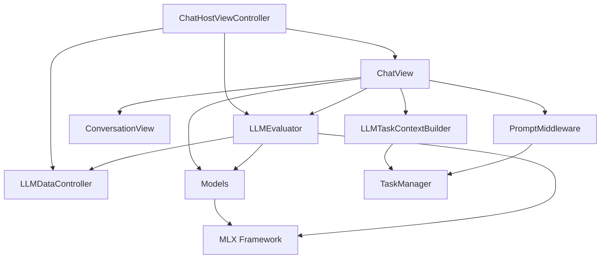

# LLM Chat Assistant Integration

<cite>
**Referenced Files in This Document**   
- [ChatHostViewController.swift](file://To%20Do%20List/LLM/ChatHostViewController.swift)
- [ChatView.swift](file://To%20Do%20List/LLM/Views/Chat/ChatView.swift)
- [ConversationView.swift](file://To%20Do%20List/LLM/Views/Chat/ConversationView.swift)
- [LLMDataController.swift](file://To%20Do%20List/LLM/Models/LLMDataController.swift)
- [LLMEvaluator.swift](file://To%20Do%20List/LLM/Models/LLMEvaluator.swift)
- [LLMTaskContextBuilder.swift](file://To%20Do%20List/LLM/Models/LLMTaskContextBuilder.swift)
- [PromptMiddleware.swift](file://To%20Do%20List/LLM/Models/PromptMiddleware.swift)
- [Models.swift](file://To%20Do%20List/LLM/Models/Models.swift)
</cite>

## Table of Contents
1. [Introduction](#introduction)
2. [Project Structure](#project-structure)
3. [Core Components](#core-components)
4. [Architecture Overview](#architecture-overview)
5. [Detailed Component Analysis](#detailed-component-analysis)
6. [Dependency Analysis](#dependency-analysis)
7. [Performance Considerations](#performance-considerations)
8. [Troubleshooting Guide](#troubleshooting-guide)
9. [Conclusion](#conclusion)

## Introduction
This document provides comprehensive documentation for the LLM chat assistant integration within the Tasker application. The system enables users to interact with a local large language model to manage tasks, retrieve summaries, and receive intelligent assistance based on their personal task data. The integration is built using SwiftUI for the interface, SwiftData for persistence, and Apple's MLX framework for local LLM execution. The architecture separates concerns between UI presentation, data management, and model evaluation, ensuring maintainability and scalability.

## Project Structure
The LLM integration is organized within a dedicated module in the Tasker application. This module contains views, models, and controllers that work together to provide a seamless chat experience. The structure follows a clean separation between presentation (Views), business logic (Models), and coordination (Controllers).



**Diagram sources**
- [ChatHostViewController.swift](file://To%20Do%20List/LLM/ChatHostViewController.swift)
- [ChatView.swift](file://To%20Do%20List/LLM/Views/Chat/ChatView.swift)
- [LLMDataController.swift](file://To%20Do%20List/LLM/Models/LLMDataController.swift)
- [LLMEvaluator.swift](file://To%20Do%20List/LLM/Models/LLMEvaluator.swift)

**Section sources**
- [ChatHostViewController.swift](file://To%20Do%20List/LLM/ChatHostViewController.swift)
- [ChatView.swift](file://To%20Do%20List/LLM/Views/Chat/ChatView.swift)

## Core Components
The LLM integration consists of several core components that work together to provide intelligent task assistance. The ChatHostViewController serves as the UIKit entry point that embeds the SwiftUI chat interface. The LLMDataController manages persistent storage of chat threads and messages using SwiftData. The LLMEvaluator handles model loading, generation, and streaming responses. The LLMTaskContextBuilder constructs contextual information from the user's tasks and projects, while PromptMiddleware processes special commands and formats prompts.

**Section sources**
- [ChatHostViewController.swift](file://To%20Do%20List/LLM/ChatHostViewController.swift#L0-L141)
- [LLMDataController.swift](file://To%20Do%20List/LLM/Models/LLMDataController.swift#L0-L16)
- [LLMEvaluator.swift](file://To%20Do%20List/LLM/Models/LLMEvaluator.swift#L0-L166)

## Architecture Overview
The LLM chat assistant follows a layered architecture that separates concerns between presentation, data management, and model interaction. The system begins with the ChatHostViewController, a UIKit view controller that hosts the SwiftUI-based chat interface. This controller provides a bridge between the existing UIKit application and the modern SwiftUI implementation.



**Diagram sources**
- [ChatHostViewController.swift](file://To%20Do%20List/LLM/ChatHostViewController.swift#L0-L141)
- [ChatView.swift](file://To%20Do%20List/LLM/Views/Chat/ChatView.swift#L0-L441)
- [LLMEvaluator.swift](file://To%20Do%20List/LLM/Models/LLMEvaluator.swift#L0-L166)

## Detailed Component Analysis

### Chat Interface Architecture
The chat interface is implemented using SwiftUI and follows a reactive architecture pattern. The ChatView manages the input field, message display, and user interactions, while the ConversationView handles the rendering of individual messages with support for thinking indicators and formatted content.

#### Chat Input and Message Handling
The ChatView implements a sophisticated input system that supports both regular messages and special slash commands. When the user submits a message, the system first checks for slash commands (like /today, /week) that trigger specific actions. If no command is detected, the message is processed as a regular query.



**Diagram sources**
- [ChatView.swift](file://To%20Do%20List/LLM/Views/Chat/ChatView.swift#L0-L441)

**Section sources**
- [ChatView.swift](file://To%20Do%20List/LLM/Views/Chat/ChatView.swift#L0-L441)

### Context Building and Prompt Engineering
The system employs sophisticated context building to provide the LLM with relevant information about the user's tasks, projects, and priorities. This context is injected into the system prompt to enable personalized and accurate responses.

#### Context Injection Strategy
The LLMTaskContextBuilder is responsible for extracting and formatting the user's task data for inclusion in prompts. It implements caching to avoid expensive recomputation and formats the data in a way that is optimal for LLM consumption.



**Diagram sources**
- [LLMTaskContextBuilder.swift](file://To%20Do%20List/LLM/Models/LLMTaskContextBuilder.swift#L0-L281)
- [PromptMiddleware.swift](file://To%20Do%20List/LLM/Models/PromptMiddleware.swift#L0-L56)

**Section sources**
- [LLMTaskContextBuilder.swift](file://To%20Do%20List/LLM/Models/LLMTaskContextBuilder.swift#L0-L281)
- [PromptMiddleware.swift](file://To%20Do%20List/LLM/Models/PromptMiddleware.swift#L0-L56)

### Model Interaction and Streaming
The LLMEvaluator class manages the interaction with the underlying LLM provider (local model via MLX). It handles model loading, token streaming, and response parsing, providing a clean interface for the rest of the application.

#### Streaming Response Architecture
The system implements incremental rendering of LLM responses to provide immediate feedback to users. Instead of waiting for the complete response, tokens are streamed and displayed as they become available, creating a more responsive and engaging experience.



**Diagram sources**
- [LLMEvaluator.swift](file://To%20Do%20List/LLM/Models/LLMEvaluator.swift#L0-L166)
- [Models.swift](file://To%20Do%20List/LLM/Models/Models.swift#L0-L124)

**Section sources**
- [LLMEvaluator.swift](file://To%20Do%20List/LLM/Models/LLMEvaluator.swift#L0-L166)

## Dependency Analysis
The LLM integration has well-defined dependencies between components, with clear separation of concerns. The architecture minimizes coupling while maintaining necessary interactions between layers.



**Diagram sources**
- [ChatHostViewController.swift](file://To%20Do%20List/LLM/ChatHostViewController.swift#L0-L141)
- [ChatView.swift](file://To%20Do%20List/LLM/Views/Chat/ChatView.swift#L0-L441)
- [LLMEvaluator.swift](file://To%20Do%20List/LLM/Models/LLMEvaluator.swift#L0-L166)
- [LLMTaskContextBuilder.swift](file://To%20Do%20List/LLM/Models/LLMTaskContextBuilder.swift#L0-L281)
- [PromptMiddleware.swift](file://To%20Do%20List/LLM/Models/PromptMiddleware.swift#L0-L56)
- [Models.swift](file://To%20Do%20List/LLM/Models/Models.swift#L0-L124)

**Section sources**
- [ChatHostViewController.swift](file://To%20Do%20List/LLM/ChatHostViewController.swift#L0-L141)
- [ChatView.swift](file://To%20Do%20List/LLM/Views/Chat/ChatView.swift#L0-L441)

## Performance Considerations
The LLM integration implements several performance optimizations to ensure a responsive user experience despite the computational demands of local LLM inference.

### Response Caching
The system implements in-memory caching for task context to avoid expensive recomputation. The LLMTaskContextBuilder caches both JSON and text representations of the user's weekly tasks with a 5-minute TTL.

```swift
private static var cachedWeekly: (generated: Date, json: String)?
private static let cacheTTL: TimeInterval = 60 * 5 // 5 minutes

static func weeklyTasksJSONCached() -> String {
    if let cached = cachedWeekly, Date().timeIntervalSince(cached.generated) < cacheTTL {
        return cached.json
    }
    // ... generate and cache
}
```

### Incremental Rendering
To provide immediate feedback during LLM generation, the system implements incremental rendering of tokens. The UI updates every 4 tokens rather than on every token to balance responsiveness with performance overhead.

```swift
let displayEveryNTokens = 4
// ...
if tokens.count % self.displayEveryNTokens == 0 {
    let text = context.tokenizer.decode(tokens: tokens)
    _Concurrency.Task { @MainActor in
        self.output = text
    }
}
```

### GPU Memory Management
The system configures GPU memory limits to prevent excessive memory usage during model inference, ensuring the application remains responsive.

```swift
MLX.GPU.set(cacheLimit: 20 * 1024 * 1024)
```

**Section sources**
- [LLMTaskContextBuilder.swift](file://To%20Do%20List/LLM/Models/LLMTaskContextBuilder.swift#L0-L281)
- [LLMEvaluator.swift](file://To%20Do%20List/LLM/Models/LLMEvaluator.swift#L0-L166)

## Troubleshooting Guide
This section documents common issues and their solutions related to the LLM integration.

### Model Loading Failures
If a model fails to load, the system throws an LLMEvaluatorError.modelNotFound error. This typically occurs when the model name does not match any available models in the configuration.

```swift
guard let model = ModelConfiguration.getModelByName(modelName) else {
    throw LLMEvaluatorError.modelNotFound(modelName)
}
```

**Solution**: Verify that the model name matches one of the available models in ModelConfiguration.availableModels.

### Empty Response Issues
When the LLM returns an empty response, it may indicate that the generation was cancelled or an error occurred during streaming.

```swift
func stop() {
    isThinking = false
    cancelled = true
}
```

**Solution**: Check the LLMEvaluator.output property for error messages and ensure the model is properly loaded before generation.

### Context Injection Problems
If task context is not appearing in prompts, verify that the context injection mechanism is working correctly.

```swift
if !ChatView.contextInjectedThreads.contains(tID) {
    let tasksText = LLMTaskContextBuilder.weeklyTasksTextCached()
    dynamicSystemPrompt += "\n\n" + tasksText
    ChatView.contextInjectedThreads.insert(tID)
}
```

**Solution**: Ensure that contextInjectedThreads is properly tracking thread IDs and that LLMTaskContextBuilder is returning valid context data.

**Section sources**
- [LLMEvaluator.swift](file://To%20Do%20List/LLM/Models/LLMEvaluator.swift#L0-L166)
- [ChatView.swift](file://To%20Do%20List/LLM/Views/Chat/ChatView.swift#L0-L441)
- [LLMTaskContextBuilder.swift](file://To%20Do%20List/LLM/Models/LLMTaskContextBuilder.swift#L0-L281)

## Conclusion
The LLM chat assistant integration in Tasker provides a powerful interface for users to interact with their task data through natural language. The architecture effectively separates concerns between UI presentation, data management, and model interaction, enabling maintainability and scalability. Key strengths include the use of local LLMs for privacy, sophisticated context building for personalized responses, and incremental rendering for a responsive user experience. The system implements important optimizations like caching and GPU memory management to ensure performance. Future improvements could include enhanced error handling, more sophisticated prompt engineering, and additional slash commands for common user queries.