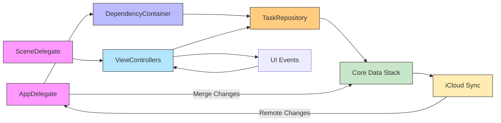
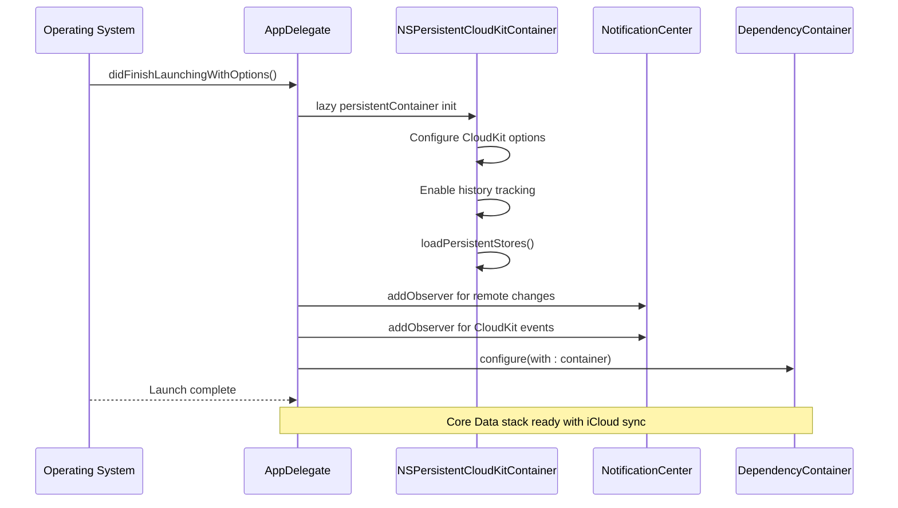
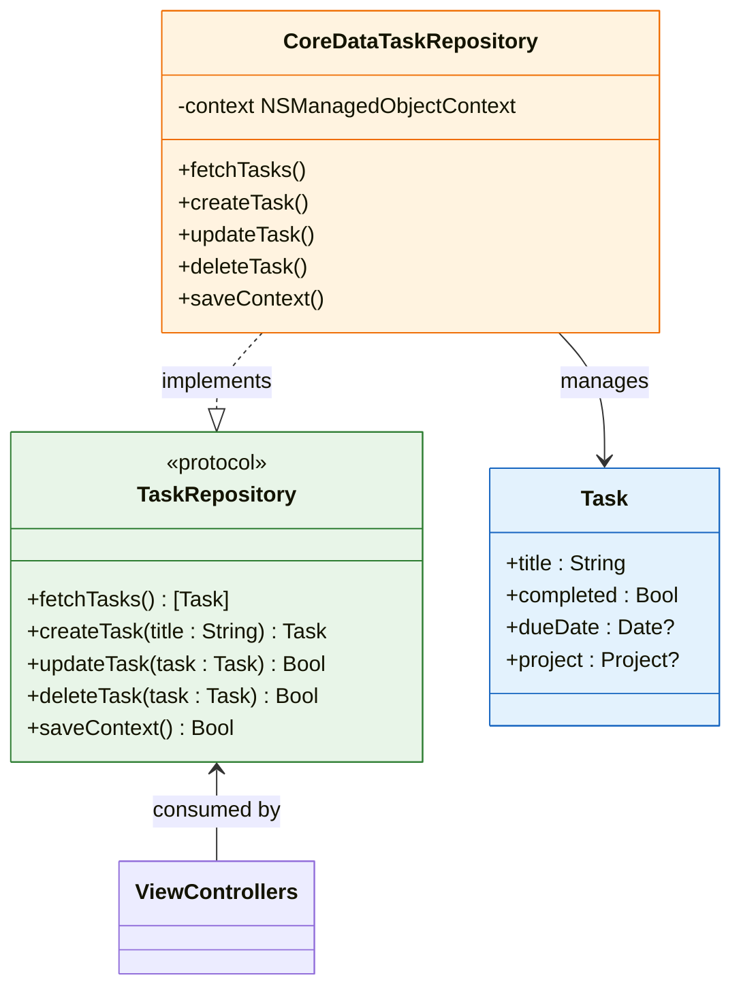
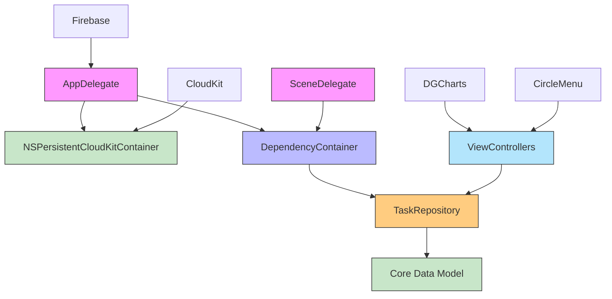

# Technical Architecture

<cite>
**Referenced Files in This Document**   
- [AppDelegate.swift](file://To%20Do%20List/AppDelegate.swift)
- [SceneDelegate.swift](file://To%20Do%20List/SceneDelegate.swift)
- [TaskRepository.swift](file://To%20Do%20List/Repositories/TaskRepository.swift)
- [DependencyContainer.swift](file://To%20Do%20List/Managers/DependencyContainer.swift)
</cite>

## Table of Contents
1. [Introduction](#introduction)
2. [Project Structure](#project-structure)
3. [Core Components](#core-components)
4. [Architecture Overview](#architecture-overview)
5. [Detailed Component Analysis](#detailed-component-analysis)
6. [Dependency Analysis](#dependency-analysis)
7. [Performance Considerations](#performance-considerations)
8. [Troubleshooting Guide](#troubleshooting-guide)
9. [Conclusion](#conclusion)

## Introduction
This document provides a comprehensive overview of the Tasker application's technical architecture. It details the hybrid Model-View-Controller (MVC) design augmented with the Repository pattern, emphasizing separation of concerns, testability, and scalability. The architecture leverages Apple’s Core Data framework with NSPersistentCloudKitContainer for seamless iCloud synchronization, while employing a DependencyContainer for centralized service management. The flow from app launch to UI presentation is orchestrated through AppDelegate and SceneDelegate, ensuring clean dependency injection and lifecycle management. Special attention is given to protocol-oriented programming for enhanced extensibility and robust background context handling for performance optimization.

## Project Structure
The Tasker application follows a feature-based organization with distinct directories for core architectural components. The main application logic resides under the "To Do List" directory, which includes AppDelegate and SceneDelegate for lifecycle management, ViewControllers for UI presentation, Managers for business logic coordination, and Repositories for data access abstraction. External dependencies are managed via CocoaPods, including CircleMenu for interactive UI elements and DGCharts for data visualization. Asset resources are centralized in Assets.xcassets, while third-party UI components like Microsoft FluentUI enhance interface consistency.

```mermaid
graph TB
subgraph "Application Core"
AppDelegate["AppDelegate.swift"]
SceneDelegate["SceneDelegate.swift"]
DependencyContainer["DependencyContainer.swift"]
end
subgraph "Data Layer"
TaskRepository["TaskRepository.swift"]
CoreData["Core Data Model"]
end
subgraph "UI Layer"
ViewControllers["ViewControllers/"]
end
AppDelegate --> DependencyContainer : "Initializes"
DependencyContainer --> TaskRepository : "Provides"
TaskRepository --> CoreData : "Accesses"
SceneDelegate --> ViewControllers : "Configures"
ViewControllers --> TaskRepository : "Consumes"
```

**Diagram sources**
- [AppDelegate.swift](file://To%20Do%20List/AppDelegate.swift#L1-L192)
- [SceneDelegate.swift](file://To%20Do%20List/SceneDelegate.swift)
- [TaskRepository.swift](file://To%20Do%20List/Repositories/TaskRepository.swift)
- [DependencyContainer.swift](file://To%20Do%20List/Managers/DependencyContainer.swift)

**Section sources**
- [AppDelegate.swift](file://To%20Do%20List/AppDelegate.swift#L1-L192)

## Core Components
The Tasker application is built around four primary architectural components: AppDelegate, SceneDelegate, DependencyContainer, and TaskRepository. These components work in concert to manage application lifecycle, coordinate dependencies, abstract data access, and ensure consistent state synchronization across devices via iCloud. The use of protocol-oriented design enables loose coupling between layers, facilitating unit testing and future extensibility. The Core Data stack is configured with NSPersistentCloudKitContainer to enable automatic cloud synchronization, while background context processing ensures responsive UI performance during data operations.

**Section sources**
- [AppDelegate.swift](file://To%20Do%20List/AppDelegate.swift#L1-L192)
- [SceneDelegate.swift](file://To%20Do%20List/SceneDelegate.swift)
- [DependencyContainer.swift](file://To%20Do%20List/Managers/DependencyContainer.swift)
- [TaskRepository.swift](file://To%20Do%20List/Repositories/TaskRepository.swift)

## Architecture Overview
Tasker employs a hybrid MVC architecture enhanced with the Repository pattern to separate data access logic from business and presentation concerns. At launch, AppDelegate initializes the Core Data stack using NSPersistentCloudKitContainer, enabling seamless iCloud synchronization. It then configures the DependencyContainer, which serves as a central registry for shared services. SceneDelegate manages scene lifecycle events and injects dependencies into view controllers, promoting inversion of control. The TaskRepository protocol abstracts all data operations, allowing view models and controllers to interact with tasks without direct knowledge of Core Data internals. This layered approach ensures maintainability, testability, and scalability.



**Diagram sources**
- [AppDelegate.swift](file://To%20Do%20List/AppDelegate.swift#L1-L192)
- [SceneDelegate.swift](file://To%20Do%20List/SceneDelegate.swift)
- [TaskRepository.swift](file://To%20Do%20List/Repositories/TaskRepository.swift)
- [DependencyContainer.swift](file://To%20Do%20List/Managers/DependencyContainer.swift)

## Detailed Component Analysis

### AppDelegate Analysis
The AppDelegate is responsible for initializing the Core Data stack with NSPersistentCloudKitContainer, enabling automatic synchronization with iCloud. It registers for remote notifications to receive CloudKit update events and observes NSPersistentStoreRemoteChange notifications to merge changes from other devices. Upon receiving remote change notifications, it triggers data consolidation logic to repair any missing task or project data. The persistent container is lazily loaded and configured with history tracking and remote change options to ensure robust sync behavior. After setup, it configures the DependencyContainer with the persistent container instance, making it available throughout the app.



**Diagram sources**
- [AppDelegate.swift](file://To%20Do%20List/AppDelegate.swift#L1-L192)

**Section sources**
- [AppDelegate.swift](file://To%20Do%20List/AppDelegate.swift#L1-L192)

### SceneDelegate Analysis
SceneDelegate manages the lifecycle of UIScene instances, configuring window and view controller hierarchies for each scene session. It is responsible for setting up the initial view controller and injecting dependencies required for UI components. By separating scene management from app-level concerns, it enables multitasking support on iPadOS and promotes cleaner responsibility division. It retrieves dependencies from the shared DependencyContainer and passes them to root view controllers, ensuring consistent configuration across different scenes.

**Section sources**
- [SceneDelegate.swift](file://To%20Do%20List/SceneDelegate.swift)

### DependencyContainer Analysis
The DependencyContainer acts as a service locator and dependency injector for the application. It is configured during app launch with the Core Data persistent container and provides access to shared resources such as repositories, managers, and coordinators. This centralized approach eliminates the need for global variables while avoiding tight coupling between components. The singleton pattern ensures consistent state across the app, and type-safe accessors prevent runtime errors due to incorrect casting.

**Section sources**
- [DependencyContainer.swift](file://To%20Do%20List/Managers/DependencyContainer.swift)

### TaskRepository Analysis
The TaskRepository protocol defines an abstraction layer over Core Data operations, encapsulating CRUD functionality for Task entities. This separation allows view controllers and business logic components to interact with tasks through a clean interface without direct dependency on Core Data. The implementation handles thread-safe access to managed object contexts, ensuring proper synchronization between main and background operations. By using protocols, the architecture supports easy mocking for unit tests and potential replacement with alternative storage mechanisms.



**Diagram sources**
- [TaskRepository.swift](file://To%20Do%20List/Repositories/TaskRepository.swift)

**Section sources**
- [TaskRepository.swift](file://To%20Do%20List/Repositories/TaskRepository.swift)

## Dependency Analysis
The Tasker application exhibits a well-defined dependency hierarchy that promotes loose coupling and testability. AppDelegate depends on Core Data and Firebase frameworks to initialize the persistence layer and configure cloud services. It directly depends on DependencyContainer to register services. SceneDelegate depends on DependencyContainer to resolve dependencies for view controllers. ViewControllers depend on TaskRepository protocol rather than concrete implementations, enabling dependency inversion. The Core Data model is encapsulated within the persistent container, preventing direct access from higher layers. Third-party libraries are isolated in the Pods directory, minimizing impact on core logic.



**Diagram sources**
- [AppDelegate.swift](file://To%20Do%20List/AppDelegate.swift#L1-L192)
- [SceneDelegate.swift](file://To%20Do%20List/SceneDelegate.swift)
- [DependencyContainer.swift](file://To%20Do%20List/Managers/DependencyContainer.swift)
- [TaskRepository.swift](file://To%20Do%20List/Repositories/TaskRepository.swift)

## Performance Considerations
The Tasker application implements several performance optimizations to ensure responsiveness and efficient resource usage. Core Data operations are performed on background contexts to prevent UI blocking, with changes merged into the main context using automaticallyMergesChangesFromParent. The NSPersistentHistoryTrackingKey enables incremental change tracking, reducing sync overhead. CloudKit event monitoring provides visibility into synchronization status without polling. Background fetch and remote notification handling allow the app to respond to cloud changes even when suspended. However, potential bottlenecks include large dataset synchronization over cellular networks and conflict resolution during offline editing, which require careful testing under real-world conditions.

**Section sources**
- [AppDelegate.swift](file://To%20Do%20List/AppDelegate.swift#L1-L192)

## Troubleshooting Guide
Common issues in the Tasker application typically relate to iCloud synchronization and Core Data consistency. If data fails to sync across devices, verify that the NSPersistentCloudKitContainer is properly configured with the correct container identifier ("iCloud.TaskerCloudKit") and that the user is signed into iCloud with adequate permissions. Monitor CloudKit event logs via NSPersistentCloudKitContainer.eventChangedNotification to diagnose sync problems. For data corruption issues, ensure that the fixMissingTasksDataWithDefaults() and fixMissingProjecsDataWithDefaults() methods are called after context merges. APNs registration failures may indicate missing entitlements or provisioning profile issues. Always check console logs for "📡 CloudKit event" and "✅ APNs token" messages to confirm proper initialization.

**Section sources**
- [AppDelegate.swift](file://To%20Do%20List/AppDelegate.swift#L1-L192)

## Conclusion
The Tasker application demonstrates a robust architectural design that balances Apple's native frameworks with modern software engineering principles. The hybrid MVC-Repository pattern provides clear separation of concerns, while protocol-oriented programming enhances testability and extensibility. The integration of NSPersistentCloudKitContainer enables seamless cross-device synchronization, and the DependencyContainer facilitates clean dependency management. Future improvements could include implementing a dedicated synchronization manager for more granular control over CloudKit operations, adding unit tests for the TaskRepository implementation, and optimizing background context usage for large datasets. Overall, the architecture provides a solid foundation for a scalable, maintainable task management application.