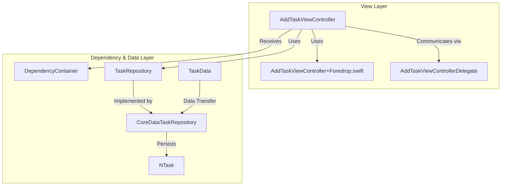
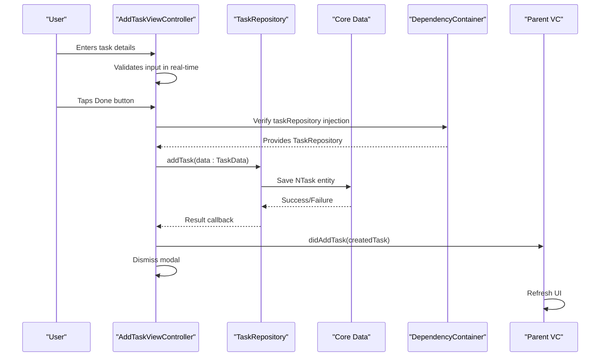
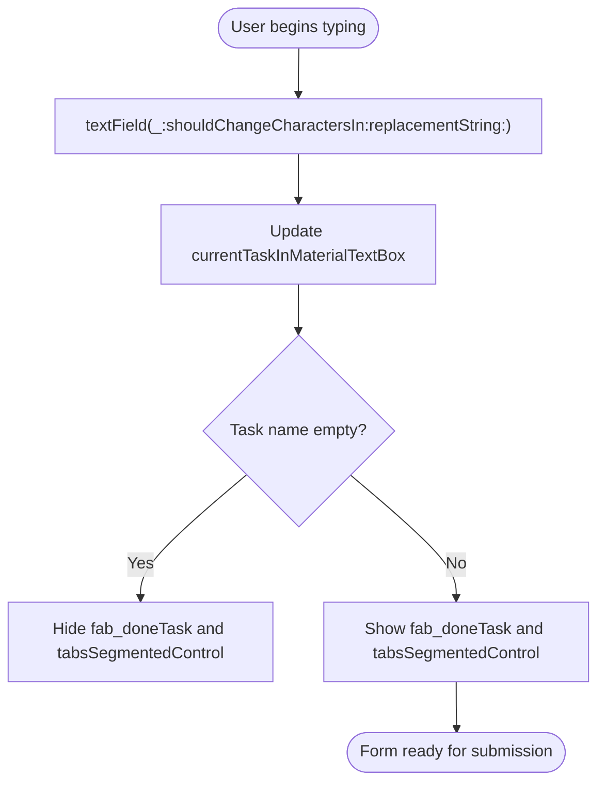
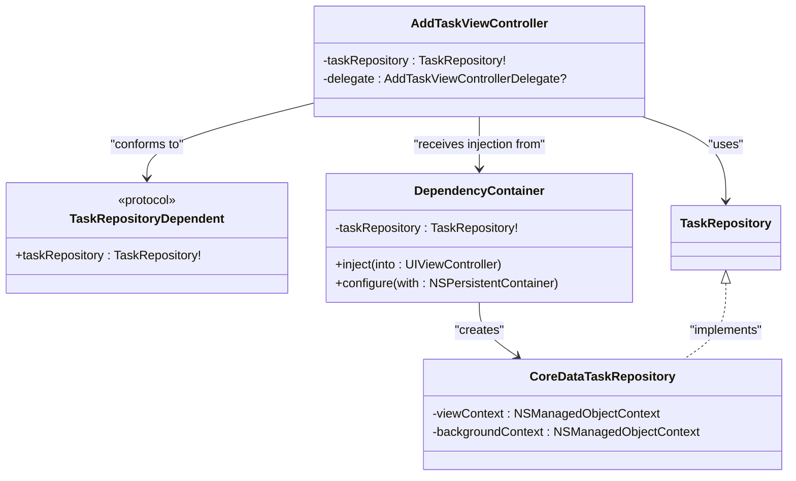
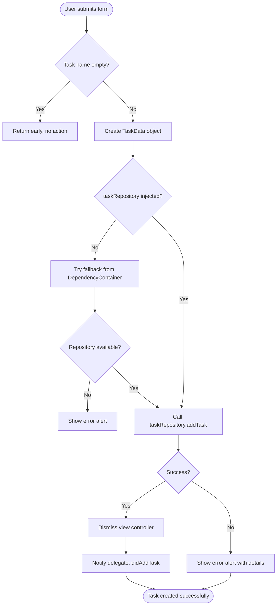
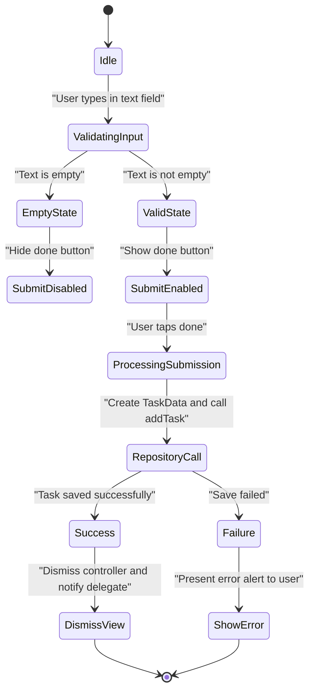

# Add Task View Controller

<cite>
**Referenced Files in This Document**   
- [AddTaskViewController.swift](file://To%20Do%20List/ViewControllers/AddTaskViewController.swift)
- [AddTaskViewController+Foredrop.swift](file://To%20Do%20List/ViewControllers/AddTaskViewController+Foredrop.swift)
- [AddTaskViewControllerDelegate.swift](file://To%20Do%20List/ViewControllers/AddTaskViewControllerDelegate.swift)
- [DependencyContainer.swift](file://To%20Do%20List/Managers/DependencyContainer.swift)
- [CoreDataTaskRepository.swift](file://To%20Do%20List/Repositories/CoreDataTaskRepository.swift)
- [TaskRepository.swift](file://To%20Do%20List/Repositories/TaskRepository.swift)
- [TaskData.swift](file://To%20Do%20List/Models/TaskData.swift)
- [NTask+CoreDataProperties.swift](file://To%20Do%20List/NTask+CoreDataProperties.swift)
</cite>

## Table of Contents
1. [Introduction](#introduction)
2. [Project Structure](#project-structure)
3. [Core Components](#core-components)
4. [Architecture Overview](#architecture-overview)
5. [Detailed Component Analysis](#detailed-component-analysis)
6. [Dependency Analysis](#dependency-analysis)
7. [Performance Considerations](#performance-considerations)
8. [Troubleshooting Guide](#troubleshooting-guide)
9. [Conclusion](#conclusion)

## Introduction
The AddTaskViewController is a central component of the Tasker application responsible for creating and editing tasks through a form-based interface. This documentation provides a comprehensive analysis of its implementation, covering form elements, data validation, dependency injection, persistence mechanisms, and user interaction flows. The controller utilizes modern iOS development patterns including the repository pattern for data access, dependency injection for testability, and protocol-oriented design for communication with parent view controllers.

## Project Structure
The AddTaskViewController is located within the ViewControllers directory of the To Do List module. It is implemented across multiple files using Swift extensions to separate concerns:
- Main implementation in AddTaskViewController.swift
- UI layout and action handling in AddTaskViewController+Foredrop.swift
- Delegate protocol definition in AddTaskViewControllerDelegate.swift

The view controller integrates with core application services through the DependencyContainer and interacts with the data layer via the TaskRepository protocol.



**Diagram sources**
- [AddTaskViewController.swift](file://To%20Do%20List/ViewControllers/AddTaskViewController.swift)
- [AddTaskViewController+Foredrop.swift](file://To%20Do%20List/ViewControllers/AddTaskViewController+Foredrop.swift)
- [DependencyContainer.swift](file://To%20Do%20List/Managers/DependencyContainer.swift)
- [TaskRepository.swift](file://To%20Do%20List/Repositories/TaskRepository.swift)

**Section sources**
- [AddTaskViewController.swift](file://To%20Do%20List/ViewControllers/AddTaskViewController.swift)
- [AddTaskViewController+Foredrop.swift](file://To%20Do%20List/ViewControllers/AddTaskViewController+Foredrop.swift)

## Core Components
The AddTaskViewController implements a form-based interface for task creation with several key components:
- Text fields for task name and description using Material Design components
- Pill button bar for project selection
- Segmented control for priority selection
- Switch control for morning/evening time categorization
- Floating action button for form submission

The controller manages its state through properties that track user input and selection, including currentTaskInMaterialTextBox, currenttProjectForAddTaskView, and currentTaskPriority. It conforms to the TaskRepositoryDependent protocol to receive its data dependency and uses weak delegation to communicate with parent view controllers.

**Section sources**
- [AddTaskViewController.swift](file://To%20Do%20List/ViewControllers/AddTaskViewController.swift#L1-L517)
- [AddTaskViewController+Foredrop.swift](file://To%20Do%20List/ViewControllers/AddTaskViewController+Foredrop.swift#L1-L170)

## Architecture Overview
The AddTaskViewController follows a clean architecture pattern with clear separation between presentation, business logic, and data access layers. It receives dependencies through the DependencyContainer rather than accessing services directly, promoting testability and loose coupling. The controller uses the repository pattern to persist data, delegating all data operations to the TaskRepository implementation.



**Diagram sources**
- [AddTaskViewController.swift](file://To%20Do%20List/ViewControllers/AddTaskViewController.swift#L1-L517)
- [AddTaskViewController+Foredrop.swift](file://To%20Do%20List/ViewControllers/AddTaskViewController+Foredrop.swift#L1-L170)
- [CoreDataTaskRepository.swift](file://To%20Do%20List/Repositories/CoreDataTaskRepository.swift#L1-L454)

## Detailed Component Analysis

### Form Interface and Data Binding
The AddTaskViewController implements a form-based interface with real-time data binding between UI controls and internal state properties. Text field input is captured through the UITextFieldDelegate protocol, with changes immediately reflected in corresponding properties.



**Diagram sources**
- [AddTaskViewController.swift](file://To%20Do%20List/ViewControllers/AddTaskViewController.swift#L380-L420)

**Section sources**
- [AddTaskViewController.swift](file://To%20Do%20List/ViewControllers/AddTaskViewController.swift#L380-L420)

### Dependency Injection and Service Access
The AddTaskViewController receives its TaskRepository dependency through property injection via the DependencyContainer. This pattern allows for flexible configuration and easier testing by decoupling the view controller from specific service implementations.



**Diagram sources**
- [AddTaskViewController.swift](file://To%20Do%20List/ViewControllers/AddTaskViewController.swift#L25-L30)
- [DependencyContainer.swift](file://To%20Do%20List/Managers/DependencyContainer.swift#L1-L80)
- [TaskRepository.swift](file://To%20Do%20List/Repositories/TaskRepository.swift#L1-L117)

**Section sources**
- [AddTaskViewController.swift](file://To%20Do%20List/ViewControllers/AddTaskViewController.swift#L25-L30)
- [DependencyContainer.swift](file://To%20Do%20List/Managers/DependencyContainer.swift#L1-L80)

### Task Creation and Persistence Flow
The task creation process follows a structured flow from user input to data persistence, with comprehensive error handling and user feedback mechanisms.



**Diagram sources**
- [AddTaskViewController+Foredrop.swift](file://To%20Do%20List/ViewControllers/AddTaskViewController+Foredrop.swift#L100-L170)
- [CoreDataTaskRepository.swift](file://To%20Do%20List/Repositories/CoreDataTaskRepository.swift#L100-L150)

**Section sources**
- [AddTaskViewController+Foredrop.swift](file://To%20Do%20List/ViewControllers/AddTaskViewController+Foredrop.swift#L100-L170)

### Input Validation and Error Handling
The controller implements both real-time and final validation to ensure data integrity before persistence. Real-time validation controls the visibility of the submit button based on whether the required task name field is populated.



**Diagram sources**
- [AddTaskViewController.swift](file://To%20Do%20List/ViewControllers/AddTaskViewController.swift#L380-L420)
- [AddTaskViewController+Foredrop.swift](file://To%20Do%20List/ViewControllers/AddTaskViewController+Foredrop.swift#L100-L170)

**Section sources**
- [AddTaskViewController.swift](file://To%20Do%20List/ViewControllers/AddTaskViewController.swift#L380-L420)

## Dependency Analysis
The AddTaskViewController has well-defined dependencies that follow modern iOS architecture principles. It depends on the TaskRepository protocol rather than a concrete implementation, allowing for dependency inversion and easier testing. The DependencyContainer manages the lifecycle of shared services and injects them into view controllers as needed.

The controller also depends on several third-party libraries for UI components:
- FSCalendar for calendar functionality
- FluentUI for UI components
- MaterialComponents for text fields and buttons

These dependencies are managed through Swift Package Manager or similar dependency management tools.

```mermaid
erDiagram
AddTaskViewController ||--o{ TaskRepository : "depends on"
DependencyContainer ||--o{ AddTaskViewController : "injects into"
TaskRepository ||--o{ CoreDataTaskRepository : "implemented by"
CoreDataTaskRepository }|--o{ NSManagedObjectContext : "uses"
AddTaskViewController }|--o{ AddTaskViewControllerDelegate : "communicates via"
class AddTaskViewController {
string currentTaskInMaterialTextBox
string currentTaskDescription
bool isThisEveningTask
string currenttProjectForAddTaskView
TaskPriority currentTaskPriority
TaskRepository taskRepository
AddTaskViewControllerDelegate delegate
}
class TaskRepository {
<<protocol>>
+addTask(data: TaskData, completion: (Result<NTask, Error>) -> Void)
}
class CoreDataTaskRepository {
+addTask(data: TaskData, completion: (Result<NTask, Error>) -> Void)
}
class TaskData {
string name
string? details
TaskType type
TaskPriority priority
Date dueDate
string project
}
class NTask {
string name
string? taskDetails
Int32 taskType
Int32 taskPriority
NSDate? dueDate
string? project
bool isComplete
NSDate? dateAdded
NSDate? dateCompleted
}
```

**Diagram sources**
- [AddTaskViewController.swift](file://To%20Do%20List/ViewControllers/AddTaskViewController.swift)
- [TaskRepository.swift](file://To%20Do%20List/Repositories/TaskRepository.swift)
- [CoreDataTaskRepository.swift](file://To%20Do%20List/Repositories/CoreDataTaskRepository.swift)
- [TaskData.swift](file://To%20Do%20List/Models/TaskData.swift)
- [NTask+CoreDataProperties.swift](file://To%20Do%20List/NTask+CoreDataProperties.swift)

**Section sources**
- [AddTaskViewController.swift](file://To%20Do%20List/ViewControllers/AddTaskViewController.swift)
- [TaskRepository.swift](file://To%20Do%20List/Repositories/TaskRepository.swift)

## Performance Considerations
The AddTaskViewController is designed with performance in mind, particularly in its data access patterns. The TaskRepository implementation uses background contexts for data modification operations, preventing UI thread blocking during Core Data saves. The view controller itself performs minimal work in its main thread, delegating all data operations to the repository layer.

The form interface is optimized for responsiveness, with real-time validation that updates UI state without expensive computations. Text field changes are processed efficiently through the UITextFieldDelegate methods, and UI updates are batched where possible.

For large project lists, the pill button bar implementation in buildSamplePillBarData uses efficient array operations to construct the selection interface, ensuring smooth performance even with numerous projects.

## Troubleshooting Guide
Common issues with the AddTaskViewController typically relate to dependency injection failures or data validation problems. The controller includes comprehensive logging to aid in debugging these issues.

**Dependency Injection Issues:**
- **Symptom**: taskRepository is nil in viewDidLoad or doneAddTaskAction
- **Cause**: DependencyContainer not properly configured or injection failed
- **Solution**: Ensure DependencyContainer.shared.configure(with:) is called during app initialization with the persistent container

**Form Submission Issues:**
- **Symptom**: Form does not submit even with valid input
- **Cause**: Empty task name field (required field)
- **Solution**: Ensure user has entered text in the task name field

**UI Layout Issues:**
- **Symptom**: Foredrop container positioned incorrectly
- **Cause**: Calendar widget layout changes affecting positioning calculations
- **Solution**: Verify setupAddTaskForedrop() positioning logic accounts for current calendar height

**Error Handling:**
The controller provides user-friendly error messages through UIAlertControllers when task creation fails. Developers can diagnose issues by checking the console logs, which include detailed information about the error domain, code, and localized description.

**Section sources**
- [AddTaskViewController.swift](file://To%20Do%20List/ViewControllers/AddTaskViewController.swift)
- [AddTaskViewController+Foredrop.swift](file://To%20Do%20List/ViewControllers/AddTaskViewController+Foredrop.swift)
- [DependencyContainer.swift](file://To%20Do%20List/Managers/DependencyContainer.swift)

## Conclusion
The AddTaskViewController represents a well-architected component that follows modern iOS development best practices. It effectively separates concerns through the use of extensions, implements proper dependency injection, and uses the repository pattern for data access. The controller provides a user-friendly interface for task creation with real-time validation and comprehensive error handling.

Key strengths include its robust dependency management through the DependencyContainer, clear communication pattern via the AddTaskViewControllerDelegate protocol, and efficient data persistence through the TaskRepository abstraction. The implementation demonstrates attention to detail in user experience, with thoughtful UI state management and helpful error feedback.

For future improvements, consider implementing more comprehensive input validation (such as character limits or date validation), adding support for additional task attributes, and enhancing accessibility features. The current architecture provides a solid foundation for these enhancements while maintaining code quality and testability.