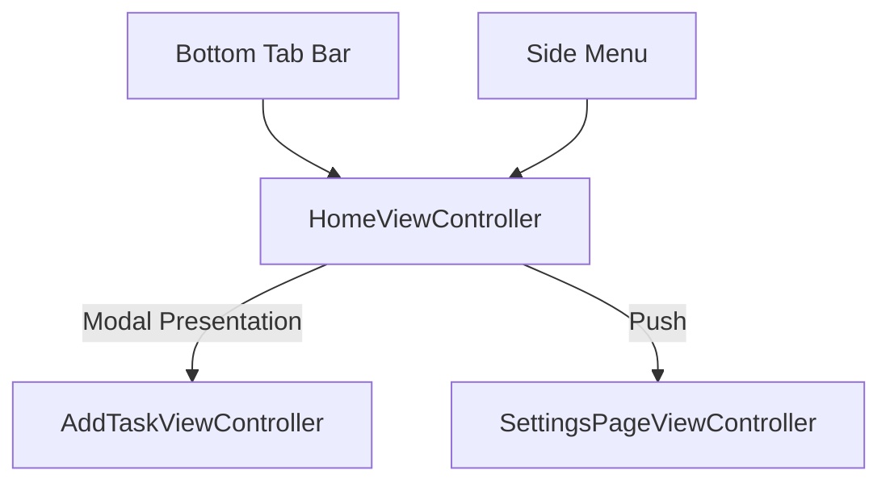
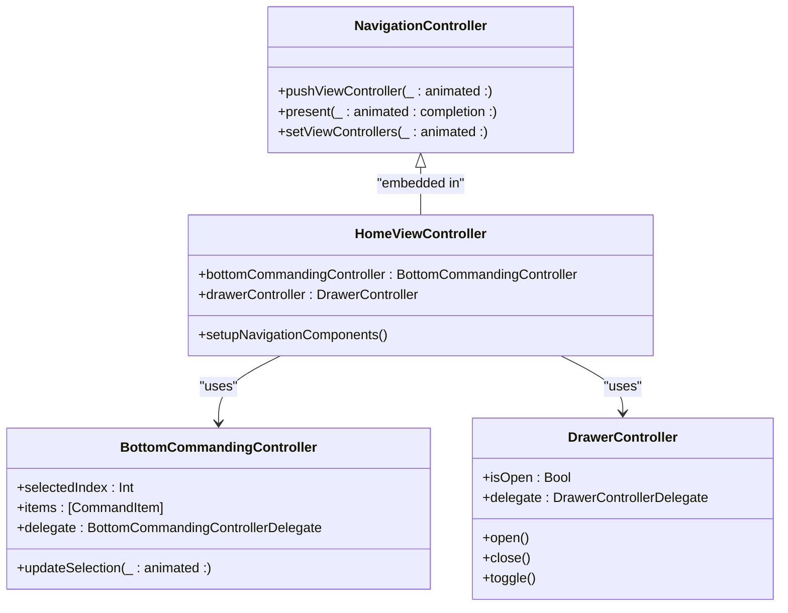
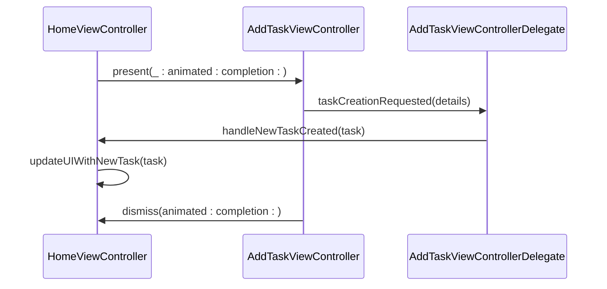
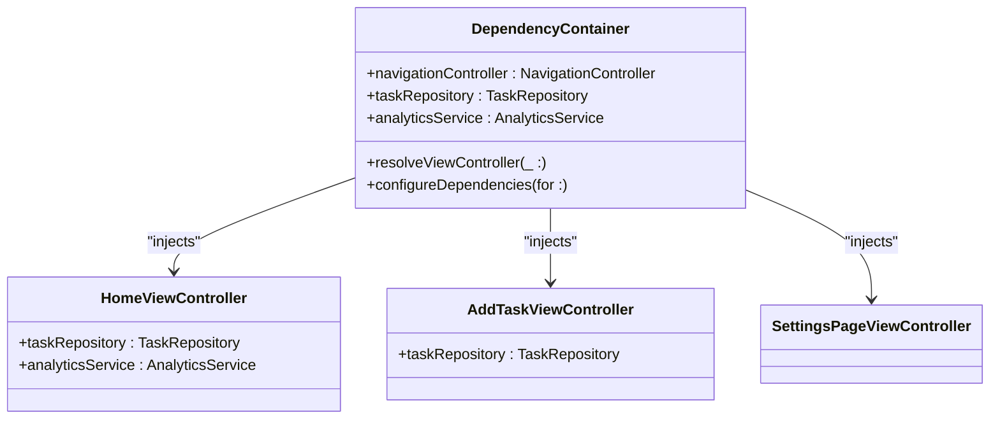
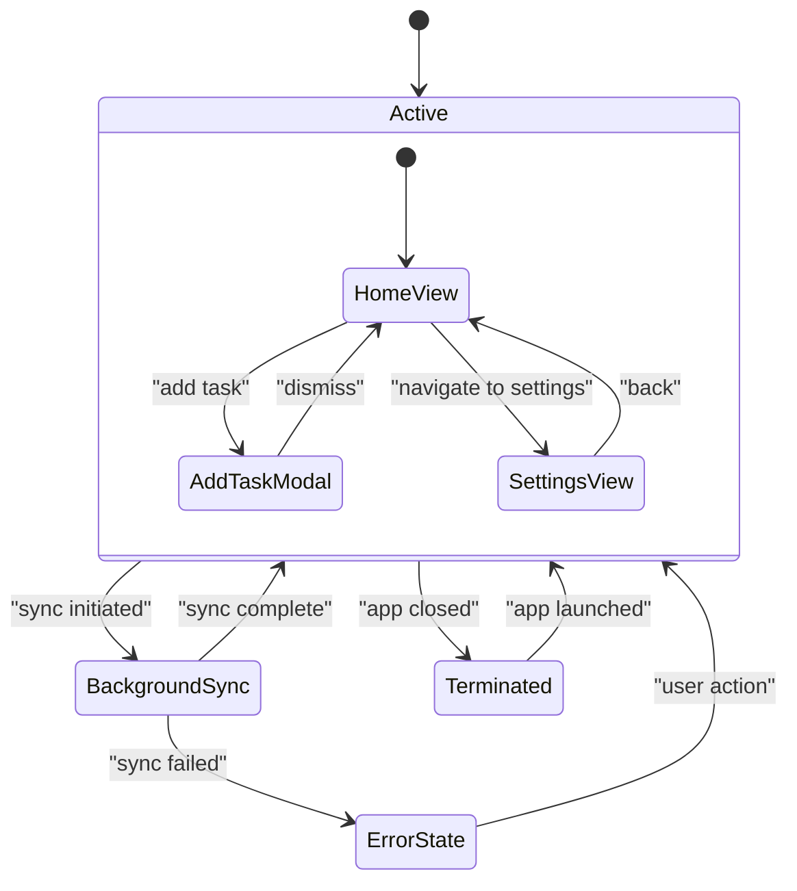

# Navigation and Flow

<cite>
**Referenced Files in This Document**   
- [HomeViewController.swift](file://To%20Do%20List/ViewControllers/HomeViewController.swift)
- [AddTaskViewController.swift](file://To%20Do%20List/ViewControllers/AddTaskViewController.swift)
- [SettingsPageViewController.swift](file://To%20Do%20List/ViewControllers/SettingsPageViewController.swift)
- [HomeViewController+FluentUIDelegate.swift](file://To%20Do%20List/ViewControllers/HomeViewController+FluentUIDelegate.swift)
- [AddTaskViewControllerDelegate.swift](file://To%20Do%20List/ViewControllers/AddTaskViewControllerDelegate.swift)
- [BottomCommandingController.swift](file://Pods/MicrosoftFluentUI/Sources/FluentUI_iOS/Components/Bottom%20Commanding/BottomCommandingController.swift)
- [DrawerController.swift](file://Pods/MicrosoftFluentUI/Sources/FluentUI_iOS/Components/Drawer/DrawerController.swift)
- [NavigationController.swift](file://Pods/MicrosoftFluentUI/Sources/FluentUI_iOS/Components/Navigation/NavigationController.swift)
- [DependencyContainer.swift](file://To%20Do%20List/DependencyContainer.swift)
</cite>

## Table of Contents
1. [Introduction](#introduction)
2. [Core Navigation Structure](#core-navigation-structure)
3. [Primary Navigation Components](#primary-navigation-components)
4. [View Controller Communication Patterns](#view-controller-communication-patterns)
5. [Dependency Injection and Navigation Coordination](#dependency-injection-and-navigation-coordination)
6. [Deep Linking and URL Handling](#deep-linking-and-url-handling)
7. [Navigation State Management](#navigation-state-management)
8. [Accessibility and Edge Case Handling](#accessibility-and-edge-case-handling)
9. [Conclusion](#conclusion)

## Introduction
The Tasker application implements a hierarchical navigation architecture centered around the HomeViewController as the root view controller. The navigation system combines modal presentations, push transitions, and tab-based navigation to provide an intuitive user experience. Built upon UIKit and enhanced with Microsoft FluentUI components, the app leverages both storyboard segues and programmatic navigation patterns. This document details the navigation flow, component interactions, state management, and edge case handling across major view controllers.

## Core Navigation Structure

The primary navigation flow in Tasker follows a hierarchical model with three key view controllers:

1. **HomeViewController**: Serves as the root view controller and main dashboard
2. **AddTaskViewController**: Presented modally for task creation
3. **SettingsPageViewController**: Pushed onto the navigation stack for configuration

The app utilizes a combination of FluentUI's NavigationController and custom bottom command bars to manage transitions. The HomeViewController is embedded within a FluentUI NavigationController, enabling consistent navigation bar styling and transition animations.

**Diagram sources**
- [HomeViewController.swift](file://To%20Do%20List/ViewControllers/HomeViewController.swift#L1-L50)
- [NavigationController.swift](file://Pods/MicrosoftFluentUI/Sources/FluentUI_iOS/Components/Navigation/NavigationController.swift#L10-L30)

**Section sources**
- [HomeViewController.swift](file://To%20Do%20List/ViewControllers/HomeViewController.swift#L1-L100)
- [SettingsPageViewController.swift](file://To%20Do%20List/ViewControllers/SettingsPageViewController.swift#L1-L25)

## Primary Navigation Components

### Bottom Tab Bar Implementation
The primary navigation is facilitated through a custom bottom tab bar implemented using FluentUI's BottomCommandingController. This component provides access to core features including task dashboard, calendar view, and analytics. The tab bar is integrated into the HomeViewController via the HomeBottomBarView component.

### Side Menu Navigation
The application implements a drawer-based side menu using FluentUI's DrawerController. This menu provides alternative navigation paths and quick access to settings, projects, and user profile. The drawer is accessible via a menu button in the navigation bar or through a swipe gesture from the left edge.

### FluentUI Navigation Components
The navigation system leverages several FluentUI components:
- **BottomCommandingController**: Manages the bottom tab interface
- **DrawerController**: Handles side menu presentation and gestures
- **NavigationController**: Provides consistent navigation stack management
- **CardPresentationController**: Used for modal presentations with FluentUI styling

**Diagram sources**
- [BottomCommandingController.swift](file://Pods/MicrosoftFluentUI/Sources/FluentUI_iOS/Components/Bottom%20Commanding/BottomCommandingController.swift#L15-L45)
- [DrawerController.swift](file://Pods/MicrosoftFluentUI/Sources/FluentUI_iOS/Components/Drawer/DrawerController.swift#L20-L50)
- [HomeViewController.swift](file://To%20Do%20List/ViewControllers/HomeViewController.swift#L200-L250)

**Section sources**
- [HomeViewController+FluentUIDelegate.swift](file://To%20Do%20List/ViewControllers/HomeViewController+FluentUIDelegate.swift#L1-L80)
- [HomeBottomBarView.swift](file://To%20Do%20List/View/HomeBottomBarView.swift#L1-L35)

## View Controller Communication Patterns

### Modal Presentation Flow
The AddTaskViewController is presented modally from the HomeViewController using a custom presentation style. The presentation is triggered by a floating action button and utilizes FluentUI's card-style modal presentation.

**Diagram sources**
- [AddTaskViewController.swift](file://To%20Do%20List/ViewControllers/AddTaskViewController.swift#L45-L90)
- [AddTaskViewControllerDelegate.swift](file://To%20Do%20List/ViewControllers/AddTaskViewControllerDelegate.swift#L5-L25)

### Delegation and Callback Mechanisms
View controllers communicate through protocol-based delegation patterns:
- **AddTaskViewControllerDelegate**: Notifies the parent view controller of task creation events
- **HomeViewControllerDelegate**: Handles navigation requests from child components
- Closure callbacks are used for simple interactions, such as button actions in custom UI components

**Section sources**
- [AddTaskViewControllerDelegate.swift](file://To%20Do%20List/ViewControllers/AddTaskViewControllerDelegate.swift#L1-L30)
- [HomeViewController.swift](file://To%20Do%20List/ViewControllers/HomeViewController.swift#L150-L200)

## Dependency Injection and Navigation Coordination

### DependencyContainer Integration
The DependencyContainer is responsible for injecting navigation dependencies into view controllers. It provides instances of navigation controllers, coordinators, and service objects through property injection.

**Diagram sources**
- [DependencyContainer.swift](file://To%20Do%20List/DependencyContainer.swift#L10-L40)
- [HomeViewController.swift](file://To%20Do%20List/ViewControllers/HomeViewController.swift#L50-L75)

### Coordinator Pattern (Pending Implementation)
While the current implementation relies on direct view controller interactions, the architecture roadmap indicates a planned migration to a coordinator pattern. The DependencyContainer will instantiate and manage navigation coordinators that handle complex navigation flows and reduce view controller responsibilities.

**Section sources**
- [DependencyContainer.swift](file://To%20Do%20List/DependencyContainer.swift#L1-L50)
- [README.md](file://README.md#L278-L306)

## Deep Linking and URL Handling

The application currently has limited deep linking capabilities. URL schemes are not fully implemented, but the architecture supports future integration through the DependencyContainer and navigation coordinator system. Planned deep links include:
- `tasker://tasks/new` - Direct access to AddTaskViewController
- `tasker://settings` - Navigate to SettingsPageViewController
- `tasker://tasks/{id}` - Open specific task details

URL handling would be managed by a central DeepLinkRouter component injected via the DependencyContainer, which would parse incoming URLs and trigger appropriate navigation flows.

## Navigation State Management

### Background Sync Operations
During background sync operations initiated by CloudKit, the navigation system preserves the current state. The app uses NSProgress and KVO to monitor sync status and temporarily disables navigation controls to prevent inconsistent states.

### State Preservation
Navigation state is preserved across app terminations using NSCoder and UserDefaults. The current tab selection, drawer state, and recent navigation history are saved and restored on launch. This ensures users return to their previous context.

**Diagram sources**
- [HomeViewController.swift](file://To%20Do%20List/ViewControllers/HomeViewController.swift#L300-L350)
- [AppDelegate.swift](file://To%20Do%20List/AppDelegate.swift#L50-L75)

**Section sources**
- [HomeViewController.swift](file://To%20Do%20List/ViewControllers/HomeViewController.swift#L250-L400)

## Accessibility and Edge Case Handling

### Accessibility Navigation
The navigation system supports VoiceOver and Switch Control through proper accessibility labeling and logical navigation order. All navigation elements have appropriate accessibility identifiers and hints. The tab bar and drawer menu are fully accessible, with proper focus management during transitions.

### Edge Case Management
The application handles several navigation edge cases:
- **Network interruptions during navigation**: Graceful degradation with offline state indication
- **Memory pressure**: View controllers are properly released from the navigation stack
- **Orientation changes**: Navigation components adapt to different screen sizes and orientations
- **Modal presentation conflicts**: Proper queuing of presentation requests to prevent race conditions

## Conclusion
The Tasker application implements a robust navigation architecture that combines UIKit's native navigation capabilities with Microsoft FluentUI's design components. The current system effectively manages the core navigation flows between HomeViewController, AddTaskViewController, and SettingsPageViewController. While the architecture currently relies on direct view controller interactions and singleton patterns, the foundation is in place for migrating to a more scalable coordinator-based approach. The integration of FluentUI components provides a consistent and accessible user experience across all navigation scenarios. Future improvements should focus on implementing the planned coordinator pattern, expanding deep linking capabilities, and enhancing state preservation across all usage scenarios.