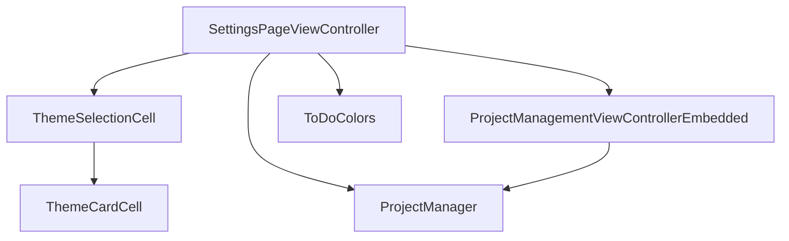
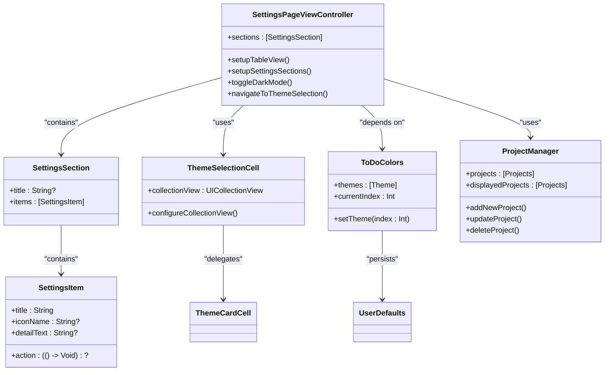
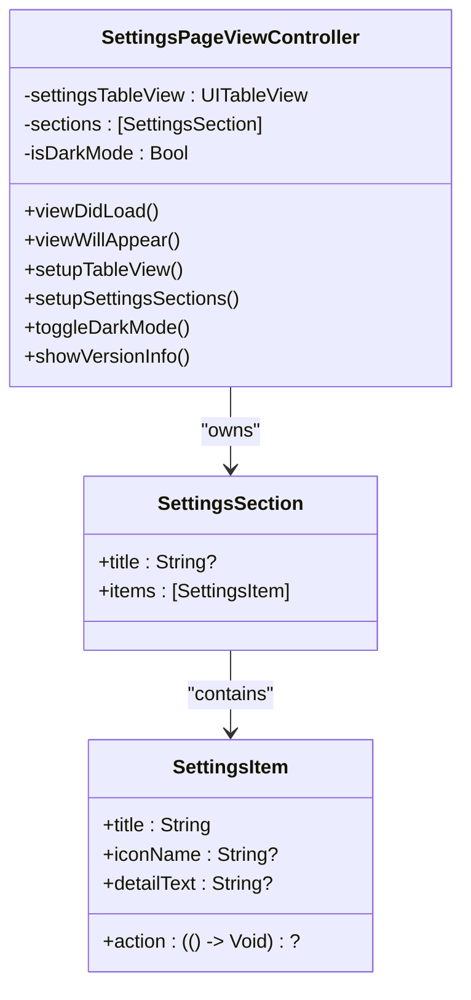
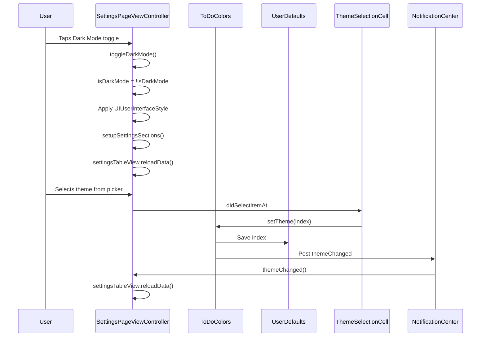
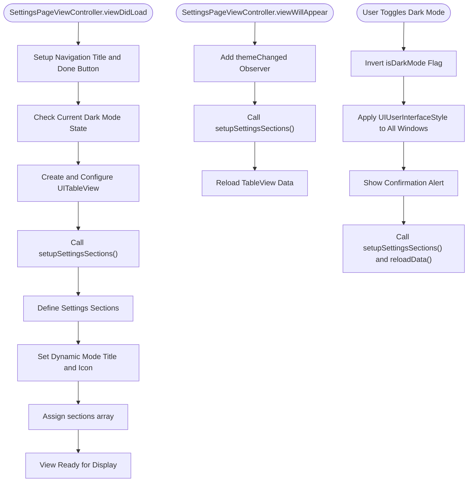
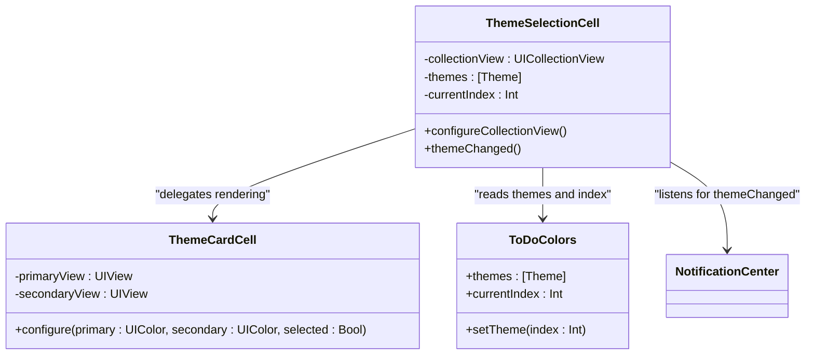
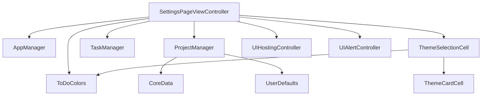

# Settings View Controller

<cite>
**Referenced Files in This Document**   
- [SettingsPageViewController.swift](file://To%20Do%20List/ViewControllers/SettingsPageViewController.swift)
- [ThemeSelectionCell.swift](file://To%20Do%20List/ViewControllers/Settings/ThemeSelectionCell.swift)
- [ToDoColors.swift](file://To%20Do%20List/View/Theme/ToDoColors.swift)
- [ProjectManager.swift](file://To%20Do%20List/ViewControllers/ProjectManager.swift)
</cite>

## Table of Contents
1. [Introduction](#introduction)
2. [Project Structure](#project-structure)
3. [Core Components](#core-components)
4. [Architecture Overview](#architecture-overview)
5. [Detailed Component Analysis](#detailed-component-analysis)
6. [Dependency Analysis](#dependency-analysis)
7. [Performance Considerations](#performance-considerations)
8. [Troubleshooting Guide](#troubleshooting-guide)
9. [Conclusion](#conclusion)

## Introduction
The `SettingsPageViewController` is a central interface in the Tasker application responsible for managing user preferences and app configuration. It provides users with control over appearance settings such as dark mode and custom themes, access to LLM-related features, project management, and app metadata. The controller dynamically updates its UI based on user interactions and system events, ensuring a responsive and consistent experience across device states and themes. This document details the implementation, architecture, and integration points of the `SettingsPageViewController`, focusing on its role in handling user settings, theme management, and navigation.

## Project Structure
The `SettingsPageViewController` resides within the ViewControllers directory and interacts with several key components including theme management, project data handling, and LLM configuration. It uses a modular structure with embedded view controllers and custom UI components to deliver a cohesive settings experience.

**Diagram sources**
- [SettingsPageViewController.swift](file://To%20Do%20List/ViewControllers/SettingsPageViewController.swift#L1-L562)
- [ThemeSelectionCell.swift](file://To%20Do%20List/ViewControllers/Settings/ThemeSelectionCell.swift#L1-L129)
- [ToDoColors.swift](file://To%20Do%20List/View/Theme/ToDoColors.swift#L1-L158)
- [ProjectManager.swift](file://To%20Do%20List/ViewControllers/ProjectManager.swift#L1-L338)

**Section sources**
- [SettingsPageViewController.swift](file://To%20Do%20List/ViewControllers/SettingsPageViewController.swift#L1-L562)

## Core Components
The `SettingsPageViewController` manages user preferences through a table-based interface, utilizing structured data models (`SettingsItem` and `SettingsSection`) to organize settings into logical groups. It handles dynamic content such as version display, theme switching, and navigation to sub-settings. The controller integrates with `UserDefaults` via the `ToDoColors` class to persist theme selections and responds to system-wide trait changes for dark mode. Custom cells like `ThemeSelectionCell` enable rich, interactive elements within the table view.

**Section sources**
- [SettingsPageViewController.swift](file://To%20Do%20List/ViewControllers/SettingsPageViewController.swift#L1-L562)
- [ToDoColors.swift](file://To%20Do%20List/View/Theme/ToDoColors.swift#L1-L158)

## Architecture Overview
The `SettingsPageViewController` follows a MVC (Model-View-Controller) pattern, delegating data management to model classes like `ProjectManager` and `AppManager`, while maintaining responsibility for UI presentation and user interaction. It uses `UITableView` as its primary interface component, with custom cell types for specialized functionality. The architecture emphasizes separation of concerns, with distinct sections handling appearance, LLM settings, and project management.

**Diagram sources**
- [SettingsPageViewController.swift](file://To%20Do%20List/ViewControllers/SettingsPageViewController.swift#L1-L562)
- [ThemeSelectionCell.swift](file://To%20Do%20List/ViewControllers/Settings/ThemeSelectionCell.swift#L1-L129)
- [ToDoColors.swift](file://To%20Do%20List/View/Theme/ToDoColors.swift#L1-L158)
- [ProjectManager.swift](file://To%20Do%20List/ViewControllers/ProjectManager.swift#L1-L338)

## Detailed Component Analysis

### SettingsPageViewController Analysis
The `SettingsPageViewController` serves as the main entry point for user configuration in Tasker. It organizes settings into sections such as Appearance, LLM Settings, and About, each containing actionable items represented by `SettingsItem` instances. The controller dynamically generates these items based on current app state, such as displaying the appropriate dark mode toggle text and icon.

#### For Object-Oriented Components:

**Diagram sources**
- [SettingsPageViewController.swift](file://To%20Do%20List/ViewControllers/SettingsPageViewController.swift#L1-L562)

#### For API/Service Components:

**Diagram sources**
- [SettingsPageViewController.swift](file://To%20Do%20List/ViewControllers/SettingsPageViewController.swift#L1-L562)
- [ThemeSelectionCell.swift](file://To%20Do%20List/ViewControllers/Settings/ThemeSelectionCell.swift#L1-L129)
- [ToDoColors.swift](file://To%20Do%20List/View/Theme/ToDoColors.swift#L1-L158)

#### For Complex Logic Components:

**Diagram sources**
- [SettingsPageViewController.swift](file://To%20Do%20List/ViewControllers/SettingsPageViewController.swift#L1-L562)

**Section sources**
- [SettingsPageViewController.swift](file://To%20Do%20List/ViewControllers/SettingsPageViewController.swift#L1-L562)

### Theme Selection Cell Analysis
The `ThemeSelectionCell` provides a horizontal scrollable interface for selecting color themes within the settings. It uses a `UICollectionView` embedded within a `UITableViewCell` to display theme options as cards, each representing a different color scheme.

#### For Object-Oriented Components:

**Diagram sources**
- [ThemeSelectionCell.swift](file://To%20Do%20List/ViewControllers/Settings/ThemeSelectionCell.swift#L1-L129)
- [ToDoColors.swift](file://To%20Do%20List/View/Theme/ToDoColors.swift#L1-L158)

**Section sources**
- [ThemeSelectionCell.swift](file://To%20Do%20List/ViewControllers/Settings/ThemeSelectionCell.swift#L1-L129)

## Dependency Analysis
The `SettingsPageViewController` has well-defined dependencies on several key components that enable its functionality. These dependencies are managed through direct instantiation or singleton access patterns.

**Diagram sources**
- [SettingsPageViewController.swift](file://To%20Do%20List/ViewControllers/SettingsPageViewController.swift#L1-L562)
- [ThemeSelectionCell.swift](file://To%20Do%20List/ViewControllers/Settings/ThemeSelectionCell.swift#L1-L129)
- [ToDoColors.swift](file://To%20Do%20List/View/Theme/ToDoColors.swift#L1-L158)
- [ProjectManager.swift](file://To%20Do%20List/ViewControllers/ProjectManager.swift#L1-L338)

**Section sources**
- [SettingsPageViewController.swift](file://To%20Do%20List/ViewControllers/SettingsPageViewController.swift#L1-L562)
- [ThemeSelectionCell.swift](file://To%20Do%20List/ViewControllers/Settings/ThemeSelectionCell.swift#L1-L129)
- [ToDoColors.swift](file://To%20Do%20List/View/Theme/ToDoColors.swift#L1-L158)
- [ProjectManager.swift](file://To%20Do%20List/ViewControllers/ProjectManager.swift#L1-L338)

## Performance Considerations
The `SettingsPageViewController` maintains good performance through efficient data management and UI updates. It avoids unnecessary Core Data fetches by relying on the `ProjectManager`'s published properties and only refreshes data when necessary. The use of `UITableView` with cell reuse ensures memory efficiency, while the embedded `UICollectionView` in `ThemeSelectionCell` is optimized with proper constraints and layout configuration. Theme changes are broadcast via `NotificationCenter`, allowing for targeted UI updates without full view reloads where possible.

## Troubleshooting Guide
Common issues with the `SettingsPageViewController` typically involve theme persistence, UI responsiveness, or navigation failures. Ensure that `UserDefaults` writes are successful by verifying the `selectedThemeIndex` key. Confirm that `NotificationCenter` observers are properly added and removed in `viewWillAppear` and `viewWillDisappear` to prevent memory leaks or missed updates. For display issues with the theme picker, verify that the `ThemeSelectionCell` constraints are correctly applied and that the collection view's data source methods are properly implemented.

**Section sources**
- [SettingsPageViewController.swift](file://To%20Do%20List/ViewControllers/SettingsPageViewController.swift#L1-L562)
- [ThemeSelectionCell.swift](file://To%20Do%20List/ViewControllers/Settings/ThemeSelectionCell.swift#L1-L129)
- [ToDoColors.swift](file://To%20Do%20List/View/Theme/ToDoColors.swift#L1-L158)

## Conclusion
The `SettingsPageViewController` effectively serves as the central hub for user configuration in Tasker, providing a clean, organized interface for managing app preferences. Its integration with `UserDefaults` through `ToDoColors` enables persistent theme selection, while its modular design allows for extensible settings sections. The controller demonstrates effective use of iOS design patterns including MVC, delegation, and notification-based updates. By leveraging `UITableView` with custom cells and embedded view controllers, it delivers a rich user experience while maintaining code organization and performance.