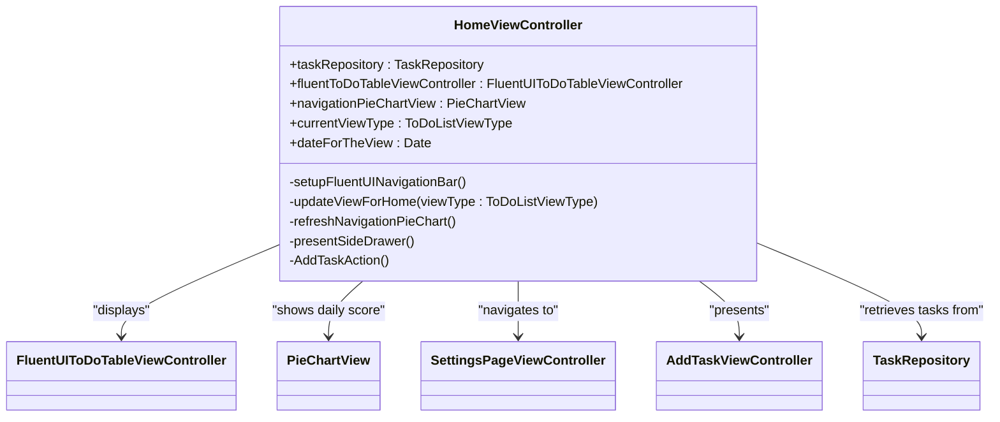
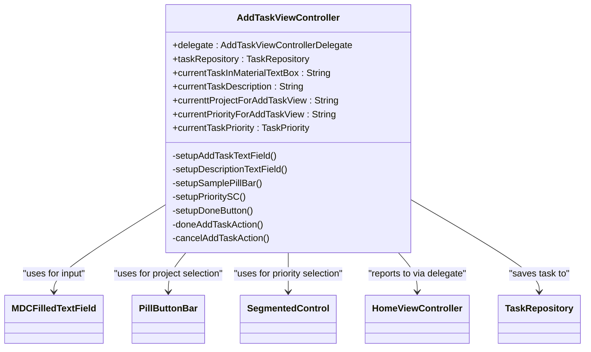
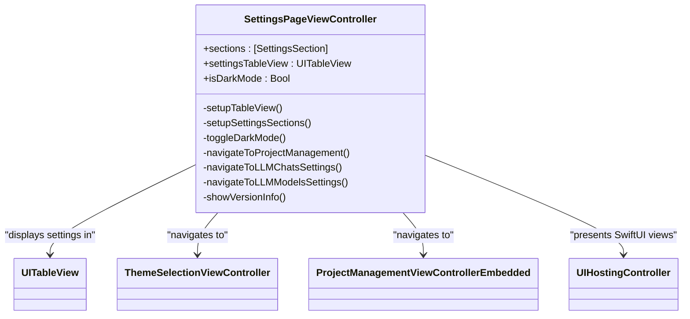
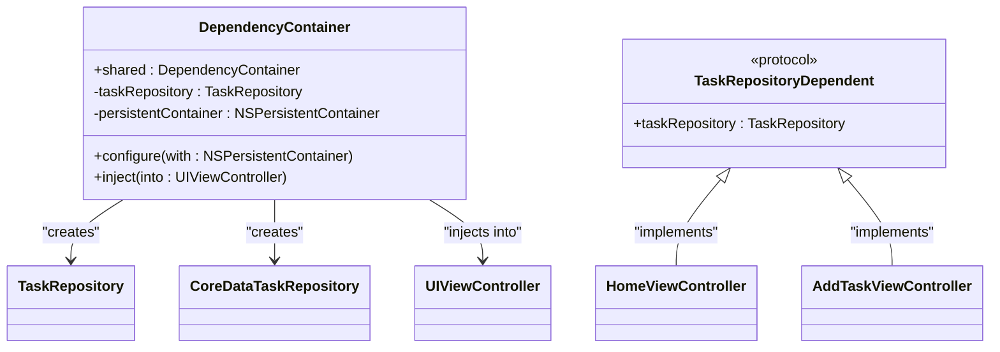
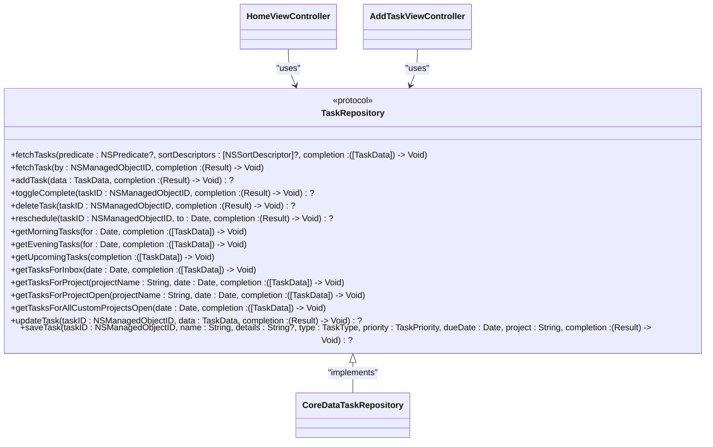

# User Interface Architecture

<cite>
**Referenced Files in This Document**   
- [HomeViewController.swift](file://To Do List/ViewControllers/HomeViewController.swift)
- [AddTaskViewController.swift](file://To Do List/ViewControllers/AddTaskViewController.swift)
- [SettingsPageViewController.swift](file://To Do List/ViewControllers/SettingsPageViewController.swift)
- [DependencyContainer.swift](file://To Do List/Managers/DependencyContainer.swift)
- [TaskRepository.swift](file://To Do List/Repositories/TaskRepository.swift)
</cite>

## Table of Contents
1. [Introduction](#introduction)
2. [Core View Controllers](#core-view-controllers)
3. [HomeViewController: Central Hub](#homeviewcontroller-central-hub)
4. [AddTaskViewController: Task Creation](#addtaskviewcontroller-task-creation)
5. [SettingsPageViewController: Preferences Management](#settingspageviewcontroller-preferences-management)
6. [UI Components and Assets](#ui-components-and-assets)
7. [Dependency Injection and Data Flow](#dependency-injection-and-data-flow)
8. [Accessibility and Responsive Design](#accessibility-and-responsive-design)
9. [State Preservation and Lifecycle](#state-preservation-and-lifecycle)
10. [Conclusion](#conclusion)

## Introduction
The Tasker app features a modern, intuitive user interface built around three primary view controllers: HomeViewController, AddTaskViewController, and SettingsPageViewController. These components work together to provide a seamless task management experience with a focus on visual clarity, user engagement, and efficient workflow. The interface leverages Material Design principles through the FluentUI framework and incorporates custom UI elements from the asset catalog. This documentation details the structure, behavior, and integration of these core components, highlighting their roles in the overall application architecture.

## Core View Controllers
The Tasker app's user interface is organized around three main view controllers that handle distinct aspects of the application's functionality. These controllers follow a clear separation of concerns while maintaining consistent design language and behavior patterns across the app.

**Section sources**
- [HomeViewController.swift](file://To Do List/ViewControllers/HomeViewController.swift#L1-L50)
- [AddTaskViewController.swift](file://To Do List/ViewControllers/AddTaskViewController.swift#L1-L50)
- [SettingsPageViewController.swift](file://To Do List/ViewControllers/SettingsPageViewController.swift#L1-L50)

## HomeViewController: Central Hub

HomeViewController serves as the central hub of the Tasker application, providing users with an overview of their tasks, daily progress, and navigation to other app features. The interface is designed to be both informative and actionable, presenting categorized tasks in a clean, organized manner.

The view controller displays tasks grouped by project or time category, with visual indicators for task priority and completion status. A prominent daily score is shown in the navigation bar, providing immediate feedback on productivity. The interface includes a top bar with a calendar icon that allows users to navigate between dates, and navigation controls for accessing different sections of the app.

Key visual elements include:
- A top bar with date display and navigation controls
- Categorized task lists with project headers
- Visual indicators for task priority (high, medium, low)
- A floating action button for adding new tasks
- A bottom app bar with navigation controls

The controller responds to user interactions by updating the displayed tasks based on the selected view type (today, upcoming, etc.) and handling navigation requests. It also manages the display of search results when the user initiates a search.

**Diagram sources**
- [HomeViewController.swift](file://To Do List/ViewControllers/HomeViewController.swift#L50-L200)

**Section sources**
- [HomeViewController.swift](file://To Do List/ViewControllers/HomeViewController.swift#L1-L300)

## AddTaskViewController: Task Creation

AddTaskViewController provides a form-based interface for creating new tasks, allowing users to specify all relevant task details before saving. The interface is designed to be simple yet comprehensive, guiding users through the task creation process with clear visual hierarchy and intuitive controls.

The form includes the following fields:
- Task name (required, primary input field)
- Task details/description (optional, multi-line text area)
- Project assignment (selected via pill buttons)
- Priority level (selected via segmented control)
- Time category (morning, evening, or upcoming)

The controller uses Material Design text fields from the MDC framework, providing a consistent look and feel with other Material Design elements in the app. Pill buttons are used for project selection, allowing users to quickly choose from existing projects or create new ones. A segmented control enables selection of task priority, with visual feedback for the selected option.

The interface is responsive to user input, enabling the "Done" button only when a task name has been entered. The controller handles form submission by creating a new task object and communicating it back to the presenting view controller through a delegate pattern.

**Diagram sources**
- [AddTaskViewController.swift](file://To Do List/ViewControllers/AddTaskViewController.swift#L50-L200)

**Section sources**
- [AddTaskViewController.swift](file://To Do List/ViewControllers/AddTaskViewController.swift#L1-L300)

## SettingsPageViewController: Preferences Management

SettingsPageViewController manages the app's preferences and configuration options, providing users with control over key application settings. The interface is organized into logical sections, making it easy for users to find and modify settings.

The controller presents settings in a table view with the following main sections:
- Projects: Access to project management features
- Appearance: Controls for dark mode and theme selection
- LLM Settings: Configuration for AI/LLM features
- About: App version and information

A key feature is the dark mode toggle, which allows users to switch between light and dark themes. The controller also provides access to iCloud sync settings, though this functionality is not fully implemented in the current codebase. The interface uses standard iOS table view cells with appropriate icons and disclosure indicators to guide user interaction.

When users modify settings, the controller applies the changes immediately and provides visual feedback through alerts or interface updates. For example, toggling dark mode immediately changes the app's appearance and shows a confirmation message.

**Diagram sources**
- [SettingsPageViewController.swift](file://To Do List/ViewControllers/SettingsPageViewController.swift#L50-L200)

**Section sources**
- [SettingsPageViewController.swift](file://To Do List/ViewControllers/SettingsPageViewController.swift#L1-L300)

## UI Components and Assets

The Tasker app utilizes a rich set of custom UI elements and assets to create a distinctive visual identity. These components are organized within the asset catalog and integrated throughout the application's interface.

### Top Bar with Calendar Icon
The top bar is a custom UI element that appears across multiple screens, providing consistent navigation and date display. It includes:
- A calendar icon (cal_Icon.imageset) for date navigation
- Date display showing day, weekday, and month
- Separators and background elements for visual hierarchy

The top bar uses assets from the HomeTopBar directory, including the calendar icon and separator lines that create visual distinction between interface sections.

### Material Design Buttons
The app incorporates Material Design principles through the use of MDC (Material Design Components) buttons and controls. Key elements include:
- Floating action buttons (material_add.imageset, material_add_White.imageset)
- Navigation buttons (material_home.imageset, material_menu.imageset, material_search.imageset)
- Status indicators (material_done_White.imageset, material_close.imageset)
- Time category indicators (material_day_White.imageset, material_evening_White.imageset)

These assets are organized in the Material_Icons directory and are used consistently across the application to maintain visual coherence.

### Custom UI Elements
Additional custom UI elements include:
- Pill buttons for project selection and filtering
- Backdrop and foredrop containers for visual layering
- Custom table view cells with dismissal controls
- Progress indicators and score displays

The interface leverages the FluentUI framework for many of these components, ensuring a modern, responsive design that adheres to iOS human interface guidelines.

**Section sources**
- [HomeViewController.swift](file://To Do List/ViewControllers/HomeViewController.swift#L200-L400)
- [AddTaskViewController.swift](file://To Do List/ViewControllers/AddTaskViewController.swift#L200-L400)
- [SettingsPageViewController.swift](file://To Do List/ViewControllers/SettingsPageViewController.swift#L200-L400)

## Dependency Injection and Data Flow

The Tasker app implements a clean dependency injection pattern to manage component relationships and data flow. This architecture promotes loose coupling, testability, and maintainability across the application.

### DependencyContainer
The DependencyContainer class serves as the central dependency management system, responsible for:
- Creating and managing shared service instances
- Injecting dependencies into view controllers
- Coordinating the application's object graph

The container is configured during app initialization with the Core Data persistent container and creates the appropriate repository implementations. It then injects these dependencies into view controllers as they are instantiated.

**Diagram sources**
- [DependencyContainer.swift](file://To Do List/Managers/DependencyContainer.swift#L1-L50)

### TaskRepository Protocol
The TaskRepository protocol defines a comprehensive interface for task data operations, enabling dependency injection and testability. It abstracts the underlying data storage mechanism (Core Data) and provides a clean API for view controllers to interact with task data.

Key responsibilities include:
- Fetching tasks with various filtering and sorting options
- Adding, updating, and deleting tasks
- Toggling task completion status
- Rescheduling tasks to new dates
- Retrieving tasks for specific projects, dates, or categories

View controllers receive a TaskRepository instance through dependency injection and use it to perform all data operations. This separation ensures that UI components remain independent of the specific data storage implementation.

**Diagram sources**
- [TaskRepository.swift](file://To Do List/Repositories/TaskRepository.swift#L1-L50)

### Data Flow
The data flow pattern follows a consistent pattern across the application:
1. View controllers receive dependencies via DependencyContainer injection
2. User interactions trigger data operations through the TaskRepository
3. Data changes are communicated back to the UI through completion handlers
4. The UI updates to reflect the new data state

For example, when a user adds a new task:
1. AddTaskViewController receives a TaskRepository instance through dependency injection
2. The user fills out the task form and taps "Done"
3. The controller calls addTask() on the repository with the task data
4. Upon successful completion, the controller notifies its delegate (HomeViewController)
5. HomeViewController refreshes its task list to include the new task

**Section sources**
- [DependencyContainer.swift](file://To Do List/Managers/DependencyContainer.swift#L1-L80)
- [TaskRepository.swift](file://To Do List/Repositories/TaskRepository.swift#L1-L118)

## Accessibility and Responsive Design

The Tasker app incorporates several accessibility features and responsive design patterns to ensure usability across different devices and user needs.

### Accessibility Considerations
The interface includes the following accessibility features:
- Proper semantic markup for screen readers
- Sufficient color contrast between text and background
- Support for dynamic type (adjustable text sizes)
- Clear visual focus indicators for interactive elements
- Descriptive labels for all controls and icons

The app uses system-provided accessibility APIs to ensure compatibility with VoiceOver and other assistive technologies. All interactive elements have appropriate accessibility labels and traits, making the interface navigable for users with visual impairments.

### Responsive Layout Behavior
The UI is designed to adapt to different screen sizes and orientations:
- Auto Layout constraints ensure proper positioning across device sizes
- Stack views organize content in a flexible, responsive manner
- Scroll views accommodate content that exceeds the visible area
- Safe area layout guides prevent content from being obscured by device notches or home indicators

The interface uses relative positioning and sizing rather than fixed coordinates, allowing it to scale appropriately on different devices. For example, the AddTaskViewController uses a vertical stack view to arrange form elements, ensuring consistent spacing and alignment regardless of screen size.

The app also responds to trait collection changes, such as when the user switches between light and dark mode or changes the display scale. View controllers observe these changes and update their appearance accordingly.

**Section sources**
- [HomeViewController.swift](file://To Do List/ViewControllers/HomeViewController.swift#L400-L600)
- [AddTaskViewController.swift](file://To Do List/ViewControllers/AddTaskViewController.swift#L400-L600)
- [SettingsPageViewController.swift](file://To Do List/ViewControllers/SettingsPageViewController.swift#L400-L600)

## State Preservation and Lifecycle

The Tasker app manages view controller state and lifecycle events to provide a seamless user experience across app sessions.

### View Controller Lifecycle
Each view controller follows the standard iOS lifecycle pattern:
- viewDidLoad: Perform initial setup and configuration
- viewWillAppear: Update content before appearing
- viewDidAppear: Perform post-appearance tasks and animations
- viewWillDisappear: Clean up resources before disappearing
- viewDidDisappear: Final cleanup tasks

For example, HomeViewController uses viewWillAppear to reload its table view data, ensuring the displayed tasks are current when the user returns to the home screen. It also uses viewDidAppear to refresh the navigation pie chart and perform any necessary animations.

### State Preservation
The app preserves key state information across app launches:
- The current view type (today, upcoming, etc.) in HomeViewController
- The selected project and filter state
- The user's dark mode preference
- The current date context for task display

This state is typically stored in UserDefaults or derived from the app's data model, allowing the interface to restore to the user's previous context when the app is relaunched.

### Memory Management
The app implements proper memory management practices:
- Deinitializers remove notification observers to prevent retain cycles
- Weak references are used for delegates to avoid strong reference cycles
- Resources are released in appropriate lifecycle methods
- Caching strategies minimize redundant data loading

For example, HomeViewController removes its notification observers in its deinit method, ensuring it won't receive notifications after being deallocated.

**Section sources**
- [HomeViewController.swift](file://To Do List/ViewControllers/HomeViewController.swift#L600-L800)
- [AddTaskViewController.swift](file://To Do List/ViewControllers/AddTaskViewController.swift#L600-L800)
- [SettingsPageViewController.swift](file://To Do List/ViewControllers/SettingsPageViewController.swift#L600-L800)

## Conclusion
The Tasker app's user interface architecture demonstrates a well-structured approach to iOS application development, combining modern design principles with robust architectural patterns. The three main view controllers—HomeViewController, AddTaskViewController, and SettingsPageViewController—each serve distinct purposes while maintaining a consistent design language and behavior pattern.

The implementation leverages dependency injection through the DependencyContainer to manage component relationships and promote testability. The TaskRepository protocol provides a clean abstraction for data operations, allowing view controllers to interact with task data without knowledge of the underlying storage mechanism.

Custom UI elements from the asset catalog, combined with Material Design components, create a distinctive visual identity that enhances user engagement. The interface incorporates accessibility features and responsive design patterns to ensure usability across different devices and user needs.

Overall, the architecture balances aesthetic appeal with functional efficiency, providing users with an intuitive and productive task management experience. The separation of concerns, consistent design patterns, and thoughtful state management contribute to an application that is both user-friendly and maintainable.