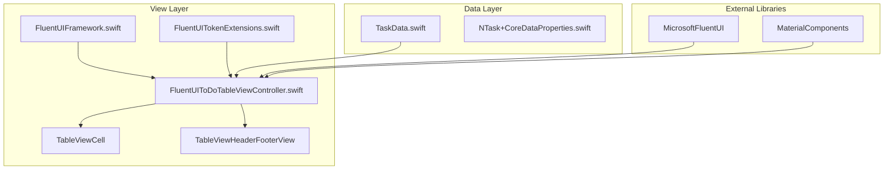
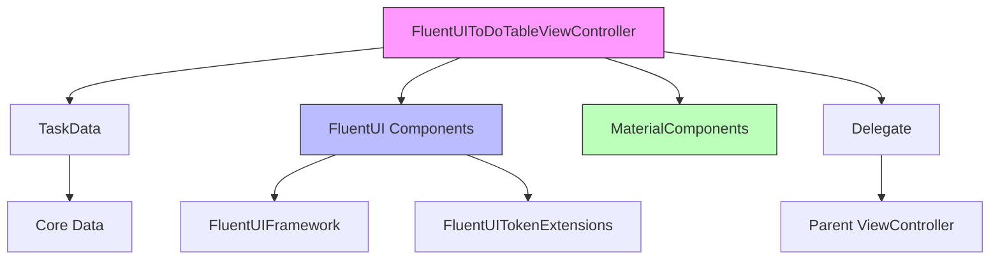
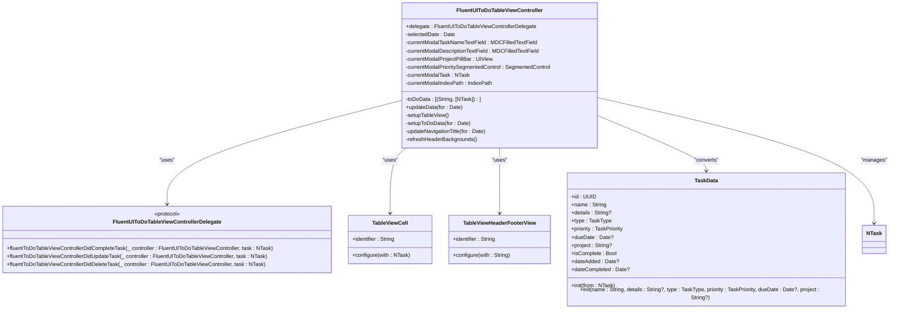
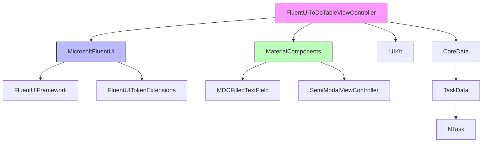

# FluentUI Integration

<cite>
**Referenced Files in This Document**   
- [FluentUIToDoTableViewController.swift](file://To%20Do%20List/ViewControllers/FluentUIToDoTableViewController.swift)
- [FluentUIFramework.swift](file://To%20Do%20List/View/Theme/FluentUIFramework.swift)
- [FluentUITokenExtensions.swift](file://To%20Do%20List/View/FluentUITokenExtensions.swift)
- [TaskData.swift](file://To%20Do%20List/Models/TaskData.swift)
- [README.md](file://README.md)
</cite>

## Table of Contents
1. [Introduction](#introduction)
2. [Project Structure](#project-structure)
3. [Core Components](#core-components)
4. [Architecture Overview](#architecture-overview)
5. [Detailed Component Analysis](#detailed-component-analysis)
6. [Dependency Analysis](#dependency-analysis)
7. [Performance Considerations](#performance-considerations)
8. [Troubleshooting Guide](#troubleshooting-guide)
9. [Conclusion](#conclusion)

## Introduction
This document provides a comprehensive analysis of the integration of Microsoft FluentUI components within the `FluentUIToDoTableViewController` in the Tasker application. The integration combines FluentUI's modern design language with Material Design Components and UIKit to create a cohesive, accessible, and performant task management interface. The analysis covers design principles, component implementation, accessibility features, theming, and integration challenges, providing a detailed understanding of how FluentUI enhances the user experience while maintaining technical robustness.

## Project Structure
The Tasker application follows a hybrid architecture combining MVC patterns with emerging Repository and Dependency Injection patterns. The FluentUI integration is primarily located within the View and ViewControllers directories, with supporting theme and token extensions.



**Diagram sources**
- [FluentUIToDoTableViewController.swift](file://To%20Do%20List/ViewControllers/FluentUIToDoTableViewController.swift)
- [FluentUIFramework.swift](file://To%20Do%20List/View/Theme/FluentUIFramework.swift)
- [FluentUITokenExtensions.swift](file://To%20Do%20List/View/FluentUITokenExtensions.swift)
- [TaskData.swift](file://To%20Do%20List/Models/TaskData.swift)

**Section sources**
- [FluentUIToDoTableViewController.swift](file://To%20Do%20List/ViewControllers/FluentUIToDoTableViewController.swift)
- [README.md](file://README.md)

## Core Components
The core components of the FluentUI integration include the `FluentUIToDoTableViewController`, which manages the presentation of tasks using FluentUI-styled cells and headers, and the supporting theme and token extension files that customize the FluentUI appearance to match the application's design language. The integration also leverages Material Design Components for text fields and modal presentation, creating a hybrid UI approach that combines the strengths of both design systems.

**Section sources**
- [FluentUIToDoTableViewController.swift](file://To%20Do%20List/ViewControllers/FluentUIToDoTableViewController.swift)
- [FluentUIFramework.swift](file://To%20Do%20List/View/Theme/FluentUIFramework.swift)
- [FluentUITokenExtensions.swift](file://To%20Do%20List/View/FluentUITokenExtensions.swift)

## Architecture Overview
The FluentUI integration follows a layered architecture where the `FluentUIToDoTableViewController` acts as the presentation layer, coordinating between the data layer (TaskData and Core Data entities) and the UI components (FluentUI cells and headers). The controller uses a delegate pattern to communicate task state changes to parent view controllers, maintaining separation of concerns while enabling rich user interactions.



**Diagram sources**
- [FluentUIToDoTableViewController.swift](file://To%20Do%20List/ViewControllers/FluentUIToDoTableViewController.swift)
- [TaskData.swift](file://To%20Do%20List/Models/TaskData.swift)

## Detailed Component Analysis

### FluentUIToDoTableViewController Analysis
The `FluentUIToDoTableViewController` is a specialized `UITableViewController` that implements Microsoft's FluentUI design system for task management. It manages task data grouping, sorting, and presentation using FluentUI-styled table cells and headers.

#### Class Diagram


**Diagram sources**
- [FluentUIToDoTableViewController.swift](file://To%20Do%20List/ViewControllers/FluentUIToDoTableViewController.swift)
- [TaskData.swift](file://To%20Do%20List/Models/TaskData.swift)

**Section sources**
- [FluentUIToDoTableViewController.swift](file://To%20Do%20List/ViewControllers/FluentUIToDoTableViewController.swift)

### FluentUI Theming System
The application implements a comprehensive theming system that extends FluentUI's default styling to match the application's brand identity while maintaining accessibility and consistency.

#### Theme Extension Analysis
The `FluentUITokenExtensions.swift` file defines custom spacing and corner radius tokens that standardize UI dimensions across the application:

```swift
// Spacing tokens for consistent layout
enum FluentSpacing: CGFloat {
    case xxxSmall = 2.0
    case xxSmall = 4.0
    case xSmall = 8.0
    case small = 12.0
    case medium = 16.0
    case large = 20.0
    case xLarge = 24.0
    case xxLarge = 32.0
    case xxxLarge = 40.0
}

// Corner radius tokens for consistent styling
enum FluentCornerRadius: CGFloat {
    case none = 0.0
    case small = 4.0
    case medium = 8.0
    case large = 12.0
    case xLarge = 16.0
    case circle = 999.0
}
```

These tokens are extended through the `FluentTheme` protocol to provide a consistent API for accessing design values:

```swift
extension FluentTheme {
    func spacing(_ size: FluentSpacing) -> CGFloat {
        return size.rawValue
    }
    
    func cornerRadius(_ size: FluentCornerRadius) -> CGFloat {
        return size.rawValue
    }
}
```

**Section sources**
- [FluentUITokenExtensions.swift](file://To%20Do%20List/View/FluentUITokenExtensions.swift)

### FluentUI Framework Integration
The `FluentUIFramework.swift` file provides the foundational integration with Microsoft's FluentUI library, ensuring proper resource loading and configuration.

```swift
public class FluentUIFramework: NSObject {
    @objc public static var bundle: Bundle { return Bundle(for: self) }
    @objc public static let resourceBundle: Bundle = {
        guard let url = bundle.resourceURL?.appendingPathComponent("FluentUIResources-ios.bundle", isDirectory: true), let bundle = Bundle(url: url) else {
            preconditionFailure("FluentUI resource bundle is not found")
        }
        return bundle
    }()
    
    @available(*, deprecated, message: "Non-fluent icons no longer supported. Setting this var no longer has any effect and it will be removed in a future update.")
    @objc public static var usesFluentIcons: Bool = true
}
```

This implementation ensures that FluentUI resources are properly loaded from the application bundle, providing access to FluentUI's iconography, typography, and other design assets.

**Section sources**
- [FluentUIFramework.swift](file://To%20Do%20List/View/Theme/FluentUIFramework.swift)

## Dependency Analysis
The FluentUI integration creates dependencies between multiple frameworks and components, requiring careful coordination to maintain a consistent user experience.



**Diagram sources**
- [FluentUIToDoTableViewController.swift](file://To%20Do%20List/ViewControllers/FluentUIToDoTableViewController.swift)
- [FluentUIFramework.swift](file://To%20Do%20List/View/Theme/FluentUIFramework.swift)
- [FluentUITokenExtensions.swift](file://To%20Do%20List/View/FluentUITokenExtensions.swift)
- [TaskData.swift](file://To%20Do%20List/Models/TaskData.swift)

**Section sources**
- [FluentUIToDoTableViewController.swift](file://To%20Do%20List/ViewControllers/FluentUIToDoTableViewController.swift)
- [README.md](file://README.md)

## Performance Considerations
The integration of FluentUI components within a UITableView context presents several performance considerations that have been addressed through careful implementation:

1. **Cell Reuse Optimization**: The controller registers FluentUI table cells and headers for reuse, minimizing allocation overhead during scrolling.
2. **Asynchronous Data Loading**: Task data setup is performed on the main thread with `DispatchQueue.main.async` to prevent UI blocking during data processing.
3. **Efficient Data Grouping**: Tasks are grouped by project and sorted by priority and due date in a single pass, reducing computational complexity.
4. **Lazy Header Refresh**: Header background refresh is scheduled with `DispatchQueue.main.async` in `viewWillAppear` and `viewDidAppear` to ensure proper styling without impacting initial load performance.
5. **Memory Management**: The controller uses weak references for delegates and stores modal form elements as optional instance variables to prevent retain cycles.

The combination of FluentUI and MaterialComponents requires careful attention to rendering performance, but the current implementation appears to balance visual richness with responsiveness.

## Troubleshooting Guide
When troubleshooting issues with the FluentUI integration, consider the following common problems and solutions:

**Section sources**
- [FluentUIToDoTableViewController.swift](file://To%20Do%20List/ViewControllers/FluentUIToDoTableViewController.swift)
- [FluentUIFramework.swift](file://To%20Do%20List/View/Theme/FluentUIFramework.swift)
- [FluentUITokenExtensions.swift](file://To%20Do%20List/View/FluentUITokenExtensions.swift)

## Conclusion
The integration of Microsoft FluentUI components in the `FluentUIToDoTableViewController` demonstrates a sophisticated approach to modern iOS UI development. By combining FluentUI's design language with Material Design Components and UIKit, the application achieves a visually rich and accessible interface that enhances the user experience. The implementation follows sound architectural principles, with proper separation of concerns, consistent theming, and attention to performance. The use of design tokens, custom extensions, and a hybrid framework approach allows for both brand consistency and adherence to platform design guidelines. As the application continues to evolve toward a Clean Architecture, this FluentUI integration serves as a strong foundation for a maintainable and scalable UI layer.