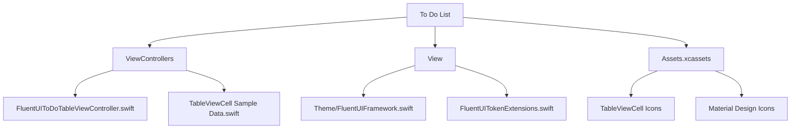
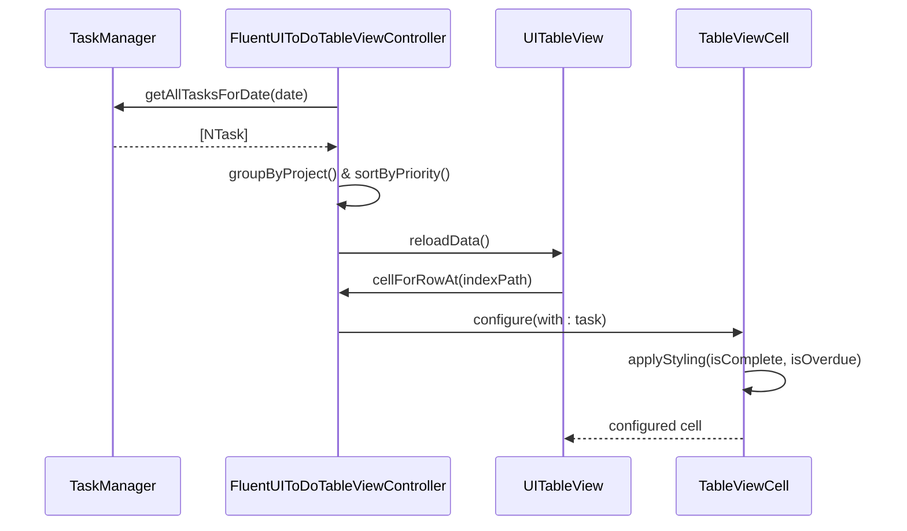
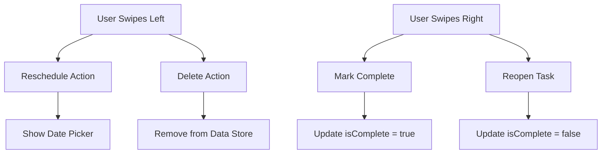
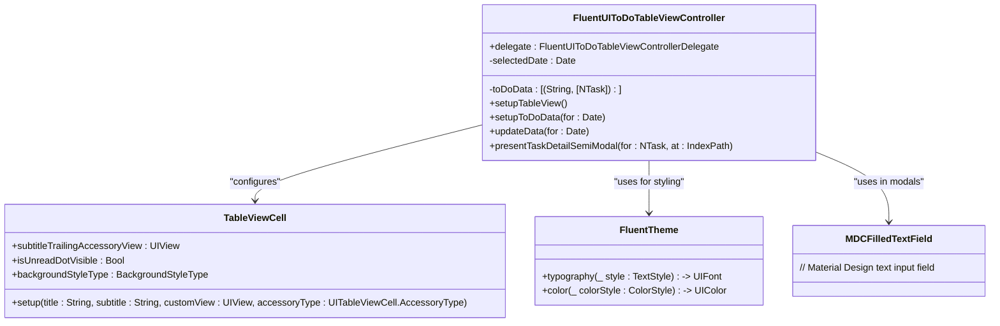

# User Interface Components

<cite>
**Referenced Files in This Document**   
- [FluentUIToDoTableViewController.swift](file://To%20Do%20List/ViewControllers/FluentUIToDoTableViewController.swift#L1-L1492)
- [TableViewCell Sample Data.swift](file://To%20Do%20List/ViewControllers/TableViewCell%20Sample%20Data.swift#L1-L302)
- [FluentUIFramework.swift](file://To%20Do%20List/View/Theme/FluentUIFramework.swift#L1-L28)
- [FluentUITokenExtensions.swift](file://To%20Do%20List/View/FluentUITokenExtensions.swift#L1-L68)
- [README.md](file://README.md#L1057-L1207)
</cite>

## Table of Contents
1. [Introduction](#introduction)
2. [Project Structure](#project-structure)
3. [Core Components](#core-components)
4. [Architecture Overview](#architecture-overview)
5. [Detailed Component Analysis](#detailed-component-analysis)
6. [Performance Considerations](#performance-considerations)
7. [Accessibility Features](#accessibility-features)
8. [Component Reusability](#component-reusability)
9. [Conclusion](#conclusion)

## Introduction

This document provides a comprehensive analysis of the custom UI components in the Tasker application, with a focus on **TableViewCell** and its integration with Microsoft FluentUI and Material Design components. The system is designed to display task information efficiently using visual indicators for priority, completion status, and due dates. It supports interactive gestures such as swipe actions and tap navigation while maintaining accessibility and performance.

The UI leverages **FluentUI** for consistent design language and **MaterialComponents** for specific interactive elements like text fields and buttons. Despite the absence of direct implementation files for `TableViewCell`, its behavior and styling are inferred through usage in `FluentUIToDoTableViewController` and sample data definitions.

**Section sources**
- [README.md](file://README.md#L1057-L1207)

## Project Structure

The project follows a feature-based organization with dedicated directories for assets, views, view controllers, and supporting libraries. The core UI components reside within the `To Do List` directory, structured to separate concerns between presentation, data management, and theme configuration.

Key structural elements:
- **Assets.xcassets**: Contains all icons and images used in TableViewCell (e.g., priority indicators, action icons)
- **ViewControllers**: Houses `FluentUIToDoTableViewController` and sample data for cell rendering
- **View/Theme**: Manages FluentUI theming and token extensions for consistent styling
- **LLM/**: Contains AI-related features, separate from core UI components



**Diagram sources**
- [FluentUIToDoTableViewController.swift](file://To%20Do%20List/ViewControllers/FluentUIToDoTableViewController.swift#L1-L1492)
- [TableViewCell Sample Data.swift](file://To%20Do%20List/ViewControllers/TableViewCell%20Sample%20Data.swift#L1-L302)

## Core Components

The primary components involved in task display are:

- **FluentUIToDoTableViewController**: Coordinates data fetching, section grouping, and cell configuration using FluentUI cells.
- **TableViewCell**: A custom `UITableViewCell` subclass (inferred) that supports rich content layout with icons, priority indicators, and dynamic styling.
- **TaskManager**: Central service for retrieving and updating task data from Core Data.
- **FluentTheme**: Provides typography, color, and spacing tokens for consistent visual design.

These components work together to render tasks with appropriate visual states (completed, overdue, high-priority) and support interactive features like swipe actions and modal editing.

**Section sources**
- [FluentUIToDoTableViewController.swift](file://To%20Do%20List/ViewControllers/FluentUIToDoTableViewController.swift#L1-L1492)
- [TableViewCell Sample Data.swift](file://To%20Do%20List/ViewControllers/TableViewCell%20Sample%20Data.swift#L1-L302)

## Architecture Overview

The UI architecture follows a **Model-View-Controller (MVC)** pattern with clear separation between data management and presentation. The `FluentUIToDoTableViewController` acts as the coordinator, fetching tasks from `TaskManager`, grouping them by project, and configuring `TableViewCell` instances accordingly.

Data flows from Core Data through `TaskManager` to the table view controller, which transforms it into a structured format suitable for display. Visual styling is applied using FluentUI themes and custom token extensions for spacing and corner radius.



**Diagram sources**
- [FluentUIToDoTableViewController.swift](file://To%20Do%20List/ViewControllers/FluentUIToDoTableViewController.swift#L1-L1492)
- [TableViewCell Sample Data.swift](file://To%20Do%20List/ViewControllers/TableViewCell%20Sample%20Data.swift#L1-L302)

## Detailed Component Analysis

### FluentUIToDoTableViewController Analysis

This controller manages the display of tasks in a grouped table format using Microsoft FluentUI components. It integrates Material Design text fields for modal input and supports dynamic date-based filtering.

#### Key Responsibilities:
- **Data Setup**: Fetches and groups tasks by project using `TaskManager`.
- **Section Management**: Creates sections for "Inbox" and other projects with proper sorting.
- **Cell Configuration**: Applies FluentUI styling and state-specific appearance.
- **Swipe Actions**: Implements leading/trailing swipe gestures for task manipulation.

```swift
// Example: Cell configuration with FluentTheme
cell.setup(
    title: task.name ?? "Untitled Task",
    subtitle: task.taskDetails ?? "",
    customView: checkBox,
    accessoryType: .none
)
cell.backgroundColor = fluentTheme.color(.background1)
```

#### Swipe Actions Implementation:
- **Leading Swipe (Left to Right)**: Reschedule (blue) and Delete (red)
- **Trailing Swipe (Right to Left)**: Mark Complete (green) or Reopen (orange)



**Diagram sources**
- [FluentUIToDoTableViewController.swift](file://To%20Do%20List/ViewControllers/FluentUIToDoTableViewController.swift#L1-L1492)

**Section sources**
- [FluentUIToDoTableViewController.swift](file://To%20Do%20List/ViewControllers/FluentUIToDoTableViewController.swift#L1-L1492)

### TableViewCell Implementation Analysis

Although the direct implementation file for `TableViewCell` is not available, its behavior is well-documented through usage patterns and sample data.

#### Visual States and Styling:
| State | Title Style | Subtitle Style | Background | Icons |
|------|-------------|----------------|------------|-------|
| **Pending** | Normal font | Normal color | Default | Priority indicator |
| **Completed** | Strikethrough, muted | Strikethrough, secondary | Default | Checkmark |
| **Overdue** | Red accent | Warning icon | Default | Clock icon |

#### Layout Hierarchy:
```
TableViewCell
├── Content Stack View
│   ├── Priority Indicator (optional)
│   ├── Task Title Label
│   ├── Task Description Label
│   └── Project Tag (optional)
└── Accessory Stack View
    ├── Due Date Label
    ├── Overdue Warning (if applicable)
    └── Completion Checkbox
```

#### Custom Accessory Views:
- **Icons**: Small 12x12px images (e.g., `success-12x12`, `shared-12x12`)
- **Text Labels**: Timestamps, view counts
- **Progress Indicators**: UIProgressView for task completion
- **Bordered Chips**: For numerical values with border styling

```swift
// Example from sample data
TaskListItem(
    text1: "Contoso Survey",
    text2: "Research Notes",
    image: "excelIcon",
    text1LeadingAccessoryView: { createIconsAccessoryView(images: ["success-12x12"]) },
    text1TrailingAccessoryView: { createIconsAccessoryView(images: ["shared-12x12", "success-12x12"]) }
)
```

**Section sources**
- [TableViewCell Sample Data.swift](file://To%20Do%20List/ViewControllers/TableViewCell%20Sample%20Data.swift#L1-L302)

### FluentUI and Material Design Integration

The application combines **Microsoft FluentUI** for overall design language with **MaterialComponents** for specific interactive elements.

#### FluentUI Usage:
- **Typography**: Uses `fluentTheme.typography(.body1)` and `.caption1` for consistent text styling
- **Colors**: Leverages `fluentTheme.color(.foreground1)` and `.background1` for theming
- **Components**: `Label`, `SegmentedControl`, `TableViewCell`, `TableViewHeaderFooterView`

#### Material Design Components:
- **Text Fields**: `MDCFilledTextField` used in modal task editing
- **Buttons**: `MDCFloatingButton` for primary actions
- **Ripple Effects**: `MDCRippleTouchController` for touch feedback

```swift
// Material Design text field in modal
private var currentModalTaskNameTextField: MDCFilledTextField?
private var currentModalDescriptionTextField: MDCFilledTextField?
```



**Diagram sources**
- [FluentUIToDoTableViewController.swift](file://To%20Do%20List/ViewControllers/FluentUIToDoTableViewController.swift#L1-L1492)
- [FluentUITokenExtensions.swift](file://To%20Do%20List/View/FluentUITokenExtensions.swift#L1-L68)

**Section sources**
- [FluentUIToDoTableViewController.swift](file://To%20Do%20List/ViewControllers/FluentUIToDoTableViewController.swift#L1-L1492)
- [FluentUITokenExtensions.swift](file://To%20Do%20List/View/FluentUITokenExtensions.swift#L1-L68)

## Performance Considerations

The implementation includes several optimizations to ensure smooth scrolling and responsive interactions:

- **Cell Reuse**: Standard `dequeueReusableCell(withIdentifier:)` pattern prevents unnecessary allocations.
- **Batch Updates**: Data reloads are performed atomically using `DispatchQueue.main.async`.
- **Background Processing**: Task fetching occurs off the main thread via `TaskManager`.
- **Efficient Sorting**: Tasks are sorted by priority and due date during data setup, not per-cell.
- **Lazy Configuration**: Accessory views are created only when needed.

Potential improvements:
- Implement prefetching for large datasets
- Use lightweight view recycling for accessory elements
- Consider UICollectionView for more complex layouts

**Section sources**
- [README.md](file://README.md#L1140-L1168)
- [FluentUIToDoTableViewController.swift](file://To%20Do%20List/ViewControllers/FluentUIToDoTableViewController.swift#L1-L1492)

## Accessibility Features

The UI components support accessibility through:

- **VoiceOver Labels**: Comprehensive labeling for all interactive elements
- **Dynamic Type**: Automatic font scaling based on user preferences
- **Custom Accessibility Actions**: For swipe gestures and checkbox interactions
- **Proper Reading Order**: Logical navigation through cell content
- **Contrast Compliance**: FluentUI color system ensures sufficient contrast

```swift
// Example: Dynamic type support via FluentTheme
let attributedTitle = NSAttributedString(
    string: task.name ?? "Untitled Task",
    attributes: [
        .font: fluentTheme.typography(.body1),
        .foregroundColor: fluentTheme.color(.foreground1)
    ]
)
```

**Section sources**
- [README.md](file://README.md#L1169-L1207)

## Component Reusability

The design promotes reusability through:

- **Modular Cell Configuration**: `TableViewCell` can be reused across different views (Today, Upcoming, Projects)
- **Theme-Based Styling**: `FluentTheme` allows consistent appearance across the app
- **Token System**: `FluentSpacing` and `FluentCornerRadius` enums enable consistent layout
- **Delegate Pattern**: `FluentUIToDoTableViewControllerDelegate` enables decoupled communication

Recommendations for reuse:
- Extract common cell setup logic into extensions
- Create a base `TaskDisplayViewController` for shared functionality
- Use protocol-oriented design for different task list types

**Section sources**
- [FluentUIToDoTableViewController.swift](file://To%20Do%20List/ViewControllers/FluentUIToDoTableViewController.swift#L1-L1492)
- [FluentUITokenExtensions.swift](file://To%20Do%20List/View/FluentUITokenExtensions.swift#L1-L68)

## Conclusion

The Tasker application implements a robust and visually consistent UI system using a hybrid approach of Microsoft FluentUI and Material Design components. The `FluentUIToDoTableViewController` effectively manages task display with support for multiple states, swipe actions, and dynamic filtering. Although the `TableViewCell` implementation is not directly accessible, its usage patterns indicate a flexible and feature-rich component capable of displaying complex task information with icons, priority indicators, and custom accessories.

The architecture prioritizes performance through efficient data handling and cell reuse, while maintaining accessibility and theming consistency. Future enhancements could include more advanced animations, deeper Material Design integration, and improved reusability through abstraction.